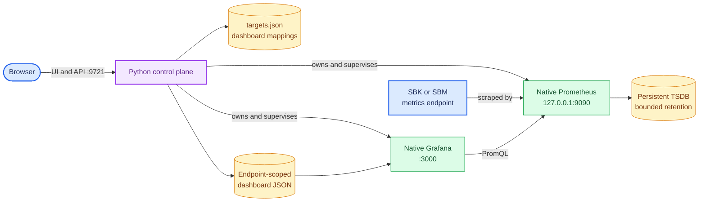

<!--
Copyright (c) KMG. All Rights Reserved.

Licensed under the Apache License, Version 2.0 (the "License");
you may not use this file except in compliance with the License.
You may obtain a copy of the License at

    http://www.apache.org/licenses/LICENSE-2.0
-->

# SBK Dashboard

`sbk-dashboard` is a Python 3 control server for dedicated SBK/SBM Grafana dashboards. It owns one native
Prometheus server and one native Grafana server, dynamically registers remote PrometheusLogger endpoints, and
provisions one isolated copy of the canonical SBK dashboard for every unique `host:port`.

Prometheus and Grafana are official native child processes—not Python libraries—and the Python server manages their
verified installation, configuration, readiness, reconciliation, health, and shutdown. The application can run
directly in Python/Conda or as a Linux container; container packaging does not change that process architecture.

The current release is `1.26.8.3`. Releases use `Major.Year.Month.Minor`, and
`src/sbk_dashboard/version.py` is the single source used by package metadata, startup logging, and `-v` output.

## Features

- Browser UI and JSON API for adding and removing hostname/IP-address plus port endpoints, with live total, up, and
  down endpoint counts on the landing page.
- Stable endpoint IDs and Grafana URLs compatible with the earlier Java implementation.
- Exact 53-panel SBK dashboard from `src/sbk_dashboard/resources/grafana/dashboards/sbk-dashboard.json`.
- A dedicated dashboard clone per endpoint, isolated by the `sbk_endpoint_id` Prometheus label.
- A deterministic comparison view for one endpoint across multiple ranges or any 2–8 SBK/SBM endpoints, with shared or per-target live and
  historical ranges, a reusable ID, and a shareable URL.
- Persistent endpoint registry, URL mappings, Prometheus TSDB, and Grafana state.
- Seven-day Prometheus retention by default; Prometheus removes expired TSDB blocks in the background.
- Verified Prometheus and Grafana downloads with live progress when native installations are absent.
- Safe `-continue false` process replacement and `-continue true` attachment.
- Explicit state-machine lifecycle with automatic restart and bounded exponential backoff for owned native services.
- Fixed HTTP worker pool, bounded admission queue, request timeouts, response-size limits, and endpoint-count limits.
- Least-privilege service binding: Prometheus is loopback-only by default, with independent management and Grafana
  bind controls.
- Timestamped, leveled control-plane logging suitable for journald, launchd, and Windows service wrappers.
- Concise periodic runtime status with a configurable interval and a 60-second default.
- Automatic landing-page launch in a local graphical browser, with SSH, CI, service, and headless-session detection.
- Bounded recent-client telemetry for active landing-page browser sessions and Grafana dashboards opened from the
  landing page.
- Process-group/descendant shutdown and bounded rotating native console logs.
- Linux, macOS, and Windows support on x86-64 and ARM64.
- Standard Python virtual-environment and Conda installation workflows.
- Non-root Linux container image for AMD64 and ARM64, with an immutable Python 3.12/Debian stable base, pinned native
  tools, IPv4/IPv6 endpoint routing, persistent state, health checks, and host-published management/Grafana ports.

## Architecture



The Python process is the control plane. Metrics ingestion, storage, PromQL, dashboard provisioning, and rendering
remain in the official Prometheus and Grafana servers. See [the architecture document](docs/ARCHITECTURE.md).

Start at the [documentation center](docs/README.md). The most useful paths are:

- [Getting started](docs/GETTING_STARTED.md): clone-to-dashboard tutorial for a new user.
- [Configuration reference](docs/CONFIGURATION.md): every CLI option, environment variable, bound, and example.
- [Usage guide](docs/USAGE.md): environment activation/deactivation, daily operation, endpoints, backup, upgrades,
  and troubleshooting.
- [Portable installation](docs/PORTABLE.md): one-command source startup, standalone release bundles, cache layout,
  repair, and platform coverage.
- [SBK and PrometheusLogger guide](docs/SBK.md): direct and distributed benchmark exporters, registration,
  networking, verification, and troubleshooting.
- [Architecture](docs/ARCHITECTURE.md): system boundaries, lifecycle, concurrency, persistence, and design decisions.
- [Implementation internals](docs/INTERNALS.md): code-level startup, request, reconciliation, supervision, and
  shutdown paths.
- [Docker deployment](docs/DOCKER.md): container networking, persistence, security, and release images.
- [Docker Hub build and publishing](docs/DOCKER_HUB.md): copy-and-paste local build, versioned multi-architecture
  publishing, verification, pull, run, and upgrade procedures.
- [Testing](docs/TESTING.md): automated validation and real SBK procedures.
- [Development guide](docs/DEVELOPMENT.md): repository map, safe local workflow, ownership, and completion checks.
- [AI software agent guide](docs/AI_AGENTS.md): instruction discovery and safe task routing for coding agents.

## Requirements

- A standalone release bundle needs no separately installed Python.
- A cloned repository or source archive uses Python 3.10+ when available and otherwise installs the exact-version
  standalone runtime under `SBK_DASHBOARD_HOME`; Python, pip, venv, and Conda are optional.
- An activated venv or Conda environment is reused when present.
- The bootstrap never installs Conda or modifies the system Python. It prepares an active environment, creates a
  private venv from supported Python, or uses a verified standalone runtime that carries its own Python.
- Network access is needed on the first start when the standalone runtime, Python packages, Prometheus, or Grafana
  are not cached. A Python-free POSIX start also needs `curl` or `wget`; Windows uses PowerShell and .NET.

The bootstrap installs the only runtime Python dependency, `psutil`, automatically.

## Run immediately after clone or download

From a source checkout or extracted source archive, use the root entry point. It reuses an active environment,
creates an immutable private venv when supported Python is available, or downloads the matching verified standalone
runtime when Python is absent or too old. Every prepared runtime is reused on later starts:

```bash
./sbk-dashboard
./sbk-dashboard background
./sbk-dashboard stop
```

```powershell
.\sbk-dashboard.ps1
.\sbk-dashboard.ps1 background
.\sbk-dashboard.ps1 stop
```

Windows Command Prompt can use `sbk-dashboard.cmd`. Use `repair` to rebuild or redownload the selected runtime. Set
`SBK_DASHBOARD_HOME` before the first start to relocate packages, caches, native tools, data, state, and logs.
Every start reports the operating system/release/architecture, Python implementation/version/executable,
venv/Conda/standalone kind, runtime location, portable home, and whether it created a fresh environment, reused a
saved environment, or repaired one.

GitHub releases also provide standalone Linux AMD64, macOS Apple-silicon, and Windows AMD64 archives. Extract the
matching archive and run its `sbk-dashboard` executable; these bundles need no system Python. Verify the adjacent
`.sha256` file first. See [portable installation](docs/PORTABLE.md).

## Start with Docker Compose

Docker Compose is the shortest container workflow:

```bash
docker compose pull
docker compose up --detach
```

The production Compose definition pulls the pinned, multi-architecture image from Docker Hub. That
image already contains the Python package and checksum-verified Prometheus and Grafana distributions, so customer
startup never builds source or downloads native archives separately. The first image pull depends on network speed;
subsequent `docker compose start` operations use the local image and persistent volume.

Developers who need a source build use the explicit override:

```bash
docker compose -f compose.yaml -f compose.dev.yaml build --progress=plain
docker compose -f compose.yaml -f compose.dev.yaml up --detach --no-build
```

The Dockerfile keeps Prometheus and Grafana in independent cached build stages, allowing cold downloads to run in
parallel. A tool upgrade invalidates only that tool's extraction stage, and BuildKit can reuse a previously verified
archive without placing it in the final image.

Open `http://localhost:9721/` in the host browser. Dashboard links opened from that page use
`http://localhost:3000/`. Compose publishes both ports, persists registrations, Prometheus history, and Grafana
state in the `sbk-dashboard-data` named volume, and restarts the service unless it is explicitly stopped. Compose
also applies a 512-process ceiling and rotates Docker's local logs at 10 MiB with three files by default. Both
ports bind to host loopback by default because authentication is disabled. Set
`SBK_DASHBOARD_PUBLISH_HOST=0.0.0.0` only when firewall or reverse-proxy controls protect network access.

Apply optional production resource guardrails with the dedicated overlay:

```bash
docker compose -f compose.yaml -f compose.resources.yaml up --detach
```

The optional defaults are 4 GiB memory and 2 CPUs; override them with `SBK_DASHBOARD_MEMORY_LIMIT` and
`SBK_DASHBOARD_CPU_LIMIT`. The base Compose definition always applies the PID ceiling; override it with
`SBK_DASHBOARD_PIDS_LIMIT`. Log bounds use `SBK_DASHBOARD_LOG_MAX_SIZE` and
`SBK_DASHBOARD_LOG_MAX_FILES`.

A container cannot launch a graphical application on its host, so browser auto-open is intentionally skipped in
this headless environment. Port publication makes the landing page and generated dashboards immediately accessible
from an existing host browser. Public-IP and DNS access work the same way when host firewall rules allow ports 9721
and 3000.

In the container image, the endpoint form therefore defaults to `host.docker.internal`. Use that value when SBK
runs on the Docker host; `127.0.0.1` would mean the sbk-dashboard container itself. Compose installs the portable
host-gateway mapping. A remote SBK endpoint should instead be registered with its normal routable DNS name, IPv4
address, or IPv6 address. The Compose network enables IPv6, but the Docker host and upstream network must also
provide IPv6 routing. Prometheus port 9090 is deliberately not published.

For a released image without a source checkout:

```bash
docker run --detach --name sbk-dashboard --restart unless-stopped \
  --read-only --tmpfs /tmp:size=64m,mode=1777 \
  --pids-limit 512 --log-opt max-size=10m --log-opt max-file=3 \
  --publish 127.0.0.1:9721:9721 --publish 127.0.0.1:3000:3000 \
  --add-host host.docker.internal:host-gateway \
  --volume sbk-dashboard-data:/var/lib/sbk-dashboard \
  kmgowda/sbk-dashboard:1.26.8.3
```

See [Docker deployment](docs/DOCKER.md) for upgrades, configuration, security, persistence, architecture support,
troubleshooting, validation, and the complete Docker Hub publishing procedure for image maintainers.

## Install with venv

Linux or macOS:

```bash
python3 -m venv .venv
. .venv/bin/activate
python -m pip install --upgrade pip
python -m pip install .
sbk-dashboard -h
```

Windows PowerShell:

```powershell
py -3 -m venv .venv
.\.venv\Scripts\Activate.ps1
python -m pip install --upgrade pip
python -m pip install .
sbk-dashboard -h
```

For an editable development installation, use `python -m pip install -e ".[dev]"`.

Stop a foreground `sbk-dashboard` with `Ctrl+C` before leaving the environment. Deactivating a venv changes the
current shell only; it does not stop an application that is still running in another terminal or as a service.

Leave the venv on Linux, macOS, Command Prompt, or PowerShell:

```text
deactivate
```

Reactivate it later with `. .venv/bin/activate` on Linux/macOS,
`.venv\Scripts\activate.bat` in Command Prompt, or `.\.venv\Scripts\Activate.ps1` in PowerShell. Deactivation does
not remove the environment or the persistent dashboard data directory.

## Install with Conda

Create the declared environment:

```bash
conda env create -f environment.yml
conda activate sbk-dashboard
sbk-dashboard -h
```

Or install into an existing Conda environment:

```bash
conda create -n sbk-dashboard python=3.12 pip
conda activate sbk-dashboard
python -m pip install .
```

Using `pip` inside the activated Conda environment installs the console command and package resources in that
environment without requiring a system-wide Python installation.

Stop a foreground `sbk-dashboard` with `Ctrl+C`, then leave the Conda environment:

```bash
conda deactivate
```

If environments were activated on top of one another, run `conda deactivate` again until the desired parent or
base environment is shown. Reactivate this project later with `conda activate sbk-dashboard`. Deactivation does not
remove the environment; removing it is a separate, deliberate operation:

```bash
conda deactivate
conda env remove --name sbk-dashboard
```

Removing a venv or Conda environment uninstalls its Python package copy but does not remove `~/.sbk-dashboard`, a
custom `-data` directory, or a Docker volume. See the [usage guide](docs/USAGE.md) before deleting persistent data.

## Start

```bash
sbk-dashboard
```

Cross-platform launchers reuse an active venv or Conda environment. Otherwise they create or reuse a checkout-
fingerprinted private venv beneath `~/.sbk-dashboard/app/<version>/<platform>/`; they do not require a project
`.venv`. Every dashboard option is passed through unchanged. The default start script stays in the foreground and
prints application logs to the console:

```bash
./scripts/start-sbk-dashboard.sh
```

```powershell
.\scripts\Start-SbkDashboard.ps1
```

For a detached process with bounded rotating file logs, use the background start script:

```bash
./scripts/start-sbk-dashboard-background.sh
./scripts/stop-sbk-dashboard.sh
```

```powershell
.\scripts\Start-SbkDashboardBackground.ps1
.\scripts\Stop-SbkDashboard.ps1
```

See [the usage guide](docs/USAGE.md#start-and-stop-scripts) for environment selection, logs, PID-reuse protection,
multiple port-isolated instances, custom arguments, and shutdown timeouts. `--help` and `--version` remain available
while an instance is running. With no arguments the stop script stops every launcher-managed instance; `-port
<port>` stops only the instance on that management port.

Stop the foreground script cleanly with `Ctrl+C`, or use the stop script for either launch mode. The shutdown path stops HTTP
admission first, then Grafana and Prometheus in reverse dependency order. For unattended operation, use the host
service manager rather than a detached shell command. See [usage and operations](docs/USAGE.md).

Defaults:

- Management UI: `http://localhost:9721/`
- Management bind: `0.0.0.0` (all IPv4 interfaces)
- Prometheus: `http://127.0.0.1:9090/` when available; otherwise the next suitable port (loopback only)
- Grafana: `http://localhost:3000/` when available; otherwise the next suitable port
- Grafana bind: `0.0.0.0` (all IPv4 interfaces)
- Endpoint form display name: initially `SBK Dashboard`; if cleared, registration falls back to `host:port`
- Endpoint form host/IP: `127.0.0.1` for native/Conda execution; `host.docker.internal` in the container image
- Authentication: disabled
- Data directory: `~/.sbk-dashboard` on management port 9721; `~/.sbk-dashboard/instances/<port>` on other ports
- Prometheus retention: 7 days
- Scrape interval: 5 seconds
- Existing-process continuation: disabled
- Short-status interval: 60 seconds

Startup prints the SBK Dashboard version, operating-system details, Python version and executable, environment type
and location, fresh/reused preparation state, supplied arguments, selected native platform,
all effective options and their sources, and dashboard links reachable through the configured address family. An
IPv4 wildcard includes `localhost`, `127.0.0.1`, and discovered IPv4 addresses; an IPv6 wildcard includes `::1` and
discovered IPv6 addresses.

After the HTTP server is ready, sbk-dashboard opens the first local dashboard link in the default graphical browser.
It requests a new tab, so an already-running browser normally keeps its existing windows and adds the landing page.
The browser ultimately controls tab/window policy. Automatic launch is skipped for SSH sessions (including X11
forwarding), CI, non-interactive Windows service sessions, and Unix environments without `DISPLAY` or
`WAYLAND_DISPLAY`. Failure to locate or start a browser produces a warning and does not stop the server.

Host inputs are canonical IP literals or DNS names. Malformed numeric IPv4 attempts, invalid IPv6, embedded ports,
zone identifiers, and unspecified remote targets are rejected before they can reach Prometheus configuration.

An endpoint is `pending` only until the next successful Prometheus target refresh. A registered endpoint that
Prometheus reports as unhealthy—or does not report after that refresh—is `down`; it returns to `up` automatically
after a successful scrape.

The landing page uses a content fingerprint of its final browser-served JavaScript and stylesheet bytes in both
asset URLs and also requires browsers to revalidate those resources. Runtime policy substitutions therefore change
the fingerprint just like source edits do. This prevents an upgrade from combining new HTML with an older cached
script and displaying stale endpoint counters.

**Open dashboard** and comparison actions use read-only readiness gateways rather than navigating directly to a
newly written Grafana UID. Grafana's health endpoint can become ready before its asynchronous file provider imports
that UID, so direct navigation previously produced a random short-lived `Dashboard not found` page. The gateway
performs one bounded loopback readiness probe per browser refresh and redirects to the normal host-aware Grafana URL
only after HTTP 200. REST responses retain direct `dashboardUrl` values and also provide relative `dashboardOpenUrl`
values; the per-target dashboard endpoint reports `ready` for API clients.

The periodic status includes `clients_recent`, `landing_clients_2m`, and `grafana_opens_5m`. The browser creates an
opaque per-tab session ID; a 30-second heartbeat keeps an open landing page active for a two-minute rolling window,
and clicking **Open dashboard** records that browser in a five-minute Grafana-open window. IDs and timestamps are
bounded to 10,000 entries per category, remain only in memory, and are discarded after expiry or restart.

These fields do not modify or proxy native Prometheus/Grafana traffic. Direct Grafana bookmarks and direct
Prometheus API users bypass the Python server and are therefore not counted. Exact native-server client identity
would require a reverse proxy or native access-log processing, which is intentionally outside this design.

### Production example

```bash
sbk-dashboard \
  -port 9721 \
  -bind 0.0.0.0 \
  -data /var/lib/sbk-dashboard \
  -retention 14 \
  -prometheus-bin /opt/prometheus/prometheus \
  -prometheus-port 9090 \
  -prometheus-bind 127.0.0.1 \
  -grafana-home /opt/grafana \
  -grafana-port 3000 \
  -grafana-bind 0.0.0.0 \
  -grafana-url http://dashboard.example.com:3000 \
  -status-seconds 60
```

When `-grafana-url` is not supplied, every generated dashboard link follows the hostname or IP address used to open
the main dashboard. For example, opening `http://203.0.113.25:9721/` produces Grafana links beginning with
`http://203.0.113.25:3000/`; `localhost`, `127.0.0.1`, DNS names, and IPv6 addresses behave the same way. This keeps
the main page and its generated dashboard links reachable from the same client machine.

`-grafana-url` remains an explicit override for reverse proxies, TLS termination, DNS aliases, or a Grafana address
whose hostname cannot be derived from the main dashboard request. An explicit value is authoritative and may differ
from Grafana's local listen address.

## Command options

```text
-h, --help                    Show help and exit
-v, --version                 Print the SBK Dashboard version and exit
-port <port>                  Management HTTP port (default 9721)
-bind <address>               Management bind address (default 0.0.0.0)
-auth <true|false>            Must be false in this release
-continue <true|false>        Reuse healthy existing services (default false)
-data, --data-dir <path>      Persistent data directory
-retention, --retention-days  Prometheus retention days (default 7)
-prometheus-bin <path>        Prometheus executable (PATH, then download)
-prometheus-port <port>       Prometheus port (default 9090; omitted default auto-selects; supplied busy port fails)
-prometheus-bind <address>    Prometheus bind address (default 127.0.0.1)
-grafana-home <path>          Grafana home (system path, then download)
-grafana-port <port>          Grafana port (default 3000; omitted default auto-selects; supplied busy port fails)
-grafana-bind <address>       Grafana bind address (default 0.0.0.0)
-grafana-url <url>            Browser-accessible Grafana base URL
-log-level <level>            DEBUG, INFO, WARNING, ERROR, or CRITICAL
-status-seconds <seconds>     Periodic short-status interval (default 60; range 1-86400)
-monitoring-properties <file> Download URLs, checksums, and install directories
```

Command-line values override environment variables, which override built-in defaults.

| Environment variable | Purpose |
|---|---|
| `SBK_DASHBOARD_HOME` | Portable runtime/cache/state root and default data root; default `~/.sbk-dashboard` |
| `SBK_DASHBOARD_DATA_DIR` | Fallback for `-data` |
| `SBK_DASHBOARD_BIND` | Fallback for `-bind`; default `0.0.0.0` |
| `SBK_DASHBOARD_DISK_RETENTION_DAYS` | Fallback for `-retention` |
| `SBK_DASHBOARD_SCRAPE_SECONDS` | Prometheus scrape interval; default 5 |
| `SBK_DASHBOARD_PROMETHEUS_BIN` | Fallback for `-prometheus-bin` |
| `SBK_DASHBOARD_PROMETHEUS_PORT` | Fallback for `-prometheus-port` |
| `SBK_DASHBOARD_PROMETHEUS_BIND` | Fallback for `-prometheus-bind`; default `127.0.0.1` |
| `SBK_DASHBOARD_GRAFANA_HOME` | Fallback for `-grafana-home` |
| `SBK_DASHBOARD_GRAFANA_PORT` | Fallback for `-grafana-port` |
| `SBK_DASHBOARD_GRAFANA_BIND` | Fallback for `-grafana-bind`; default `0.0.0.0` |
| `SBK_DASHBOARD_GRAFANA_URL` | Fallback for `-grafana-url` |
| `SBK_DASHBOARD_LOG_LEVEL` | Fallback for `-log-level`; default `INFO` |
| `SBK_DASHBOARD_STATUS_SECONDS` | Fallback for `-status-seconds`; default 60, maximum 86,400 |
| `SBK_DASHBOARD_DEFAULT_TARGET_HOST` | Endpoint-form default; native default `127.0.0.1`, image default `host.docker.internal` |
| `SBK_DASHBOARD_MONITORING_PROPERTIES` | External download properties file |
| `SBK_DASHBOARD_HTTP_WORKERS` | Fixed management HTTP workers; default 8, maximum 128 |
| `SBK_DASHBOARD_HTTP_QUEUE` | Queued HTTP requests beyond active workers; default 64 |
| `SBK_DASHBOARD_REQUEST_TIMEOUT_SECONDS` | Per-client socket timeout; default 15 |
| `SBK_DASHBOARD_HEALTH_RESPONSE_MB` | Maximum Prometheus target-health response; default 4 MiB |
| `SBK_DASHBOARD_SUPERVISOR_SECONDS` | Native health and restart interval; default 5 |
| `SBK_DASHBOARD_PROCESS_LOG_MB` | Maximum bytes per native console log generation; default 10 MiB |
| `SBK_DASHBOARD_PROCESS_LOG_BACKUPS` | Rotated native console log generations; default 3 |
| `SBK_DASHBOARD_MAX_TARGETS` | Persisted endpoint limit; default 10,000 |
| `SBK_DASHBOARD_TARGET_HEALTH_TIMEOUT_SECONDS` | Prometheus target-status request timeout; default 4 |
| `SBK_DASHBOARD_PROMETHEUS_STARTUP_TIMEOUT_SECONDS` | Prometheus readiness deadline; default 45 |
| `SBK_DASHBOARD_GRAFANA_STARTUP_TIMEOUT_SECONDS` | Grafana readiness deadline; default 120 |

Bind values accept IP literals (including IPv6) or conservative DNS names. Keep Prometheus on its loopback default
unless direct remote Prometheus access is an explicit requirement. Authentication is disabled, so expose management
and Grafana only on trusted networks or through a secured reverse proxy.

`SBK_JAVA_HOME`, `JAVA_HOME`, `SBK_DASHBOARD_RETENTION_SAMPLES`, and `SBK_DASHBOARD_SEGMENT_SIZE_MB` are not used by
the Python implementation. Prometheus time-based retention is the only sample-retention mechanism.

## Automatic native installation

The packaged `native-artifacts.json` manifest contains pinned Prometheus and Grafana URLs, checksums, archive
layouts, and executable names for:

- `linux-x86_64` and `linux-arm64`
- `macos-x86_64` and `macos-arm64`
- `windows-x86_64` and `windows-arm64`

Portable startup downloads missing tools to `<SBK_DASHBOARD_HOME>/downloads`, checksum-verifies, safely extracts,
and installs under `<SBK_DASHBOARD_HOME>/tools`, sharing them across port-isolated instances. Without the portable
home environment, direct console installations retain `${data.directory}/downloads` and `${data.directory}/tools`.
Each response is bounded by `download.max.bytes`, including downloads without a
`Content-Length`. Cached verified archives are reused. TAR.GZ and ZIP traversal, links, and special entries are
rejected. When the official `promtool` is available beside Prometheus, each generated `prometheus.yml` is validated
with `promtool check config` before the native services start.

Override only the required values in an external file:

```properties
download.directory=/srv/sbk-dashboard/downloads
install.directory=/srv/sbk-dashboard/tools
# Maximum bytes accepted for each downloaded archive (default: 2 GiB).
download.max.bytes=2147483648
prometheus.download.url=https://mirror.example/prometheus.tar.gz
prometheus.download.file=prometheus.tar.gz
prometheus.download.sha256=<64 lowercase hexadecimal characters>
prometheus.archive.directory=prometheus-version-platform
prometheus.executable=prometheus
prometheus.archive.format=tar.gz
```

Pass an external compatibility override using `-monitoring-properties /path/to/monitoring-download.properties`. Platform-qualified values such as
`prometheus.windows-x86_64.download.url` are also supported. Unspecified values retain packaged defaults.

## Existing-process behavior

At startup, sbk-dashboard reports whether each Prometheus/Grafana port is the available built-in default, was
supplied through the command line/environment, or was selected automatically because the built-in default was busy.
An occupied CLI/environment port fails startup with the bind address and identifiable listener PID/executable; the
listener is never stopped, even when it is another Prometheus or Grafana process. Choose another explicit port or
use an unspecified default to allow bounded automatic fallback.

With `-continue false`, the application still validates both native ports immediately before acquisition. This
second check closes the selection-to-launch race and refuses replacement of operator-supplied ports. Unrelated or
unidentified listeners always fail startup safely.

Use `-continue true` to attach to healthy compatible services already on the configured ports:

```bash
sbk-dashboard -continue true
```

Attached services are not stopped at dashboard shutdown. They must already use configuration compatible with this
data directory's Prometheus discovery and Grafana provisioning paths.

Every Prometheus or Grafana process launched by sbk-dashboard runs beneath a lightweight lifecycle guardian. Normal
`SIGINT`/`SIGTERM` shutdown still performs reverse-order graceful and then forceful process-tree cleanup. If the main
Python process is terminated with `SIGKILL`, `TerminateProcess`, or an equivalent non-catchable termination, each
guardian detects the missing parent by PID and creation time, terminates its native process tree, and exits. Guardians
are not created for attached `-continue true` services, so externally owned processes remain untouched.

Port checks resolve DNS bind names to every IPv4/IPv6 result and check wildcard binds through the host's bounded
local-interface list before attempting a real `bind()` and `listen()`. On Windows an exclusive bind remains the
default ownership test. A reusable fallback is allowed only when `psutil` confirms that every matching socket is in
`TIME_WAIT`; active, unidentified, or non-`TIME_WAIT` owners remain unavailable. This permits fast restart without
weakening the rule that unrelated listeners are never replaced.

Owned services are supervised every five seconds. An exited child is restarted immediately; a running service that
fails three consecutive health probes is replaced. Repeated launch failures use exponential backoff capped at 60
seconds, preventing a crash loop from consuming CPU or filling logs. Attached `-continue true` services are observed
but never restarted or terminated because sbk-dashboard does not own them.

Prometheus has a 45-second startup deadline and Grafana has a 120-second deadline by default. The separate values
avoid spurious Grafana failures on slower hosts while keeping Prometheus failure detection prompt.

## Production resource and lifecycle controls

- The management server has eight workers and a queue of 64 by default. Excess requests receive HTTP 503 instead of
  allocating more threads or unbounded queued futures.
- Client sockets time out, JSON requests are limited to 64 KiB, and Prometheus health responses default to 4 MiB.
- Registrations and status maps cannot exceed `SBK_DASHBOARD_MAX_TARGETS`.
- Registration/configuration replacements synchronize both file contents and their parent directory on POSIX so an
  atomic rename is durable across a crash. Windows retains atomic replacement with native filesystem semantics.
- Prometheus and Grafana console output is continuously drained in 64 KiB chunks and rotated at 10 MiB with three
  backups by default. A transient open, write, or rotation error is retried with bounded exponential backoff while
  output continues to be drained and discarded; recovery is logged. No subprocess output pipe is allowed to
  accumulate in memory.
- Every stack, HTTP server, and native component has validated `new`, `starting`, `running`, `stopping`, `stopped`,
  and `failed` states. Shutdown is idempotent and reports incomplete child termination.
- Owned POSIX services start in dedicated sessions/process groups. Shutdown addresses the group and recorded
  descendants. Windows starts each native process suspended, assigns it to a kill-on-close Job Object, and only then
  resumes it; recursive graceful/forceful cleanup remains the ordered shutdown path.
- One small guardian process per owned native service closes the cleanup gap where the control plane cannot run a
  signal handler. It retains no samples or endpoint state and exits with its native child.
- A single supervisor thread manages both native components and target health. HTTP worker threads are fixed and are
  joined at shutdown; subprocess log-pump threads exit at EOF and are joined. Shutdown reports an error instead of
  declaring success if a log-pump worker does not stop after its pipe is closed.

For unattended 24/7 use, run `sbk-dashboard` under the host service manager—such as systemd, launchd, or Windows
Service Control Manager—with automatic restart enabled for failure of the Python control process itself. The internal
supervisor covers Prometheus and Grafana failures; the host service manager covers VM events and control-plane
failure.

## Run SBK and register it

SBK Dashboard scrapes the HTTP exporter owned by SBK's `PrometheusLogger`. Start the dashboard, then run SBK with
the logger selected explicitly:

```bash
./build/install/sbk/bin/sbk \
  -class file \
  -file /tmp/sbk-dashboard-example.dat \
  -writers 1 \
  -size 4096 \
  -seconds 120 \
  -records 1000 \
  -out PrometheusLogger
```

Open `http://localhost:9721/` and add host `127.0.0.1`, port `9718`, path `/metrics`. The returned dashboard URL is
similar to `http://localhost:3000/d/sbk-f9720cad2e38eec6/`. Registering the same host on port `9719` produces a
different endpoint ID, target label, dashboard JSON, mapping, and URL.

That `127.0.0.1` example applies to a directly installed sbk-dashboard. With Docker/Compose, keep the form's
`host.docker.internal` default for an SBK process on the Docker host. Register while SBK is still running: SBK starts
its PrometheusLogger HTTP endpoint when the benchmark opens and stops it when the benchmark closes. Prometheus
retains successfully scraped history afterward, but the endpoint state becomes `down` once the exporter stops.

Use `-context PORT/PATH` to change the exporter from its `9718/metrics` default. Direct SBK, Docker host access,
remote exporters, multiple concurrent benchmarks, and SBM/SBK-GEM aggregation have different registration details.
Follow the complete [SBK and PrometheusLogger guide](docs/SBK.md) for those workflows, verification commands,
networking and security guidance, and troubleshooting.

### API

```bash
curl -fsS -X POST http://localhost:9721/api/targets \
  -H 'Content-Type: application/json' \
  --data '{"name":"NVMe benchmark","kind":"SBK","host":"benchmark-01.example","port":9718,"metricsPath":"/metrics"}'

curl -fsS http://localhost:9721/api/targets

curl -fsS -X POST http://localhost:9721/api/comparison-dashboard \
  -H 'Content-Type: application/json' \
  --data '{"targetIds":["<first-endpoint-id>","<second-endpoint-id>"]}'

curl -i -X DELETE http://localhost:9721/api/targets/<endpoint-id>
```

Repeating the first request with the same normalized host, port, name, metrics path, and kind returns HTTP 200 with
the existing endpoint and dashboard ID; the initial creation returns HTTP 201. No duplicate dashboard is generated.
Conflicting metadata for an already registered `host:port` is rejected instead of silently replacing its scrape
configuration.

The landing page also provides a checkbox beside every endpoint. Select one endpoint and choose **Compare time
ranges** to open two independently configurable lanes for the same dashboard, with controls to add up to eight
lanes. Or select 2–8 endpoints and choose **Compare selected** to retain the multi-target behavior. Every lane
initially follows one global live range; after it opens, a
target can be detached to an independent relative-live range or a fixed historical range and later rejoined. Targets
with identical ranges share one bounded query group. The sorted endpoint-ID set produces a deterministic
`sbk-comparison-<16-hex>` dashboard ID, so selecting the same dashboards again—even in another order—returns the
same ID and URL. Time choices are encoded in the app URL for bookmarking and do not create another dashboard.
Comparison is bounded to eight lanes/targets, four distinct time groups, and a 31-day fixed range; the generated descriptor cache is
bounded to 128 dashboards. Ranges use wall-clock time—historical runs are not shifted to a common relative origin.
Grafana imports a newly generated descriptor asynchronously. The landing page first opens the response's
`dashboardOpenUrl`, which probes that exact UID through the control plane and redirects into the app only after
Grafana has imported it. The app retains its bounded, low-frequency 37.5-second readiness window as defense in depth,
so an ordinary provider cycle does not require closing or reopening the comparison. The classic single-range
fallback uses the same provisioned descriptor.
The packaged comparison plugin carries a deterministic build revision, so restarting after a source update makes
Grafana and the browser load the matching descriptor handling and canonical row layout instead of an older cached
module. Reload any comparison tab that was already open before the restart.
See the [comparison guide](docs/COMPARISON.md) for examples, controls, limits, and implementation details.

## Persistent files

```text
~/.sbk-dashboard/
├── downloads/                     # verified native archives
├── tools/                         # installed native distributions
├── targets.json                   # endpoint registry
├── dashboard-mappings.json        # stable target-to-URL mappings
└── monitoring/
    ├── managed-processes.json     # validated managed-child identity
    ├── prometheus/
    │   ├── prometheus.yml
    │   ├── targets.json
    │   └── data/                  # persistent Prometheus TSDB
    ├── grafana/
    │   ├── grafana.ini
    │   ├── data/                  # Grafana database and installed app
    │   ├── provisioning/
    │   └── dashboards/            # sbk-<endpoint-id>.json
    └── logs/
        ├── prometheus.log[.1-.3]
        └── grafana-console.log[.1-.3]
```

Existing Java-created `targets.json`, monitoring data, and dashboard mappings remain compatible, so the same data
directory can be reused after upgrading.

## Build and test

Software agents and automated coding tools should begin with [`AGENTS.md`](AGENTS.md). The detailed code map,
runtime flows, change recipes, debugging guidance, validation layers, and review priorities are in
[`docs/AGENT_GUIDE.md`](docs/AGENT_GUIDE.md). Tool-specific discovery files delegate to those canonical documents so
Codex, Devin, Windsurf, Cursor, Copilot, Claude, Gemini, and other agents follow the same engineering contract.
Code-level component ownership and call paths are documented separately in
[`docs/INTERNALS.md`](docs/INTERNALS.md).

```bash
python -m pip install -e ".[dev]"
ruff check src tests scripts
mypy
python -m pytest
coverage erase
COVERAGE_PROCESS_START=pyproject.toml coverage run -m pytest
coverage combine
coverage report
python -m build --no-isolation
git diff --check
```

Tests cover lifecycle transitions, bounded HTTP admission, process restart/tree shutdown, resource-leak warnings,
log rotation and transient recovery, IPv4/IPv6/DNS/TIME_WAIT port checks, configuration precedence, all six native
platform definitions, safe TAR.GZ and ZIP extraction,
endpoint persistence and compatibility, dashboard cloning and complete PromQL scoping, discovery generation,
management APIs, health attachment, process ownership, and package resources. Native Linux validation is described
in [testing documentation](docs/TESTING.md).
