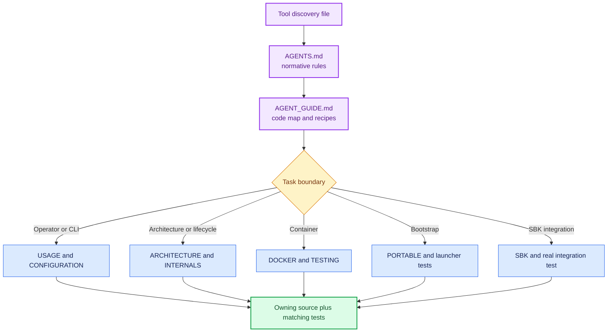
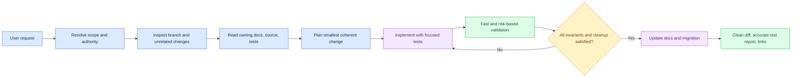

<!--
Copyright (c) KMG. All Rights Reserved.

Licensed under the Apache License, Version 2.0 (the "License");
you may not use this file except in compliance with the License.
You may obtain a copy of the License at

    http://www.apache.org/licenses/LICENSE-2.0
-->

# AI software agent guide

This repository supports Codex, Devin, Cursor, Windsurf, Copilot, Claude, Gemini, and other software agents through
one shared contract. Tool-specific files are discovery pointers; they do not redefine architecture or safety.

## Instruction discovery

| Agent/tool | Discovery file | Canonical next reads |
|---|---|---|
| Codex and AGENTS-aware tools | `AGENTS.md`, `CODEX.md` | `docs/AGENT_GUIDE.md`, owning guide |
| Devin | `DEVIN.md` | `AGENTS.md`, `docs/AGENT_GUIDE.md` |
| Cursor | `.cursor/rules/sbk-dashboard.mdc` | `AGENTS.md`, `docs/AGENT_GUIDE.md` |
| Windsurf | `.windsurf/rules/sbk-dashboard.md` | `AGENTS.md`, `docs/AGENT_GUIDE.md` |
| GitHub Copilot | `.github/copilot-instructions.md` | `AGENTS.md`, `docs/AGENT_GUIDE.md` |
| Claude | `CLAUDE.md` | `AGENTS.md`, `docs/AGENT_GUIDE.md` |
| Gemini | `GEMINI.md` | `AGENTS.md`, `docs/AGENT_GUIDE.md` |
| Any other agent | `AGENTS.md` | [Documentation center](README.md), [Development](DEVELOPMENT.md) |

## Required read order

Read selected instruction files completely. Do not infer behavior from generated caches, build outputs, runtime
data, or downloaded native tools.

## Project mental model

The Python application is a bounded control plane. It owns configuration, registration, reconciliation, status,
and lifecycle. Official Prometheus owns samples/retention, and official Grafana owns querying/rendering. One
application instance owns exactly one native pair. Endpoint isolation is a stable label/dashboard transformation,
not a process-per-endpoint design.

Never silently change these boundaries:

- authentication remains disabled;
- endpoint identity remains SHA-256 prefix of normalized lowercase `host:port`;
- Prometheus/Grafana remain native owned or explicitly attached processes;
- persistence stays atomic and Prometheus remains the TSDB;
- HTTP admission and every other resource remain bounded;
- Linux, macOS, Windows, x86-64, and ARM64 behavior stays explicit;
- the supported container retains the same single-control-plane/native-child architecture.

## Agent execution loop

### Before editing

1. Inspect `git status` and the requested base/branch.
2. Preserve unrelated user changes.
3. Identify the architectural owner from `AGENTS.md` and `INTERNALS.md`.
4. Read the matching tests before designing behavior.
5. Resolve ambiguity from local sources when safe; ask only when a choice materially changes scope or external state.

### While editing

- Prefer composition, immutable values, explicit lifecycle methods, and short lock scopes.
- Add focused success/failure/concurrency tests alongside behavior.
- Never use real operator data or default live-test ports.
- Keep external writes, publication, deletion, and credentials within explicit user authority.
- Do not weaken checksums, process identity, bounds, or rollback to make a test pass.
- Update public help, precedence reporting, examples, and migration notes when a contract changes.

### Before completion

Run the exact required commands from `AGENTS.md`, plus the risk-specific layer in `TESTING.md`. Confirm no child
process, listener, container, volume, benchmark file, or temporary data remains. Report what actually ran and call
out native platforms not exercised locally.

## Task routing

| User intent | Read first | Typical proof |
|---|---|---|
| Explain/review | Architecture and owning source | Evidence-backed report; no mutation |
| CLI/config change | Configuration, `config.py`, `contracts.py` | precedence, invalid values, help/startup output |
| Endpoint/API change | Internals, registry/web/provisioning | rollback, methods, bounds, URL/XSS safety |
| Lifecycle change | Architecture, processes/guardian | clean stop, crash, descendants, attached behavior |
| Dashboard change | SBK source JSON, provisioning | byte hash, 53 panels, selector scoping |
| Bootstrap/platform change | Portable, bootstrap/platform files | checksum, traversal, atomic promotion, native smoke |
| Container change | Docker, container contracts/smoke | Compose equivalence, both architectures, security scan |
| Documentation change | Documentation center and source truth | links, option coverage, Mermaid rendering |
| Release change | Migration, Testing, publishing guides | version sync, packages, artifacts, CI/tag agreement |

## High-risk review questions

1. Can this stop an unrelated process or remove user data?
2. Can any input, queue, response, thread, collection, retry, or log grow without a bound?
3. Can a crash or partial startup leave a child, socket, pipe, lock, or stale ownership record?
4. Can two endpoint mutations interleave and expose inconsistent registry/discovery/dashboard state?
5. Can a request header or registration value reach a URL, label, filename, HTML, or PromQL expression unsafely?
6. Does restart preserve identity, mappings, dashboards, TSDB history, and Grafana state?
7. Does behavior remain correct on POSIX and Windows ownership models?

## Handoff template

An agent completion should state:

- outcome and user-visible behavior;
- branch/commit/PR when requested;
- important files or architectural boundary changed;
- exact tests and live validations run;
- platforms not natively tested;
- remaining risks or follow-up, if any;
- working-tree and cleanup state.

Do not claim a task complete because code compiles or a global coverage percentage passed. Completion means the
requested outcome, its failure paths, documentation, and resource cleanup are all handled.
