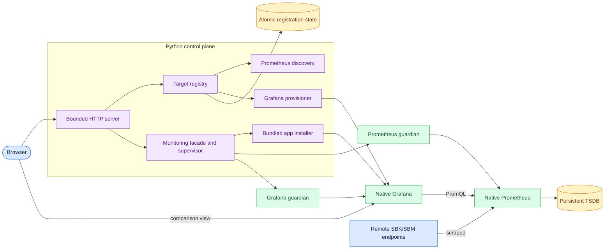
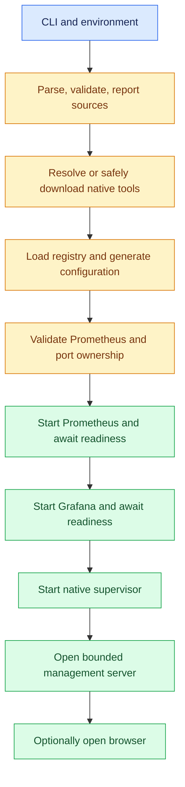
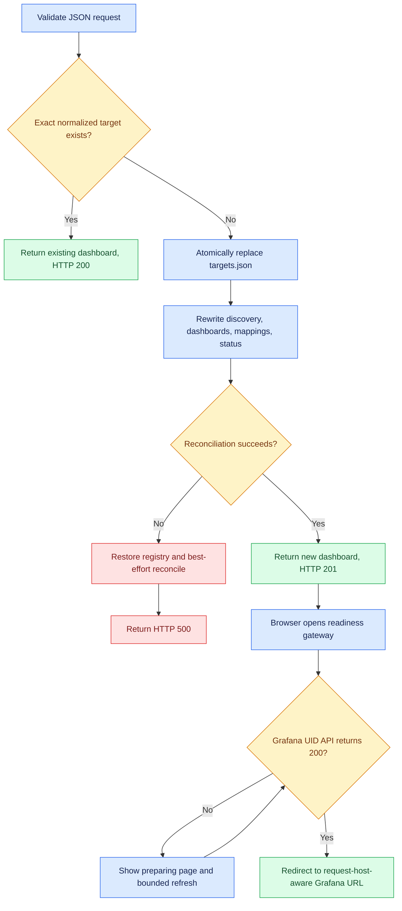
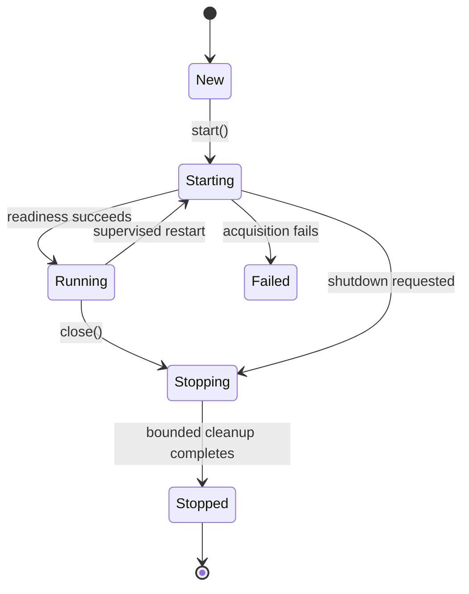

<!--
Copyright (c) KMG. All Rights Reserved.

Licensed under the Apache License, Version 2.0 (the "License");
you may not use this file except in compliance with the License.
You may obtain a copy of the License at

    http://www.apache.org/licenses/LICENSE-2.0
-->

# Architecture

This document defines system boundaries and design decisions. For operator procedures see
[`USAGE.md`](USAGE.md); for module-level call paths, locks, generated files, and failure handling see
[`INTERNALS.md`](INTERNALS.md).

## Runtime boundary

`sbk-dashboard` is a Python control plane around two official native servers. Prometheus and Grafana are not Python
modules and are never embedded in the Python interpreter.

There is one Prometheus process and one Grafana process per `sbk-dashboard` instance. There is not one native process
per endpoint. This is significantly less expensive and lets Prometheus query data across endpoints when required.

Operational values have explicit owners rather than scattered literals. `contracts.py` owns application defaults
and bounded environment settings, `comparison.py` owns the immutable comparison policy and normalized selections,
`endpoint_policy.py` owns endpoint identity and validation, `platforms.py` owns OS/architecture normalization, and
`layout.py` owns persistent path construction. The packaged
`native-artifacts.json` manifest is the sole built-in Prometheus/Grafana artifact catalog consumed by both direct
bootstrap and Docker builds. Dependency-free installer transfer/retry/lock bounds live in
`scripts/portable-bootstrap.properties`. Protocol syntax, schema versions, HTTP status codes, and intrinsic
lifecycle timings remain named local constants at their owning boundary rather than operator configuration. Ruff's
`PLR2004` rule rejects newly introduced unnamed comparison literals in production Python while tests may retain
explicit fixture values.

## Control-plane lifecycle

Startup is dependency ordered. The management port is not opened until the native monitoring stack is ready:

Endpoint registration is a serialized compensating transaction:

Deletion uses the same transaction in reverse. Request-specific Grafana hostnames are computed only while rendering
the response and are never persisted into endpoint identity or mappings.

Shutdown first closes management admission and its worker pool. It then signals and joins the supervisor, stops
Grafana before Prometheus, closes log pumps, removes owned PID records, and restores signal handlers. Attached
`-continue true` services are deliberately excluded from termination.

## Endpoint isolation

1. The user submits a host, port, optional display name, SBK/SBM kind, and metrics path.
2. Input is normalized and SHA-256 of lowercase `host:port` supplies a stable 16-hex-character endpoint ID.
3. An exact normalized repeat returns the existing registration without rewriting state or creating another
   dashboard; conflicting metadata for the same identity is rejected.
4. `targets.json` is atomically replaced for a new identity.
5. Prometheus file discovery receives the address, metrics path, and `sbk_endpoint_id` label.
   The stable registered name and SBK/SBM kind are attached as `sbk_dashboard_name` and `sbk_kind` for readable,
   endpoint-distinct comparison legends.
6. The canonical dashboard is deep-copied without changing its panels or visualization settings.
7. Every `SBK_*` PromQL selector receives the endpoint label.
8. Grafana's file provisioner observes `sbk-<endpoint-id>.json` and exposes `/d/sbk-<endpoint-id>/`.
9. `dashboard-mappings.json` records the deterministic relationship.

Grafana health and dashboard readiness are different states: `/api/health` can be ready while the file provider has
not imported a newly written UID. The landing page therefore links through `GET /dashboards/<id>`. Each request makes
one one-second-bounded loopback UID probe. A missing UID returns a small `no-store` preparing page whose browser
refresh follows the centrally bounded 37.5-second backoff; a ready UID produces an immediate HTTP 302 to the normal
request-host-aware Grafana URL. No HTTP worker sleeps between attempts, direct `dashboardUrl` API compatibility is
preserved, and an exhausted sequence offers explicit retry instead of exposing Grafana's transient 404 page.

The comparison API normalizes one endpoint or up to the configured maximum of unique registered endpoint IDs by
sorting them and derives
`sbk-comparison-<16-hex>` from the SHA-256 digest of that set. It atomically provisions a canonical-dashboard
descriptor; the same set in any order therefore reuses the same Grafana UID and file. The descriptor remains a
classic single-range fallback and is also the server-owned input to the bundled `sbkcomparison-app`. Grafana's
file provider imports new descriptors asynchronously. The landing page therefore opens the comparison-specific
readiness gateway, which validates the endpoint set and redirects to the app only after that UID returns HTTP 200.
The app retains bounded exponential readiness checks as defense in depth. One
endpoint produces 2–8 deterministic browser-only time lanes; multiple endpoints retain one lane per target. The
multi-target maximum defaults to 4 and is bounded to 2–32 through validated CLI/environment configuration. Lane
count and range selections live only in validated URL state, so this mode does not duplicate registrations,
descriptors, discovery entries, or Prometheus series.

The frontend-only Grafana app uses Grafana Scenes to build one query scene per distinct time range after the view
opens. Every target starts in one global live scene. Detaching a target creates or joins an independent relative-live
or fixed historical scene, while reattaching it returns to global time. Each scene replaces the descriptor's
`${sbk_endpoints:regex}` token with only its assigned fixed-hex endpoint IDs. This preserves endpoint isolation while
allowing different ranges without duplicating persisted dashboards. Four time groups and a 31-day fixed range bound
query amplification. Each scene retains the canonical row hierarchy, collapse state, 24-column coordinates, and
grid heights; row containers are not flattened into an unstructured panel list. Generated descriptors form a
bounded 128-entry cache; reconciliation removes cached
comparisons containing deleted registrations.

The host is the same uniqueness component for DNS, IPv4, and IPv6 names; changing only the port creates a distinct
endpoint and dashboard.

Dashboard URLs are resolved at API response time. With the default Grafana URL, the server takes the validated
hostname or IP address from the direct HTTP `Host` header and combines it with the Grafana scheme, port, and dashboard
UID. Consequently a main page opened through a public IP, loopback address, DNS name, or IPv6 literal links to Grafana
through that same address. `-grafana-url` is an authoritative static override for reverse-proxy and TLS deployments.

The landing page derives its total, up, and down endpoint counters from the same bounded `/api/targets` response used
for the endpoint inventory. Counts refresh with the inventory every ten seconds and after registration, deletion, or
manual refresh. A newly reconciled endpoint is pending until a successful Prometheus target refresh. If that response
does not contain the registered endpoint, the endpoint is down rather than remaining pending indefinitely. Pending
and unknown endpoints remain included in the total but are not misclassified as down.

The HTML response inserts a bounded SHA-256 content fingerprint of the final substituted JavaScript plus stylesheet
bytes into both asset URLs, and every HTML, JavaScript, and stylesheet response uses `Cache-Control: no-cache`.
Changes to server-owned UI policy values therefore invalidate the URL even when the raw `app.js` resource is
unchanged. The new URL bypasses an earlier unexpired cached asset immediately, while revalidation protects subsequent
loads. A deployment cannot combine a new document with an older control script, which would leave newly introduced
UI state at its static initial value.

## Persistence and retention

The Python control plane persists registrations and generated configuration using temporary files, `fsync`, and
atomic replacement. On POSIX it also synchronizes the parent directory after replacement so the renamed directory
entry is crash-durable. It does not store samples itself.

Persisted endpoint fields are revalidated on every load. The normalized host and port must reproduce the stored
stable endpoint ID before that ID can be used in Prometheus labels, Grafana UIDs, or generated filenames.

Prometheus stores all samples under `monitoring/prometheus/data`. The `-retention` value is passed as
`--storage.tsdb.retention.time=<days>d`; Prometheus performs block cleanup in the background. Its default is seven
days. A remote endpoint being down does not erase previously ingested samples.

Grafana stores its SQLite database and state under `monitoring/grafana/data`. Generated dashboards are declarative
files, so they are restored deterministically from endpoint registrations.

Corrupt or missing historical TSDB data is handled by Prometheus's own startup and recovery behavior. A target
scrape error becomes a non-fatal `down` state and does not prevent the management server or other dashboards from
operating. Failure of Prometheus itself to start is fatal because the dashboard would have no metrics engine.

Generated Prometheus configuration is checked with the adjacent official `promtool` before native services start
when that executable is available. Downloaded tool archives are checksum-pinned and bounded by the configured
`download.max.bytes` value even when a server omits `Content-Length`.

## Concurrency

- The HTTP Active Object uses a fixed worker pool (eight by default) and a bounded admission semaphore/queue (64 by
  default). Work beyond that capacity receives HTTP 503 without creating a thread or queued future.
- Accepted client sockets have a 15-second timeout. Request bodies are bounded at 64 KiB and Prometheus target-health
  responses at 4 MiB by default.
- Registry mutations, status snapshots, discovery writes, and provisioning reconciliations are protected by locks.
- Status publication uses immutable tuple/dictionary replacement, so readers never observe partially reconciled
  state. Each reconciliation advances a generation; a Prometheus response captured for an older generation is
  discarded rather than overwriting a new endpoint's pending state. The map is capped by the endpoint limit.
- One supervisor thread checks both native services and refreshes target state. It sleeps on a shutdown event, so
  shutdown interrupts the wait without polling delay.
- Recent browser activity uses two fixed-capacity LRU maps under one short-held lock. Landing heartbeats expire after
  two minutes; Grafana opens initiated by the landing page expire after five minutes. Only opaque per-tab IDs and
  monotonic timestamps are retained, with no persistence, IP history, extra worker, or native-server request.
- The composition-root thread waits on the shutdown signal with the configured status interval and logs one
  immutable, non-networked summary of HTTP lifecycle, monitoring lifecycle, native health, and endpoint-state counts.
  The default interval is 60 seconds and is bounded between one second and one day.
- After HTTP readiness, the composition root makes one best-effort request to the platform default graphical browser
  for the first local management URL, preferring a new tab. SSH, CI, Windows service, and headless Unix sessions are
  skipped before invoking browser integration; failure is non-fatal and creates no background worker.
- Target refresh has a bounded configurable timeout. Prometheus and Grafana have separate bounded startup deadlines
  because Grafana initialization can be materially slower on constrained hosts.
- Each owned service has one 64 KiB chunked log-pump thread. Pipes are continuously drained, logs are bounded and
  rotated, and pumps are joined and descriptors closed at shutdown or restart. Transient log open/write/rotation
  failures retry with exponential backoff capped at five minutes without retaining output in memory. A pump that
  remains alive after its source pipe is closed makes lifecycle cleanup fail explicitly, preventing a replacement
  process from racing an old worker for the same log path.
- Prometheus independently schedules and executes endpoint scrapes.
- Grafana independently handles browser sessions and queries.

Python's interpreter lock is not a capacity bottleneck here: the control plane is mostly short filesystem and HTTP
operations, while ingestion, storage, querying, and rendering execute in the native servers.

## Native lifecycle safety

The bootstrap chooses one of six OS/CPU definitions and requires HTTPS plus a pinned SHA-256. It downloads to a
partial file, displays progress, flushes it, atomically promotes it, validates safe archive entries, and installs to
a temporary directory before promotion.

With `-continue false`, listener discovery uses `psutil`. Both requested ports are inspected and all owners are
validated before any process is stopped. Persisted PID, creation time, executable, and port provide a safe fallback
where listener ownership is unavailable. With `-continue true`, health endpoints are checked and compatible
services are attached rather than owned.

Each stack and component follows a validated lifecycle state machine:

Illegal transitions fail immediately. Construction has no process side effects; `start()` acquires resources and
`close()` is idempotent. Startup failure performs reverse-order cleanup. Shutdown first stops admission, signals the
supervisor, joins it, and then stops Grafana and Prometheus in reverse dependency order.

Each owned native process is launched by a dedicated lightweight Python guardian in its own POSIX session or Windows
process group. On Windows, the guardian also creates a Job Object with
`JOB_OBJECT_LIMIT_KILL_ON_JOB_CLOSE`, starts the native process suspended, assigns it to the job, and resumes it only
after assignment succeeds. Later native descendants inherit that job, and Windows kills the complete tree if the
guardian handle closes. The native PID, executable, creation time, and port are persisted to defend against PID
reuse. Normal termination addresses the guardian cleanup domain and captured native descendant tree, first
gracefully and then forcibly after a bounded timeout. Descendants are enumerated again immediately before forced
termination to reduce the Windows child-spawn race where process-group signals are unavailable.

The guardian independently validates the control-plane PID and creation time four times per second. If the main
process disappears without running cleanup—including `SIGKILL` on POSIX or direct process termination on Windows—it
terminates the native process and all descendants, removes its transient handshake file, and exits. The handshake is
created before startup is considered successful, closing the launch/registration race. A transient Windows sharing
violation while reading the atomically replaced handshake is retried only within the existing bounded startup
deadline; persistent denial reports the last read error. The main supervisor also validates the native PID and
creation time directly and cleans the native tree if a guardian is killed unexpectedly.
Attached `-continue true` services have no guardian and remain outside application ownership.

The supervisor restarts an exited owned process, or one that remains unhealthy for three checks. Failed restarts use
exponential backoff capped at 60 seconds. Attached processes are health-checked but never restarted or terminated.
Only processes launched by the current invocation are owned during normal shutdown.

Prometheus binds to `127.0.0.1` by default because its only application consumer is Grafana. Management and Grafana
default to `0.0.0.0` to preserve remote dashboard access. Each address is independently configurable; bind addresses
control listeners, while `-grafana-url` and validated request hosts control browser-visible URLs. Shared canonical
host parsing applies the same IP/DNS rules to configuration and registration boundaries. Port ownership fallback
probes resolve configured hostnames through `getaddrinfo`, check each resulting address family, and check a bounded
set of local interface addresses for wildcard listeners before requiring a successful bind and listen. POSIX probes
enable address reuse so `TIME_WAIT` does not block restart. Windows first requires exclusive ownership and permits a
reusable fallback only when `psutil` reports exclusively `TIME_WAIT` sockets for the port and family.
IPv6 link-local interface addresses are excluded from wildcard connect preflights because an unscoped zone address
is not a portable socket endpoint; the authoritative bind/listen probe still covers wildcard listener conflicts.

## Object-oriented design

The implementation uses patterns where they enforce runtime invariants:

- **Facade:** `ManagedMonitoringStack` exposes reconciliation, status, health, start, and close while hiding two
  service lifecycles and generated configuration.
- **State:** `LifecycleController` validates every stack, HTTP server, and native-service transition.
- **Command:** immutable `NativeServiceSpec` objects supply platform-resolved launch commands and resource policy.
- **Strategy:** `HealthProbe` separates readiness policy from native process ownership and makes supervision
  independently testable.
- **Supervisor:** one bounded control loop observes services, applies thresholds/backoff, and reconciles status.
- **Process guardian:** one bounded helper per owned native service enforces parent-death cleanup even when the
  control plane cannot execute signal handlers.
- **Repository:** `TargetRegistry` and `ManagedProcessRegistry` own validation and atomic persistence.
- **Value Object:** immutable `ComparisonPolicy` and `ComparisonSelection` objects keep bounds, duplicate handling,
  normalization, descriptor policy, and deterministic identity consistent across HTTP and provisioning boundaries.
- **Compensating transaction:** target mutations are serialized across persistence and monitoring reconciliation;
  any reconciliation exception restores the prior registration snapshot before the API reports failure.
- **Active Object / Bulkhead:** the HTTP executor isolates request concurrency with fixed workers and backpressure.
- **RAII-style context ownership:** every response, archive, file, socket, process pipe, thread pool, and child process
  has an explicit close/join path.

These patterns are composition-based. There is no inheritance hierarchy for its own sake; immutable dataclasses
describe state and policies, while lifecycle-owning objects encapsulate mutation behind locks.

## Resource bounds and 24/7 operation

Python-side growth is bounded by the endpoint limit, fixed HTTP workers/queue, maximum request/health payloads, one
status per endpoint, two 10,000-entry recent-client maps, two child descriptors, and fixed log generations. Repeated
warning text is emitted only when the failure changes, avoiding identical five-second log spam. Endpoint
reconciliation serializes one dashboard clone at a time rather than retaining all cloned JSON trees.

Prometheus TSDB memory/disk use and Grafana query memory remain native-service concerns. Time retention constrains
Prometheus history, while operators must size the VM for metric cardinality and dashboard query load. A host service
manager should supervise the Python process; its internal supervisor is responsible for its owned native children.

The Python control plane uses standard logging with timestamps and severity levels. Native child output remains
separately drained and rotated so neither Python logging nor a blocked process pipe can grow without bound.
Periodic status is a single concise INFO record; it reads only already-published endpoint/native snapshots and the
bounded recent-client maps. It does not add another thread, native health request, retry loop, or persisted history.
A snapshot/reporting error emits a warning and does not terminate the server.

Prometheus and Grafana remain direct native servers rather than Python-proxied routes. Consequently the control plane
does not claim visibility into users who directly bookmark Grafana or call Prometheus. `grafana_opens_5m` means recent
dashboard opens initiated from the landing page, not continuously active Grafana sessions.

## Cross-platform strategy

All control-plane code is common across Linux, macOS, and Windows. Platform differences are limited to:

- normalized OS/CPU archive selection;
- TAR.GZ versus ZIP extraction;
- `.exe` executable discovery;
- native process and socket information supplied by `psutil`;
- the platform's venv activation command; and
- POSIX process sessions/signals versus Windows process groups and `Ctrl+Break` for the optional background launcher.

The installed `sbk-dashboard` console entry point is generated by Python packaging on every platform. The same
wheel can be installed in a venv or Conda environment; Prometheus and Grafana archives remain platform-specific.
The repository launchers reuse an active venv/Conda environment, otherwise use or create an immutable private venv
under `SBK_DASHBOARD_HOME/app/<version>/<platform>/<source-fingerprint>`. When Python 3.10+ is unavailable, a
Python-free shell/PowerShell stage zero downloads the exact-version standalone release into
`SBK_DASHBOARD_HOME/distributions`, verifies its published SHA-256, safely extracts it, and atomically promotes it. An exclusive,
bounded installation lock protects a sibling staging build and atomic promotion, and two recent source fingerprints
are retained per version/platform. Shared pip/native caches, default application data, launcher state, and logs stay
under the dedicated portable home. Preparation completes before launcher acquisition and passes an explicit
fresh/reused/repaired state plus environment kind/location into the OS-neutral launcher diagnostic. Launchers keep one
port-plus-mode-plus-PID-plus-creation-time identity per script-started instance. Help
and version requests bypass ownership checks. Different management ports
have independent state and logs; the stop launcher targets one port when supplied or every recorded instance by
default. Each instance still owns a distinct control plane and native-service pair. Non-default management ports
derive isolated default data roots, and unspecified occupied native default ports receive bounded deterministic
fallback selection. Explicit CLI/environment ports and data paths remain authoritative. The default launcher runs
the control plane in its own foreground process so logs and
signals stay attached to the console. Frozen background application/watcher children re-enter explicit internal
executable modes, so lifecycle management never depends on a system Python. On Windows, the separate stop script writes an identity-specific request that
a bounded foreground monitor converts to an in-process interrupt; interactive `Ctrl+C`/`Ctrl+Break` remain native
console signals. This avoids unreliable cross-process console event forwarding while retaining the application's
native child guardians. The optional background launcher uses a small log-draining supervisor that
bounds control-plane logs and forwards shutdown to the normal application lifecycle; it does not replace
native-service ownership or the production recommendation to use a host service manager. A separate minimal
parent-death watcher observes the background supervisor's PID and creation time. If the supervisor is killed, the
watcher signals the isolated dashboard process group, waits for normal cleanup, and then forcefully removes only
captured descendants that exceed the shutdown bound. The shared stop launcher addresses either mode solely through
the port-specific, creation-time-guarded ownership records. Background startup uses two bounded handshakes: the start command first
records ownership and authorizes acquisition, so the supervisor cannot launch the application or watcher early; the
supervisor then confirms that the application survived its immediate startup window and that the watcher exists
before the start command reports success.

Native shutdown first signals each owned isolated cleanup domain and waits for graceful exit. It then force-kills
surviving descendants, checks the final wait result, and treats any survivor as an incomplete shutdown error. On
POSIX, a final group kill also covers a descendant created after the initial process-tree snapshot. On Windows,
closing the guardian's Job Object is the final kernel-enforced bound. Attached services remain excluded from
termination.

Native port selection precedes tool bootstrap. An available unspecified port retains its built-in default; an
occupied unspecified default receives a bounded deterministic fallback. CLI/environment ports are authoritative
and must be available and distinct. They are checked once during selection and again atomically with existing-owner
inspection before either service is replaced, so a late listener produces a detailed startup failure and is never
terminated. `-continue true` deliberately bypasses availability selection because those listeners must exist and
pass compatibility health checks before attachment.

## Authentication and container boundary

Authentication is deliberately disabled. `-auth true` is rejected and reserved for future development. The server
must therefore be protected by network controls or a reverse proxy when exposed outside a trusted environment.

The optional Linux container is a delivery boundary, not a distributed redesign. One container runs `tini`, the
Python control plane, two guardians, one native Prometheus process, and one native Grafana process. The Python
process retains configuration, reconciliation, supervision, and cleanup ownership. Prometheus remains loopback-only
inside the container; only management port 9721 and Grafana port 3000 are published to the host.

Production Compose selects the prebuilt, pinned Docker Hub image and never builds or downloads native distributions
at container startup. `compose.dev.yaml` is an explicit source-build override that changes only image acquisition.
Both paths execute the same Dockerfile runtime stage, entry point, process topology, configuration, volume, and
network policy. Independent cached Prometheus and Grafana build stages reduce build latency without splitting
runtime services or transferring lifecycle ownership away from the Python process.

The image runs as UID/GID 10001, uses a digest-pinned official Python 3.12 slim image on the current Debian stable
generation, embeds checksum-pinned official AMD64 or ARM64 Linux native tools as immutable root-owned content, and
stores the entire writable data root in `/var/lib/sbk-dashboard`. Compose makes the remaining root filesystem
read-only and supplies only a bounded temporary `/tmp`. A persistent volume therefore preserves endpoint registrations,
generated mappings/dashboards, Prometheus TSDB history, Grafana state, and process logs across replacement. `tini`
forwards the image's `SIGTERM` stop signal and reaps children, while the existing guardians retain hard-parent-death
protection. Compose grants 30 seconds for ordered cleanup; after that bound the container runtime kills every
remaining process in the container PID namespace/cgroup, preventing a host orphan.

Compose publishes management and Grafana on host loopback by default. Network-wide publication is an explicit
operator choice because authentication remains disabled. Base Compose bounds PIDs and rotates engine logs;
`compose.resources.yaml` is an optional overlay that adds CPU and memory limits without changing topology or
imposing one capacity profile on every deployment.

Container builds hash-pin Python build/runtime inputs, exact-lock direct final-image OS packages, retain that package
inventory, and verify the installed package version against the OCI version argument. Native AMD64 and ARM64 jobs
run identical restore/lifecycle smoke tests; AMD64 is scanned for fixed high/critical vulnerabilities on changes and
weekly. Tagged release builds attach SBOM and provenance attestations and keylessly sign the published
multi-architecture digest through GitHub OIDC.

Compose adds `host.docker.internal:host-gateway`, allowing container Prometheus to scrape an SBK exporter on the
Docker host, and the image supplies that hostname as the landing form default. Direct host execution retains
`127.0.0.1` as its form default. The validated default is injected while serving the shared HTML asset, so container
delivery does not fork the UI or registration behavior. Compose also enables IPv6 on its user-defined bridge.
Remote exporters use normal routable DNS, IPv4, or IPv6
addresses; outbound access follows the Docker host's routes and firewall policy. Request-derived Grafana URLs continue
to use the hostname by which the browser reached port 9721 and retain Grafana port 3000, so localhost, public IP, and
DNS access remain consistent without persisting client-specific routing.

Docker Desktop can run this Linux image on macOS and Windows. That is distinct from the directly installed native
macOS/Windows Python application and native tool archives. Kubernetes and a split-service Compose topology remain
outside the supported architecture.
