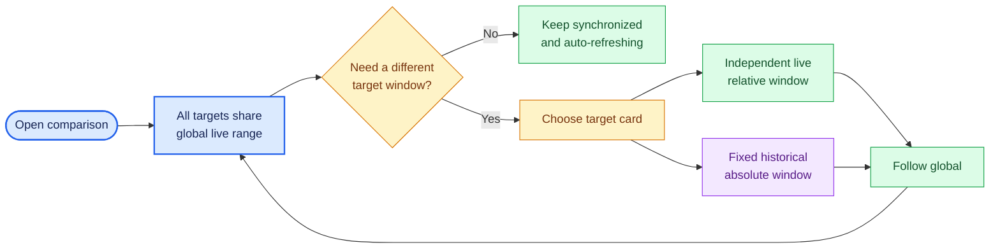
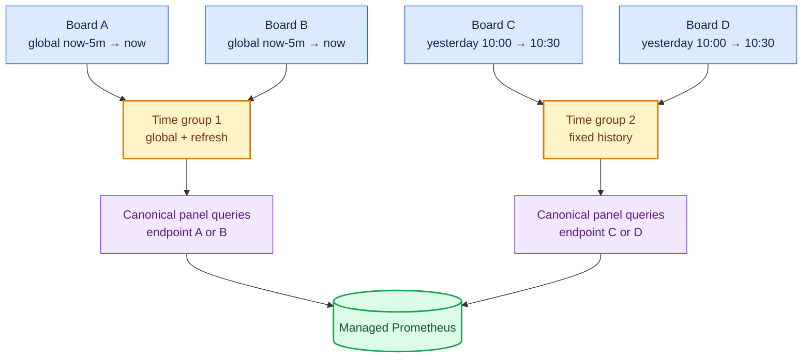

<!--
Copyright (c) KMG. All Rights Reserved.

Licensed under the Apache License, Version 2.0 (the "License");
you may not use this file except in compliance with the License.
You may obtain a copy of the License at

    http://www.apache.org/licenses/LICENSE-2.0
-->

# Compare SBK and SBM results

SBK Dashboard supports two additive comparison modes in one Grafana app:

- select one registered target to compare that dashboard across two or more time ranges; or
- select 2–8 registered SBK or SBM targets to compare different dashboards as before.

Every lane initially follows one global live time range. After the comparison opens, detach only the lane whose time
window must differ. Existing multi-target comparison URLs and behavior remain compatible.

## Use the comparison view

1. Register every exporter on the SBK Dashboard landing page.
2. Select one target and choose **Compare time ranges**, or select 2–8 targets and choose **Compare selected**.
3. Use the Grafana time picker in **Global live range** to inspect all targets together.
4. In a target card, select one of these modes:
   - **Follow global live range** — stays synchronized with the global picker and refreshes with incoming samples.
   - **Independent live range** — uses its own relative window, such as the last 15 minutes, and continues refreshing.
   - **Fixed historical range** — uses explicit local date/time values and does not move with wall-clock time.
5. Choose **Follow global** to attach that target to the global range again.

For a single target, the app creates **Range 1** and **Range 2** controls. Use **Add time range** to create another
lane, up to eight, or **Remove last range** to return toward the two-lane minimum. The lanes all query the same
endpoint-scoped dashboard; they do not duplicate registrations, Prometheus targets, or descriptor files.

For example, keep `Board A` on **Follow global live range**, set the global picker to `Last 5 minutes`, and change
`Board B` to a fixed range covering yesterday's benchmark. Board A continues to show incoming values while Board B
shows the retained historical samples. If both targets should be live again, choose **Follow global** for Board B.



## Range grouping and resource bounds

Targets with exactly the same mode and range share one Grafana Scenes query group. Two targets following global time
therefore execute the canonical panel queries once for their combined endpoint selector, not twice. Moving one target
to a different range creates a second group. Moving a third target to that same range reuses the second group.

The comparison is deliberately bounded:

- one endpoint with 2–8 time lanes, or 2–8 distinct endpoints;
- at most four distinct time groups;
- at most 31 days in one fixed historical range; and
- at most 128 cached comparison descriptors.

These are runtime policy values emitted in the server-owned comparison descriptor. Invalid or oversized URL state
falls back to the global range. Prometheus retention still determines whether samples exist; the default retention is
seven days, so a valid 31-day query can legitimately contain no data outside retained history.



## Bookmark and API behavior

The selected endpoint set determines the stable `sbk-comparison-<16-hex>` ID, including a one-endpoint set.
Selection order does not matter, and
requesting the same set again returns the same ID and URL. Time choices are browser state encoded in the Grafana app
URL; changing time ranges does not create another dashboard file or mutate endpoint registrations. For one target,
the URL also stores the bounded lane count. Existing multi-target bookmarks retain their original endpoint-keyed
time state.

Each descriptor's internal Grafana title includes that ID's digest. The title is intentionally unique even though
the comparison app supplies the visible heading: Grafana rejects file-provider updates when different dashboard
files in one folder have duplicate titles.

```bash
curl --fail --request POST http://127.0.0.1:9721/api/comparison-dashboard \
  --header 'Content-Type: application/json' \
  --data '{"targetIds":["1111111111111111","2222222222222222"]}'
```

The response contains:

```json
{
  "dashboardId": "sbk-comparison-0123456789abcdef",
  "dashboardUrl": "http://127.0.0.1:3000/a/kmg-sbkcomparison-app?comparisonUid=sbk-comparison-0123456789abcdef",
  "classicDashboardUrl": "http://127.0.0.1:3000/d/sbk-comparison-0123456789abcdef/?var-sbk_endpoints=..."
}
```

Use `dashboardUrl` for independent ranges. `classicDashboardUrl` is a compatibility fallback: it renders the exact
provisioned canonical dashboard with one Grafana-wide range and cannot assign different ranges to individual targets.
For a one-target request, that fallback is the ordinary single-range rendering, not a multi-range view.

## Implementation

The Python control plane remains the authority for registrations, endpoint identity, dashboard descriptors, and
limits. It packages a prebuilt frontend-only Grafana app and atomically installs it into the managed Grafana data
directory before Grafana starts. Grafana provisions the app for the anonymous Viewer organization. No Node.js
runtime, npm install, additional process, service, port, or network download is required in source, portable, wheel,
or container deployments.

The app loads only a validated `sbk-comparison-*` descriptor through Grafana's same-origin dashboard API. Grafana
imports a newly written descriptor asynchronously, so the app uses 11 bounded exponential readiness checks over
37.5 seconds. This covers the observed Grafana 13 file-provider cycle without rapid polling. For one target it
creates deterministic `Range N` browser lanes; for multiple targets it retains one lane per endpoint. It converts the
canonical dashboard to Grafana Scenes, preserving its six named rows, expanded/collapsed state, exact 24-column
panel positions, and panel heights in every time group. It replaces the descriptor's endpoint-variable token with
the IDs assigned to each time group and uses the already provisioned Prometheus datasource. Endpoint IDs are fixed
lowercase hex, and the descriptor itself is created only from registered targets.

```mermaid
sequenceDiagram
    participant U as Browser
    participant C as Python control plane
    participant G as Managed Grafana + app
    participant P as Managed Prometheus
    U->>C: POST /api/comparison-dashboard (target IDs)
    C->>C: Validate, sort, hash, atomically write descriptor
    C-->>U: App URL + classic fallback URL
    U->>G: Open comparison app
    G->>G: Provision descriptor; validate policy/targets
    U->>G: Detach Board B to historical range
    G->>G: Group targets by exact range
    par Global live group
        G->>P: Canonical queries scoped to live target IDs
    and Historical group
        G->>P: Canonical queries scoped to historical target IDs
    end
    P-->>G: Time series for each requested range
    G-->>U: Side-by-side grouped panels
```

## Important semantics

- Ranges use absolute wall-clock timestamps. This feature does not shift or normalize separate runs to a common
  elapsed-time origin.
- `datetime-local` values use the browser's local time zone; Grafana and Prometheus exchange absolute timestamps.
- A live exporter can be compared with retained history. A stopped exporter can still show retained samples.
- Two lanes may intentionally use the same range. Identical selections share one bounded query group until one lane
  is changed.
- Removing a registered endpoint invalidates cached comparisons containing it during reconciliation.
- The app is bundled but intentionally unsigned. The generated Grafana configuration permits only the exact
  `kmg-sbkcomparison-app` ID; do not broaden the unsigned-plugin allowlist.

## Developer validation

The plugin source is in `grafana-plugin/`; the committed production bundle is under
`src/sbk_dashboard/resources/grafana/plugins/kmg-sbkcomparison-app/`. Node.js is a build/test dependency only.
The source descriptor retains the application release version. The production build adds a deterministic
`-build.<sha256-prefix>` suffix to the packaged plugin version from all frontend sources and build inputs. Grafana
uses that version in the browser module URL, so rebuilding this feature within the same application release cannot
reuse an older descriptor loader or panel layout from the browser cache.

```bash
npm ci --prefix grafana-plugin
npm run typecheck --prefix grafana-plugin
npm test --prefix grafana-plugin
npm run build --prefix grafana-plugin
git diff --exit-code -- src/sbk_dashboard/resources/grafana/plugins
```

Also run the Python suite, package build, and container smoke test from [Testing](TESTING.md). A live check must
verify the app route and module return HTTP 200, the provisioned app is enabled, all managed listeners exit on
shutdown, and the classic fallback still renders.
