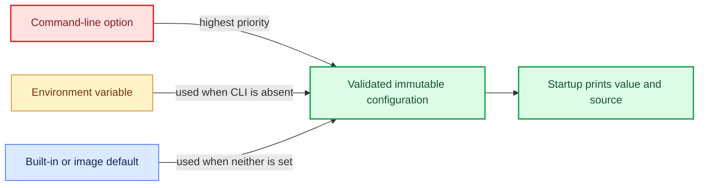

<!--
Copyright (c) KMG. All Rights Reserved.

Licensed under the Apache License, Version 2.0 (the "License");
you may not use this file except in compliance with the License.
You may obtain a copy of the License at

    http://www.apache.org/licenses/LICENSE-2.0
-->

# Configuration reference

This is the complete operator-facing configuration reference. The executable source of truth is
`src/sbk_dashboard/config.py`; numeric defaults and bounds live in `src/sbk_dashboard/contracts.py`.

## Precedence



CLI options override their corresponding environment variable. Environment variables override built-in defaults.
Operational-only variables without a CLI form are selected directly from the environment. Blank environment
values are treated as unset.

## Command-line options

Run `sbk-dashboard --help` to obtain the installed version's generated help.

| Option | Value/default | Meaning and example |
|---|---|---|
| `-h`, `--help` | none | Print generated help without starting services. |
| `-v`, `--version` | none | Print the application version and exit. |
| `-port`, `--port` | TCP port; `9721` | Management UI/API listener. Example: `-port 19721`. |
| `-bind` | IP/DNS; `0.0.0.0` | Management bind address. Use `127.0.0.1` for local-only access. |
| `-auth` | `false` only | Reserved. `-auth true` deliberately fails because authentication is not implemented. |
| `-continue` | `true` or `false`; `false` | Attach to healthy compatible services instead of owning them. Attached services are never stopped or restarted. |
| `-data`, `--data-dir` | directory | Persistent registrations, native configuration, logs, Grafana state, and Prometheus TSDB. |
| `-retention`, `--retention-days` | positive days; `7` | Prometheus time retention. Example: `-retention 30`. |
| `-prometheus-bin` | executable path | Use this Prometheus binary instead of PATH/cache/download resolution. |
| `-prometheus-port` | TCP port; `9090` | Explicit values are authoritative and must be free (or compatible with `-continue true`). Omitted busy default gets a bounded fallback. |
| `-prometheus-bind` | IP/DNS; `127.0.0.1` | Prometheus listener. Keep loopback unless remote Prometheus access is intentional. |
| `-grafana-home` | directory | Grafana distribution home containing `bin/grafana` or `bin/grafana.exe`. |
| `-grafana-port` | TCP port; `3000` | Explicit values are authoritative; omitted busy default gets a bounded fallback. |
| `-grafana-bind` | IP/DNS; `0.0.0.0` | Grafana listener address. |
| `-grafana-url` | absolute HTTP(S) URL | Browser-visible Grafana base URL for TLS, proxy, DNS, or host-port mapping. |
| `-log-level` | `DEBUG`, `INFO`, `WARNING`, `ERROR`, `CRITICAL`; `INFO` | Python control-plane log threshold. |
| `-status-seconds` | `1..86400`; `60` | Periodic concise runtime status interval. |
| `-monitoring-properties` | file | Compatibility override for native artifact URLs, checksums, paths, and limits. |

Single-dash long options are retained for compatibility. `--port`, `--data-dir`, and `--retention-days` are the
available double-dash aliases.

## Application environment variables

| Variable | Default/bounds | Purpose |
|---|---|---|
| `SBK_DASHBOARD_HOME` | `~/.sbk-dashboard` | Portable runtime, cache, launcher, and default data root. Set before first start. |
| `SBK_DASHBOARD_DATA_DIR` | derived from home/port | Fallback for `-data`; changes application data, not portable caches. |
| `SBK_DASHBOARD_BIND` | `0.0.0.0` | Fallback for `-bind`. |
| `SBK_DASHBOARD_DISK_RETENTION_DAYS` | `7`, positive | Fallback for `-retention`. |
| `SBK_DASHBOARD_SCRAPE_SECONDS` | `5`, positive | Prometheus scrape and evaluation interval. |
| `SBK_DASHBOARD_PROMETHEUS_BIN` | `prometheus` | Fallback for `-prometheus-bin`. |
| `SBK_DASHBOARD_PROMETHEUS_PORT` | `9090` | Fallback for `-prometheus-port`; an occupied supplied value fails. |
| `SBK_DASHBOARD_PROMETHEUS_BIND` | `127.0.0.1` | Fallback for `-prometheus-bind`. |
| `SBK_DASHBOARD_GRAFANA_HOME` | platform system path | Fallback for `-grafana-home`. |
| `SBK_DASHBOARD_GRAFANA_PORT` | `3000` | Fallback for `-grafana-port`; an occupied supplied value fails. |
| `SBK_DASHBOARD_GRAFANA_BIND` | `0.0.0.0` | Fallback for `-grafana-bind`. |
| `SBK_DASHBOARD_GRAFANA_URL` | `http://localhost:<grafana-port>` | Fallback for `-grafana-url`; authoritative for public links. |
| `SBK_DASHBOARD_LOG_LEVEL` | `INFO` | Fallback for `-log-level`. |
| `SBK_DASHBOARD_STATUS_SECONDS` | `60`; `1..86400` | Fallback for `-status-seconds`. |
| `SBK_DASHBOARD_DEFAULT_TARGET_HOST` | native `127.0.0.1`; image `host.docker.internal` | Initial endpoint host shown by the landing page. |
| `SBK_DASHBOARD_MONITORING_PROPERTIES` | packaged manifest | External artifact-properties override. |
| `SBK_DASHBOARD_HTTP_WORKERS` | `8`; `1..128` | Fixed management HTTP worker count. |
| `SBK_DASHBOARD_HTTP_QUEUE` | `64`; `0..10000` | Requests admitted beyond active workers before HTTP 503. |
| `SBK_DASHBOARD_REQUEST_TIMEOUT_SECONDS` | `15`; `1..300` | Accepted client socket timeout. |
| `SBK_DASHBOARD_HEALTH_RESPONSE_MB` | `4`; `1..64` | Maximum Prometheus target-health response size. |
| `SBK_DASHBOARD_SUPERVISOR_SECONDS` | `5`; `1..60` | Native health/restart and target-refresh interval. |
| `SBK_DASHBOARD_PROCESS_LOG_MB` | `10`; `1..1024` | Maximum native console log generation size. |
| `SBK_DASHBOARD_PROCESS_LOG_BACKUPS` | `3`; `0..100` | Rotated native console log generations. |
| `SBK_DASHBOARD_MAX_TARGETS` | `10000`; `1..1000000` | Maximum persisted endpoint registrations. |
| `SBK_DASHBOARD_TARGET_HEALTH_TIMEOUT_SECONDS` | `4`; `1..300` | Prometheus active-target request timeout. |
| `SBK_DASHBOARD_PROMETHEUS_STARTUP_TIMEOUT_SECONDS` | `45`; `1..900` | Prometheus readiness deadline. |
| `SBK_DASHBOARD_GRAFANA_STARTUP_TIMEOUT_SECONDS` | `120`; `1..900` | Grafana readiness deadline. |

## Launcher and bootstrap variables

| Variable | Default/bounds | Purpose |
|---|---|---|
| `SBK_DASHBOARD_LAUNCHER_DIR` | `<home>/launcher` | Narrow override for launcher state, locks, stop requests, and background logs. |
| `SBK_DASHBOARD_STOP_TIMEOUT` | `20` seconds; `1..300` | Grace period before launcher-owned descendants are force-killed. |
| `SBK_DASHBOARD_PORTABLE_BASE_URL` | exact GitHub version release | HTTPS mirror containing matching standalone archive/checksum files. |

`SBK_DASHBOARD_BOOTSTRAP_RUNTIME_KIND`, `SBK_DASHBOARD_BOOTSTRAP_RUNTIME_STATE`,
`SBK_DASHBOARD_BOOTSTRAP_RUNTIME_PATH`, and `SBK_DASHBOARD_BOOTSTRAP_DIAGNOSTICS_REPORTED` are internal handoff
variables. Operators should not set them.

## Docker and Compose variables

| Variable | Default | Purpose |
|---|---|---|
| `SBK_DASHBOARD_IMAGE` | `kmgowda/sbk-dashboard:1.26.8.2` | Production Compose image reference; may include an immutable digest. |
| `SBK_DASHBOARD_PUBLISH_HOST` | `127.0.0.1` | Host interface for published management/Grafana ports. |
| `SBK_DASHBOARD_PIDS_LIMIT` | `512` | Base Compose process limit. |
| `SBK_DASHBOARD_LOG_MAX_SIZE` | `10m` | Docker `json-file` generation size. |
| `SBK_DASHBOARD_LOG_MAX_FILES` | `3` | Docker `json-file` generations. |
| `SBK_DASHBOARD_MEMORY_LIMIT` | `4g` | Optional resource-overlay memory limit. |
| `SBK_DASHBOARD_CPU_LIMIT` | `2.0` | Optional resource-overlay CPU limit. |
| `SBK_DASHBOARD_VCS_REF` | `local` | Development image revision label input. |
| `SBK_DASHBOARD_BUILD_DATE` | Unix epoch | Development image creation label input. |

## Common configurations

### Local-only native dashboard

```bash
./sbk-dashboard -bind 127.0.0.1 -grafana-bind 127.0.0.1
```

### Second isolated instance

```bash
./sbk-dashboard -port 19721
```

Its default data directory is `~/.sbk-dashboard/instances/19721`. If default Prometheus or Grafana ports are busy,
unspecified native ports are selected automatically and reported. To make all ports explicit:

```bash
./sbk-dashboard -port 19721 -prometheus-port 19090 -grafana-port 13000
```

### Reverse proxy or different public Grafana port

```bash
./sbk-dashboard \
  -bind 127.0.0.1 \
  -grafana-bind 127.0.0.1 \
  -grafana-url https://benchmarks.example.com/grafana
```

The explicit URL is authoritative. Without it, API responses validate the direct request `Host` and combine only
that hostname with the configured Grafana scheme, port, and base path.

### Attach to compatible existing native services

```bash
./sbk-dashboard \
  -continue true \
  -prometheus-port 9090 \
  -grafana-port 3000
```

Both services must already be healthy and compatible. Attached services are observed but never restarted or
stopped by SBK Dashboard.

### Production paths and longer retention

```bash
sbk-dashboard \
  -data /var/lib/sbk-dashboard \
  -retention 30 \
  -prometheus-bin /opt/prometheus/prometheus \
  -grafana-home /opt/grafana \
  -grafana-url https://dashboard.example.com:3000
```

## External native-artifact properties

The default structured manifest is `src/sbk_dashboard/resources/native-artifacts.json`. A compatibility properties
file may override download/install directories, the maximum archive size, and platform-qualified artifact fields.
Use only official HTTPS URLs and pinned 64-hex SHA-256 values. Example key shapes:

```properties
download.directory=/var/cache/sbk-dashboard/downloads
install.directory=/opt/sbk-dashboard/tools
download.max.bytes=2147483648
prometheus.linux-x86_64.download.url=https://example.invalid/prometheus.tar.gz
prometheus.linux-x86_64.download.sha256=<64-hex-sha256>
```

Prefer the packaged manifest. An override transfers artifact review and mirror availability responsibility to the
operator.

## Input and exposure rules

- Ports are `1..65535`; Prometheus and Grafana ports must differ.
- Bind/target hosts accept canonical IP literals or conservative DNS names, not embedded ports or IPv6 zone IDs.
- `-grafana-url` must be an absolute HTTP or HTTPS URL.
- Authentication is disabled. Keep management and Grafana on trusted networks or behind an authenticated proxy.
- A user-supplied busy native port fails with listener details and is never automatically replaced.
- `-continue false` stops only a verified compatible listener; unidentified processes are never killed.
