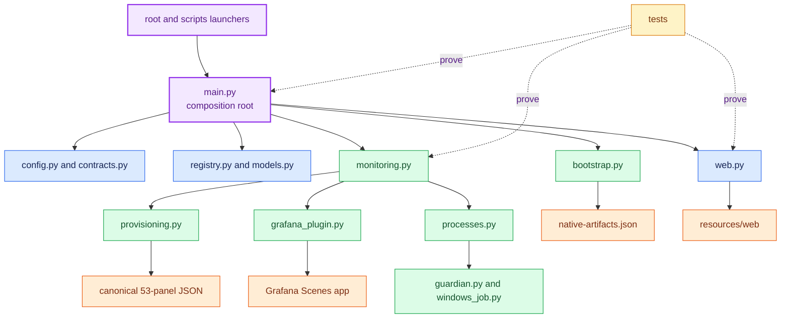

<!--
Copyright (c) KMG. All Rights Reserved.

Licensed under the Apache License, Version 2.0 (the "License");
you may not use this file except in compliance with the License.
You may obtain a copy of the License at

    http://www.apache.org/licenses/LICENSE-2.0
-->

# Development guide

This guide is the practical entry point for engineers changing the repository. Read [Architecture](ARCHITECTURE.md)
before changing boundaries and [Implementation internals](INTERNALS.md) before changing lifecycle or persistence.
Software agents must additionally follow [`AGENTS.md`](../AGENTS.md).

## Repository map



## Create a development environment

Python venv:

```bash
python3 -m venv .venv
. .venv/bin/activate
python -m pip install --upgrade pip
python -m pip install -e ".[dev]"
```

Conda:

```bash
conda env create -f environment.yml
conda activate sbk-dashboard
python -m pip install -e ".[dev]"
```

Confirm the source checkout is selected:

```bash
python -c "import sbk_dashboard; print(sbk_dashboard.__file__)"
python -m sbk_dashboard --version
```

Node.js 22 is required only when changing the bundled Grafana comparison app. It is not a runtime dependency:

```bash
npm ci --prefix grafana-plugin
npm run typecheck --prefix grafana-plugin
npm test --prefix grafana-plugin
npm run build --prefix grafana-plugin
git diff --exit-code -- src/sbk_dashboard/resources/grafana/plugins
```

Commit the reviewed production bundle together with its TypeScript source. Do not edit `module.js` directly.

## Run the application safely

Use non-default ports and a disposable data directory while developing:

```bash
dev_data="$(mktemp -d)"
python -m sbk_dashboard \
  -port 19721 \
  -prometheus-port 19090 \
  -grafana-port 13000 \
  -data "$dev_data" \
  -bind 127.0.0.1 \
  -grafana-bind 127.0.0.1
```

Stop with `Ctrl+C`. Remove only the exact temporary directory after verifying all child processes have exited.
Never point tests or development starts at a real operator data root.

## Change workflow

```mermaid
flowchart LR
    Read[Read contract and owning guide] --> Inspect[Inspect source plus matching tests]
    Inspect --> Change[Make the smallest coherent change]
    Change --> Focused[Run focused tests]
    Focused --> Fast[Run Ruff, mypy, unittest, diff check]
    Fast --> Risk{Integration boundary changed?}
    Risk -->|No| Full[Run coverage and package build]
    Risk -->|Yes| Live[Run native, real SBK, or container validation]
    Live --> Full
    Full --> Docs[Update docs and migration notes]
    Docs --> Review[Review diff and resource cleanup]

    classDef planning fill:#dbeafe,stroke:#2563eb,color:#172554;
    classDef change fill:#f3e8ff,stroke:#9333ea,color:#581c87;
    classDef validation fill:#dcfce7,stroke:#16a34a,color:#14532d;
    classDef decision fill:#fef3c7,stroke:#d97706,color:#78350f;
    class Read,Inspect planning;
    class Change,Docs change;
    class Focused,Fast,Live,Full,Review validation;
    class Risk decision;
```



## Required validation

Fast checks after every code change:

```bash
ruff check src tests scripts
mypy
PYTHONPATH=src python -W error::ResourceWarning -m unittest discover -s tests -q
git diff --check
```

Complete pre-commit validation:

```bash
coverage erase
COVERAGE_PROCESS_START=pyproject.toml coverage run -m pytest -q
coverage combine
coverage report
python -m build --no-isolation
```

Coverage must remain at least 60%. Use [Testing](TESTING.md) for container, cross-platform, native-stack, and real
SBK procedures.

## Choose the correct owner

| Change | Primary owner | Tests/documentation |
|---|---|---|
| CLI, env, defaults | `config.py`, `contracts.py` | `test_config.py`, configuration/README |
| Comparison bounds/identity | `comparison.py` | comparison, provisioning, and web tests; comparison/internals docs |
| Endpoint schema/identity | `models.py`, `registry.py`, `endpoint_policy.py` | registry, API, migration |
| API/UI | `web.py`, `resources/web` | web/monitoring tests, configuration/usage |
| Prometheus discovery/Grafana JSON | `provisioning.py` | provisioning tests, architecture/internals |
| Native lifecycle | `processes.py`, `guardian.py`, `windows_job.py` | process/guardian/platform tests |
| Stack reconciliation/status | `monitoring.py` | monitoring tests, internals |
| Download/extraction | `bootstrap.py`, artifact manifest | bootstrap/extraction tests, portable docs |
| Source launcher/runtime | `scripts/sbk_dashboard_bootstrap.py`, launcher scripts | launcher/portable tests |
| Container delivery | Dockerfile, Compose, container workflow | container contracts/smoke, Docker docs |

## Important design constraints

- Keep one Python control plane and one owned Prometheus/Grafana pair per application instance.
- Keep HTTP workers, queues, reads, files, collections, retries, and logs bounded.
- Never stop an unrelated listener; verify executable, PID creation time, port, and ownership.
- Preserve atomic persistence and rollback across registration/reconciliation.
- Scope every generated `SBK_*` query with `sbk_endpoint_id`.
- Preserve the canonical upstream dashboard bytes unless explicitly synchronizing SBK.
- Keep common logic OS-neutral and isolate process/archive differences.

## Documentation contributions

Use [Documentation center](README.md) to choose the owning guide. Add examples that can be copied safely, state the
deployment/OS assumptions, and avoid duplicating source-of-truth tables unless a contract test keeps them aligned.
Diagrams use fenced `mermaid` blocks, quoted node labels, and explicit `classDef` colors that remain legible on light
and dark GitHub themes. Run the documentation tests and Mermaid renderer check described in [Testing](TESTING.md).

## Release metadata

Change `src/sbk_dashboard/version.py`, then synchronize intentional packaging references:

```bash
python scripts/sync_release_metadata.py --write
python scripts/sync_release_metadata.py
```

Follow [Docker Hub publishing](DOCKER_HUB.md) for image release gates and [Portable installation](PORTABLE.md) for
standalone artifacts. Use [Release publishing](RELEASING.md) for the guarded cross-platform command. Do not create a
tag until version, packages, documentation, and both architecture gates agree.
