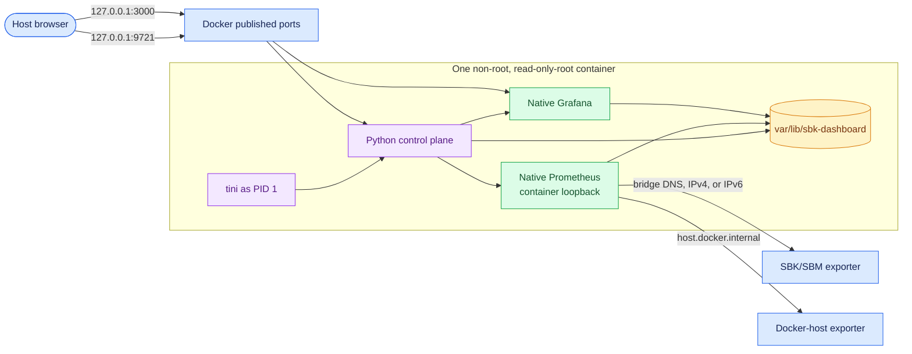

<!--
Copyright (c) KMG. All Rights Reserved.

Licensed under the Apache License, Version 2.0 (the "License");
you may not use this file except in compliance with the License.
You may obtain a copy of the License at

    http://www.apache.org/licenses/LICENSE-2.0
-->

# Docker deployment

The supported image packages the Python control plane, official Prometheus, and official Grafana in one Linux
container. Prometheus and Grafana remain managed native child processes; they are not embedded Python modules or
independent service containers.



Stopping the container first gives the application a bounded graceful-cleanup window. If it does not exit, Docker
terminates the container PID namespace/cgroup; the guardians and process-group or Job Object rules remain active
inside the same topology.

## Quick start

Use the pinned release image:

```bash
docker compose pull
docker compose up --detach
docker compose ps
```

`compose.yaml` contains no `build` section. It pulls
`kmgowda/sbk-dashboard:1.26.8.3` from Docker Hub when missing and reuses the local image afterward. Prometheus,
Grafana, and the Python wheel are already installed in that image; they are never downloaded during container
startup. Override the pinned image only when deliberately testing another published build:

```bash
SBK_DASHBOARD_IMAGE=kmgowda/sbk-dashboard:<version> docker compose up --detach
```

The first image pull still transfers the complete runtime image. Routine `docker compose start` operations perform
no pull, build, native download, or extraction.

Open these host URLs:

- Landing page: `http://localhost:9721/`
- Grafana: `http://localhost:3000/`

The container is headless and cannot open a browser process on the Docker host. Compose publishes ports 9721 and
3000 on host loopback by default. Because authentication is disabled, set `SBK_DASHBOARD_PUBLISH_HOST=0.0.0.0` only
for deliberate network-wide access protected by a firewall, trusted network, or authenticated reverse proxy.
Publishing the ports makes the UI and every generated dashboard link available to the host browser immediately.
Opening the landing page
through a public IP or DNS name produces generated Grafana links with that same hostname and port 3000.

Inspect or stop the deployment with:

```bash
docker compose logs --follow sbk-dashboard
docker compose stop
docker compose start
docker compose down
```

`docker compose down` preserves the named volume. Do not add `--volumes` during routine stop, upgrade, or recovery;
that option deletes endpoint registrations, Prometheus history, Grafana state, and generated mappings.

## Released image

Release tags publish `linux/amd64` and `linux/arm64` images to Docker Hub. Run a pinned release:

```bash
docker run --detach --name sbk-dashboard --restart unless-stopped \
  --read-only --tmpfs /tmp:size=64m,mode=1777 \
  --pids-limit 512 --log-opt max-size=10m --log-opt max-file=3 \
  --publish 127.0.0.1:9721:9721 --publish 127.0.0.1:3000:3000 \
  --add-host host.docker.internal:host-gateway \
  --volume sbk-dashboard-data:/var/lib/sbk-dashboard \
  kmgowda/sbk-dashboard:1.26.8.3
```

Use a pinned release in production instead of `latest`; use its immutable manifest digest where change control
requires byte-identical deployment. The image runs as UID/GID 10001, uses `tini` as PID 1,
includes a control-plane health check, exposes only ports 9721 and 3000, and keeps Prometheus on container loopback.
The per-target-time comparison app is already present in the Python package and is atomically installed into the
persistent managed Grafana directory on startup. The runtime image does not include Node.js/npm and does not fetch a
plugin from the network. The exact app ID is the only unsigned plugin allowed by generated Grafana configuration.
Its official Python 3.12/Debian stable base is pinned by complete patch version and immutable multi-architecture
digest so AMD64 and ARM64 builds resolve the same reviewed manifest. Native archive URLs, filenames, formats, and
checksums come from the same packaged `native-artifacts.json` used by direct installations; they are not duplicated
as Docker build arguments. Native archive downloads are checksum-verified,
time-bounded, retried, and capped at the same 2 GiB per-download maximum as automatic native installation.
Python build tools and the Linux AMD64/ARM64 `psutil` wheels are exact-version and SHA-256 pinned. The build verifies
that the installed application version equals the OCI `APPLICATION_VERSION` label input. Direct final-image Debian
packages are exact-version locked in `requirements/container-os.txt`; the base image digest owns the remaining
transitive OS inventory. Builds fail closed when a reviewed direct package version is no longer available.

Resolve an immutable digest after pulling or publishing:

```bash
docker buildx imagetools inspect kmgowda/sbk-dashboard:1.26.8.3
SBK_DASHBOARD_IMAGE='kmgowda/sbk-dashboard:1.26.8.3@sha256:<manifest-digest>' docker compose up --detach
```

## Register endpoints

The address entered in the landing page is preserved and resolved or routed from inside the container:

| Exporter location | Host field | Example |
|---|---|---|
| Same container | `127.0.0.1` | Only for an exporter deliberately running in this container |
| Docker host | `host.docker.internal` | `host.docker.internal:9718/metrics` |
| Remote system | Routable DNS, IPv4, or IPv6 | `benchmark-01.example.com:9718/metrics` |

The container image sets the form's default host to `host.docker.internal`; a direct Python/Conda installation
defaults it to `127.0.0.1`. Do not use the container's `127.0.0.1` for an exporter on the Docker host, because it
refers to the container network namespace.

The supplied Compose and `docker run` commands install Docker's `host-gateway` mapping so a host SBK process is
reachable on Linux and Docker Desktop. The host exporter must listen on an address reachable from the Docker bridge;
an exporter bound exclusively to host `127.0.0.1` generally cannot be reached by a Linux container.

Compose enables IPv6 on its user-defined bridge. IPv4 and DNS endpoints use Docker's normal outbound masquerading;
literal IPv6 endpoints additionally require IPv6 routing in the Docker daemon, host OS, and upstream network. No
inbound port publication is needed for scraping because Prometheus initiates the connection from the container.

## Configuration

The image supplies container-safe defaults for the data directory, native tool paths, and bind addresses. Existing
CLI options can be appended after the image name:

```bash
docker run --detach --name sbk-dashboard \
  --publish 9721:9721 --publish 3000:3000 \
  --add-host host.docker.internal:host-gateway \
  --volume sbk-dashboard-data:/var/lib/sbk-dashboard \
  kmgowda/sbk-dashboard:1.26.8.3 \
  -retention 14 -status-seconds 30
```

Environment variables documented in the README can be set with `--env` or Compose `environment`. Do not override
the following image defaults unless the replacement paths/addresses are valid inside the container:

- `SBK_DASHBOARD_DATA_DIR=/var/lib/sbk-dashboard`
- `SBK_DASHBOARD_DEFAULT_TARGET_HOST=host.docker.internal`
- `SBK_DASHBOARD_PROMETHEUS_BIN=/opt/prometheus/prometheus`
- `SBK_DASHBOARD_GRAFANA_HOME=/opt/grafana`
- `SBK_DASHBOARD_PROMETHEUS_BIND=127.0.0.1`
- `SBK_DASHBOARD_BIND=0.0.0.0`
- `SBK_DASHBOARD_GRAFANA_BIND=0.0.0.0`

For a reverse proxy, TLS, or a different host-published Grafana port, set `-grafana-url` to the complete URL clients
can reach. If host port 33000 maps to container port 3000, for example, use
`-grafana-url https://dashboard.example.com:33000`.

## Persistence and upgrades

All mutable state lives under `/var/lib/sbk-dashboard`; the image itself is replaceable. Upgrade while retaining the
named volume:

```bash
docker compose pull
docker compose up --detach
```

For a bind mount, create the directory in advance and make it writable by UID/GID 10001. Back up the data directory
or volume while the container is stopped for a consistent Prometheus/Grafana snapshot. Never copy runtime PID state
from a running instance into another simultaneously running instance.

Back up and restore a named volume with the pinned application image as a minimal tar helper:

```bash
docker compose stop
docker volume create sbk-dashboard-restore
docker run --rm --user 0:0 --entrypoint sh \
  --volume sbk-dashboard_sbk-dashboard-data:/source:ro \
  --volume sbk-dashboard-restore:/restore \
  kmgowda/sbk-dashboard:1.26.8.3 \
  -c 'set -eu; tar -C /source -cf - . | tar -C /restore -xf -'
```

Replace `sbk-dashboard_sbk-dashboard-data` with the name reported by `docker volume ls`. Test the restored volume
with a separate stopped deployment before treating the backup as recoverable. The automated container smoke test
does this copy into a fresh volume and revalidates registrations, dashboards, comparisons, and Prometheus history.

## Optional resource limits

The base Compose definition always limits the container to 512 PIDs. It does not assume that a small development
host and a high-cardinality production host have the same CPU and memory capacity. Apply the optional overlay to
select those bounds:

```bash
docker compose -f compose.yaml -f compose.resources.yaml up --detach
```

Its defaults are 4 GiB memory and 2 CPUs. Override them, the base PID limit, and log rotation when necessary:

```bash
SBK_DASHBOARD_MEMORY_LIMIT=8g \
SBK_DASHBOARD_CPU_LIMIT=4 \
SBK_DASHBOARD_PIDS_LIMIT=768 \
SBK_DASHBOARD_LOG_MAX_SIZE=20m \
SBK_DASHBOARD_LOG_MAX_FILES=5 \
docker compose -f compose.yaml -f compose.resources.yaml up --detach
```

Select limits from observed Prometheus cardinality and Grafana query load. An OOM kill is a hard termination; the
next start recovers persisted state, but graceful shutdown remains preferable.

## Security and operations

Authentication is not implemented. Restrict ports 9721 and 3000 with host firewall/security-group rules, a trusted
network, or an authenticated reverse proxy. Prometheus 9090 is intentionally neither exposed nor published.

The Compose definition drops all Linux capabilities, enables `no-new-privileges`, makes the image root filesystem
read-only, provides a bounded temporary `/tmp`, limits the process count, and rotates the Docker `json-file` log.
Only the `/var/lib/sbk-dashboard` volume is persistent and
writable. Prometheus and Grafana installations under `/opt` remain root-owned and non-writable by UID 10001. Do not
add privileged mode or mount the Docker socket. Native child logs and control-plane state remain bounded according
to normal sbk-dashboard settings. The image health check reports unhealthy when the management/native stack health
endpoint cannot respond successfully.

Release and weekly scheduled CI scan the runnable AMD64 image with pinned Trivy and fail for fixed `HIGH` or `CRITICAL` OS/library
vulnerabilities. `.trivyignore.yaml` contains only target-scoped, explained, expiring exceptions for findings still
present in the newest official native builds; an expired exception fails the next build. Published
multi-architecture digests carry BuildKit SBOM/provenance attestations and a keyless Cosign signature issued from
the tagged GitHub Actions workflow. Verify the digest and signature as documented in `DOCKER_HUB.md`; a version tag
alone is human-readable but remains registry-mutable.

The Dockerfile pins a reviewed official Python multi-architecture digest and exact direct runtime package versions.
The installed package lock is retained in the image beside OCI creation, documentation, revision, version, and base
identity labels. Updating the base digest or OS lock is an explicit maintenance change followed by both architecture
gates and the vulnerability scan.

Graceful `docker stop` sends the declared `SIGTERM` through `tini`; the Python lifecycle closes Grafana and
Prometheus in reverse dependency order and removes ownership records. The existing guardian processes provide
additional cleanup if the Python control plane dies unexpectedly. Compose allows 30 seconds for ordered
graceful/forced cleanup; after that deadline Docker kills every process remaining in the container PID
namespace/cgroup. Docker `SIGKILL` cannot run in-container cleanup, so use the normal stop grace period whenever
possible.

## Build and validate

Production users should not build locally. For source development, combine the production definition with the
explicit build override:

```bash
docker compose -f compose.yaml -f compose.dev.yaml build --progress=plain
docker compose -f compose.yaml -f compose.dev.yaml up --detach --no-build
```

The override changes only image acquisition. Ports, volume, network, security settings, entry point, and the runtime
topology remain inherited from `compose.yaml`.

Build and smoke-test the local architecture directly:

```bash
docker build --build-arg VCS_REF=local \
  --build-arg BUILD_DATE="$(git show -s --format=%cI HEAD)" \
  --tag sbk-dashboard:1.26.8.3 .
python tests/container_smoke.py --image sbk-dashboard:1.26.8.3
```

The Dockerfile uses BuildKit cache mounts, so local builds require Docker BuildKit/the Buildx component. Docker
Desktop and Docker Engine installations normally provide it; legacy-builder-only installations must install Buildx
before building. Docker build contexts exclude local Grafana-plugin `node_modules` and Jest cache trees; those
development-only files are never needed because the committed production plugin bundle is the runtime input.

Build both published architectures into a local OCI archive without publishing them:

```bash
docker buildx build --platform linux/amd64,linux/arm64 \
  --output type=oci,dest=sbk-dashboard-multiarch.oci .
```

Docker cannot load a multi-platform image into the classic local image store. For a runnable local image, build one
host platform with `--load`; for a release manifest, use the authenticated `--push` workflow in `DOCKER_HUB.md`.

The live smoke test validates host port access, read-only-root execution, immutable native tools, registration, a
generated Grafana dashboard, persistent state after `SIGKILL`, backup restoration into a fresh volume,
stale-ownership recovery, graceful exit, bounded PID/log settings, and absence of surviving native child PIDs. The
real-SBK mode is documented in `docs/TESTING.md`.

Prometheus and Grafana downloads are separate Docker stages backed by independent checksum-validated BuildKit cache
mounts, allowing cold downloads to run in parallel.
Changing only one manifest entry invalidates the native download stages while the independent cache mounts preserve
unaffected verified archives. Cached archives never enter the final runtime image.

## Publish images to Docker Hub

Use the dedicated [Docker Hub build, publishing, and pull guide](DOCKER_HUB.md). It provides complete copy-and-paste
procedures for local Compose and direct builds, smoke validation, secure access-token login, Buildx setup,
AMD64/ARM64 version publishing, manifest verification, customer pulls, upgrades, GitHub Actions, and common errors.

## Troubleshooting

- If `http://localhost:9721/` is unreachable, run `docker compose ps` and `docker compose logs sbk-dashboard`.
- If startup reports an occupied host port, stop the host listener or change the left side of the port mapping and
  set an explicit `-grafana-url` when changing Grafana's host port.
- If a Docker-host target is down, use `host.docker.internal`, confirm the exporter listens beyond host loopback,
  and test it from inside the container network.
- Register the endpoint while SBK is running. PrometheusLogger closes its HTTP endpoint when the benchmark exits;
  stored history remains available, but the registered endpoint correctly changes to `down`.
- Test the exact scrape URL from the Prometheus network namespace:

  ```bash
  docker compose exec -T sbk-dashboard python -c \
    'import urllib.request; r=urllib.request.urlopen("http://host.docker.internal:9718/metrics", timeout=5); print(r.status); print(r.read(300).decode())'
  ```

  For a remote exporter, replace `host.docker.internal` with its routable DNS name or IP. Connection refused means
  the exporter is stopped or the port is wrong; a timeout normally means routing or firewall policy; HTTP 404 means
  the metrics path is wrong. Prometheus' detailed `lastError` is available with:

  ```bash
  docker compose exec -T sbk-dashboard python -c \
    'import urllib.request; print(urllib.request.urlopen("http://127.0.0.1:9090/api/v1/targets?state=active", timeout=5).read().decode())'
  ```
- If the generated Grafana hostname is wrong behind a proxy, set the authoritative `-grafana-url`.
- If a bind-mounted data directory is read-only, make it writable by UID/GID 10001 or use the named volume.
