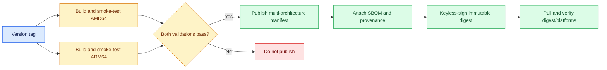

<!--
Copyright (c) KMG. All Rights Reserved.

Licensed under the Apache License, Version 2.0 (the "License");
you may not use this file except in compliance with the License.
You may obtain a copy of the License at

    http://www.apache.org/licenses/LICENSE-2.0
-->

# Build, publish, and pull the Docker image

This guide shows how to build SBK Dashboard on your computer, test it, publish a versioned AMD64/ARM64 image to
Docker Hub, and pull that image on another computer. The examples use the public Docker Hub repository
`kmgowda/sbk-dashboard`.

Run the commands from the root of the `sbk-dashboard` source checkout—the directory that contains `Dockerfile`,
`compose.yaml`, and `pyproject.toml`. The commands use a POSIX shell such as Bash or Zsh on Linux or macOS. Docker
Desktop can run the same Linux container build on macOS or Windows.

## What these commands produce

The release build publishes two tags:

- `kmgowda/sbk-dashboard:1.26.8.3` is the stable version tag used by `compose.yaml`.
- `kmgowda/sbk-dashboard:latest` is a convenient pointer to the newest stable release.

Each tag points to one multi-architecture manifest containing:

- `linux/amd64` for x86-64 systems; and
- `linux/arm64` for 64-bit ARM systems.

Registry tags can be reassigned. The manifest's `sha256:` digest is the immutable production identity. The GitHub
release workflow also publishes SBOM/provenance attestations and a keyless Cosign signature for that digest.

The image still runs one Python control plane, one native Prometheus child process, and one native Grafana child
process. Publishing a multi-architecture image does not split those services into separate containers.



## 1. Prepare the tools and repository

Install Docker Engine with the Compose and Buildx plugins, or install Docker Desktop. Confirm all three commands are
available:

```bash
docker version
docker compose version
docker buildx version
```

Use an existing checkout, or clone the repository:

```bash
git clone https://github.com/kmgowda/sbk-dashboard.git
cd sbk-dashboard
```

Before publishing, check that you are on the intended release commit and that the working tree is clean:

```bash
git status --short --branch
git log -1 --oneline
```

Do not publish an image from uncommitted source. Commit and test the intended release first.

## 2. Read the application version

The application version comes from `src/sbk_dashboard/version.py`. The following block reads it automatically and
also records the exact Git commit in the OCI image metadata:

```bash
export SBK_VERSION="$(PYTHONPATH=src python3 -c 'from sbk_dashboard.version import VERSION; print(VERSION)')"
export SBK_IMAGE="kmgowda/sbk-dashboard"
export SBK_VCS_REF="$(git rev-parse HEAD)"
export SBK_BUILD_DATE="$(git show -s --format=%cI HEAD)"

printf 'Version: %s\nImage: %s\nCommit: %s\nCreated: %s\n' \
  "$SBK_VERSION" "$SBK_IMAGE" "$SBK_VCS_REF" "$SBK_BUILD_DATE"
```

For the current release, the version output should be `1.26.8.3`. Stop if the version or commit is not the one you
intend to publish.

## 3. Build locally with Docker Compose

The production `compose.yaml` pulls the published Docker Hub image. Add `compose.dev.yaml` when you want to build
the same runtime image from the local source:

```bash
docker compose -f compose.yaml -f compose.dev.yaml build --progress=plain
docker compose -f compose.yaml -f compose.dev.yaml up --detach --no-build
docker compose -f compose.yaml -f compose.dev.yaml ps
```

Check the management API and open the browser pages:

```bash
curl -fsS http://127.0.0.1:9721/api/health
```

- Management page: <http://localhost:9721/>
- Grafana: <http://localhost:3000/>

Inspect logs if startup is not healthy:

```bash
docker compose -f compose.yaml -f compose.dev.yaml logs --tail=200 sbk-dashboard
```

Stop the local validation container without deleting its named volume:

```bash
docker compose -f compose.yaml -f compose.dev.yaml down
```

Do not add `--volumes` unless deleting registrations, Grafana state, and Prometheus history is intentional.

## 4. Build and test one local image directly

The direct build command is useful when you want a named local image for the automated smoke test:

```bash
docker build \
  --build-arg APPLICATION_VERSION="$SBK_VERSION" \
  --build-arg VCS_REF="$SBK_VCS_REF" \
  --build-arg BUILD_DATE="$SBK_BUILD_DATE" \
  --tag "sbk-dashboard:$SBK_VERSION-local" \
  .
```

Run the Linux container smoke test:

```bash
python3 tests/container_smoke.py --image "sbk-dashboard:$SBK_VERSION-local"
```

The smoke test uses disposable containers, a network, and a volume. It verifies health, published ports, read-only
root operation, immutable native installations, endpoint registration, Grafana provisioning, Prometheus
persistence and stale-state recovery after `SIGKILL`, and clean native-process shutdown.
Do not publish if this test fails.

## 5. Create the Docker Hub repository and token

Before the first push:

1. Sign in to Docker Hub.
2. Create the repository `kmgowda/sbk-dashboard`.
3. Make it public so users can pull without logging in.
4. Create a personal access token with write permission.

Use the access token instead of the Docker Hub account password. Do not put the token in this repository, a shell
script, Compose YAML, the Dockerfile, an image layer, or a committed environment file.

Log in from the publishing computer:

```bash
docker login --username kmgowda
```

Paste the access token at the password prompt. A successful login prints `Login Succeeded`.

## 6. Prepare a multi-architecture Buildx builder

Show the available builders:

```bash
docker buildx ls
```

Create and select a dedicated builder the first time this computer publishes SBK Dashboard:

```bash
docker buildx create \
  --name sbk-dashboard-publisher \
  --driver docker-container \
  --use
docker buildx inspect --bootstrap
```

If the builder already exists, select and initialize it instead:

```bash
docker buildx use sbk-dashboard-publisher
docker buildx inspect --bootstrap
```

The inspection output should list support for both `linux/amd64` and `linux/arm64`. Docker Desktop normally provides
the required emulation automatically. On a Linux publisher, Buildx/QEMU must be configured for the non-native
architecture before the release build.

## 7. Build and push the versioned image

This command builds both architectures and pushes the version and `latest` tags in one operation:

```bash
docker buildx build \
  --platform linux/amd64,linux/arm64 \
  --build-arg APPLICATION_VERSION="$SBK_VERSION" \
  --build-arg VCS_REF="$SBK_VCS_REF" \
  --build-arg BUILD_DATE="$SBK_BUILD_DATE" \
  --tag "$SBK_IMAGE:$SBK_VERSION" \
  --tag "$SBK_IMAGE:latest" \
  --provenance=mode=max \
  --sbom=true \
  --push \
  .
```

`--push` uploads the image and manifest directly to Docker Hub. A multi-architecture result cannot be loaded as one
ordinary local Docker image, so do not replace `--push` with `--load` for the release command.

Use `latest` only for a stable release. Consumers and `compose.yaml` should use the exact version tag so an upgrade
cannot happen unexpectedly.

The supported release path is the tagged GitHub workflow because it applies the vulnerability gate and GitHub-OIDC
signature. A manual Buildx push can reproduce the image and attestations, but it is not presented as an officially
signed repository release.

## 8. Verify the Docker Hub image

Inspect the published manifest:

```bash
docker buildx imagetools inspect "$SBK_IMAGE:$SBK_VERSION"
```

The output must include both:

```text
Platform: linux/amd64
Platform: linux/arm64
```

Copy the top-level manifest digest from the inspection output and install Cosign. Verify that the signature was
issued by this repository's tagged release workflow:

```bash
export SBK_DIGEST='sha256:<manifest-digest>'
cosign verify \
  --certificate-identity-regexp \
    '^https://github.com/kmgowda/sbk-dashboard/.github/workflows/container.yml@refs/tags/v' \
  --certificate-oidc-issuer 'https://token.actions.githubusercontent.com' \
  "$SBK_IMAGE@$SBK_DIGEST"
```

For strict production deployment, use the version and digest together:

```bash
export SBK_DASHBOARD_IMAGE="$SBK_IMAGE:$SBK_VERSION@$SBK_DIGEST"
docker compose pull
docker compose up --detach
```

Pull the version through the same Compose definition used by customers:

```bash
SBK_DASHBOARD_IMAGE="$SBK_IMAGE:$SBK_VERSION" docker compose pull
```

Start the pulled image and check it:

```bash
SBK_DASHBOARD_IMAGE="$SBK_IMAGE:$SBK_VERSION" docker compose up --detach
docker compose ps
curl -fsS http://127.0.0.1:9721/api/health
```

Confirm the running container uses the intended image:

```bash
docker compose images
```

Stop it while preserving the data volume:

```bash
docker compose down
```

After publishing is complete, log out on computers that are not dedicated release builders:

```bash
docker logout
```

## 9. Pull and run the image as a user

Users with a source checkout can use the pinned image from `compose.yaml`:

```bash
git clone https://github.com/kmgowda/sbk-dashboard.git
cd sbk-dashboard
docker compose pull
docker compose up --detach
docker compose ps
```

Open <http://localhost:9721/> and <http://localhost:3000/>. View startup logs with:

```bash
docker compose logs --follow sbk-dashboard
```

To pull a specific version explicitly:

```bash
docker pull kmgowda/sbk-dashboard:1.26.8.3
```

Run the image without a source checkout or Compose:

```bash
docker volume create sbk-dashboard-data
docker run --detach \
  --name sbk-dashboard \
  --restart unless-stopped \
  --read-only \
  --tmpfs /tmp:size=64m,mode=1777 \
  --publish 127.0.0.1:9721:9721 \
  --publish 127.0.0.1:3000:3000 \
  --add-host host.docker.internal:host-gateway \
  --volume sbk-dashboard-data:/var/lib/sbk-dashboard \
  kmgowda/sbk-dashboard:1.26.8.3
```

Check the container and its health endpoint:

```bash
docker ps --filter name=sbk-dashboard
curl -fsS http://127.0.0.1:9721/api/health
```

## 10. Upgrade to another published version

Back up persistent data before an important production upgrade. Then pull the new version and recreate the
container against the same named volume:

```bash
export SBK_DASHBOARD_IMAGE="kmgowda/sbk-dashboard:1.26.8.3"
docker compose pull
docker compose up --detach
docker compose ps
```

Change the version after a newer release is published. Do not run `docker compose down --volumes`; the `--volumes`
option permanently deletes the named data volume.

## 11. Publish automatically from GitHub Actions

The `publish` job in `.github/workflows/container.yml` validates and publishes a tagged release. Add these Actions
secrets in the GitHub repository settings:

| Secret | Value |
|---|---|
| `DOCKERHUB_USERNAME` | Docker Hub user with write access to `kmgowda/sbk-dashboard` |
| `DOCKERHUB_TOKEN` | Docker Hub access token with write permission |

Use the guarded release command after the version PR is merged to `main`:

```bash
./release-sbk-dashboard.sh check
export GITHUB_TOKEN='<token-from-secure-credential-store>'
./release-sbk-dashboard.sh publish --confirm "v$SBK_VERSION"
```

`GITHUB_TOKEN` must authenticate GitHub user `kmgowda`; the release command rejects another user or repository.

The command requires successful cross-platform CI, creates and pushes the annotated tag, waits for this workflow,
then creates the generated-notes GitHub Release and waits for every portable/Python asset. See
[`RELEASING.md`](RELEASING.md) for Windows syntax, the exact asset list, safety checks, and partial-release recovery.

The container workflow natively builds and smoke-tests runnable AMD64 and ARM64 images, rejects fixed high/critical
vulnerabilities with pinned Trivy, attaches provenance and an SBOM, publishes both the version and `latest` tags, and
keylessly signs their shared digest with GitHub OIDC. It stops before Docker Hub login when the Git tag and package
version do not match. No long-lived signing key is stored in repository secrets. Any reviewed scanner exception is
target-scoped, documented, and time-limited in `.trivyignore.yaml`; expiry deliberately blocks publishing until the
native dependencies are upgraded or the exception is reviewed again.
The validation jobs also run weekly so disclosure of a new vulnerability is visible without waiting for a source
commit or release tag.

## Troubleshooting

### `denied: requested access to the resource is denied`

The Docker Hub account is not logged in, the token lacks write permission, or the account cannot write the
`kmgowda/sbk-dashboard` repository. Log in again with the correct account and access token:

```bash
docker logout
docker login --username kmgowda
```

### `manifest unknown` or `pull access denied`

Confirm the version exists in Docker Hub and the repository is public. Inspect the exact version instead of relying
on `latest`:

```bash
docker buildx imagetools inspect kmgowda/sbk-dashboard:1.26.8.3
```

### Only one architecture appears

The image was probably built with ordinary `docker build` or without the full `--platform` list. Publish again with
the Buildx command from step 7 and verify both platforms before announcing the release.

### Compose pulls the wrong image

Show the fully resolved Compose configuration:

```bash
docker compose config
```

Check `SBK_DASHBOARD_IMAGE` in the current shell. An environment override takes precedence over the default image in
`compose.yaml`:

```bash
printf '%s\n' "${SBK_DASHBOARD_IMAGE:-not set}"
```

### The remote pull fails but a local build is needed

Use the source-build override. It does not require the SBK Dashboard image to exist in Docker Hub:

```bash
docker compose -f compose.yaml -f compose.dev.yaml build --progress=plain
docker compose -f compose.yaml -f compose.dev.yaml up --detach --no-build
```
