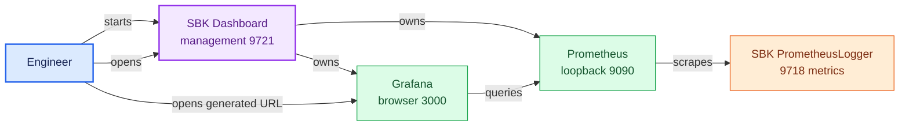
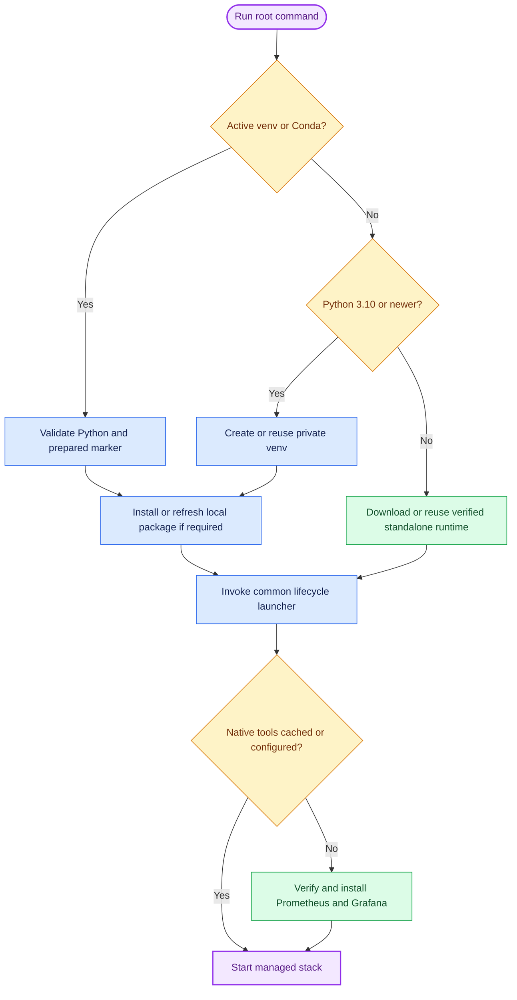

<!--
Copyright (c) KMG. All Rights Reserved.

Licensed under the Apache License, Version 2.0 (the "License");
you may not use this file except in compliance with the License.
You may obtain a copy of the License at

    http://www.apache.org/licenses/LICENSE-2.0
-->

# Getting started

This tutorial takes a new engineer from a source clone to a live SBK dashboard. It uses safe local defaults and
explains what the first start creates. For every option, see [Configuration reference](CONFIGURATION.md).

## What will run



One application instance owns one Prometheus and one Grafana. Registering more endpoints does not start more
native servers; it adds isolated discovery labels and dashboard files to the shared managed pair.

## Option A: start directly from a clone

The root command is the simplest cross-platform development and evaluation path. Python 3.10+ is used when present;
if it is missing or too old, the command downloads the verified standalone release for the same application
version. Later starts reuse the prepared environment.

Linux or macOS:

```bash
git clone https://github.com/kmgowda/sbk-dashboard.git
cd sbk-dashboard
./sbk-dashboard --help
./sbk-dashboard
```

Windows PowerShell:

```powershell
git clone https://github.com/kmgowda/sbk-dashboard.git
Set-Location sbk-dashboard
.\sbk-dashboard.ps1 --help
.\sbk-dashboard.ps1
```

Windows Command Prompt:

```batch
git clone https://github.com/kmgowda/sbk-dashboard.git
cd sbk-dashboard
sbk-dashboard.cmd --help
sbk-dashboard.cmd
```

On the first start, expect preparation messages followed by detected OS, architecture, Python/runtime identity,
environment state (`fresh`, `reused`, or `repaired`), selected native ports, and reachable URLs. Open
<http://localhost:9721/> if the browser is not opened automatically.

## Option B: start the released container

Use this path when Docker is already the deployment standard:

```bash
git clone https://github.com/kmgowda/sbk-dashboard.git
cd sbk-dashboard
docker compose pull
docker compose up --detach
docker compose ps
docker compose logs --tail=100 sbk-dashboard
```

Open <http://localhost:9721/> and <http://localhost:3000/>. Container Prometheus remains internal. The default
endpoint host in the form is `host.docker.internal`, which addresses an exporter running on the Docker host.

## Run a small SBK benchmark

From `/root/projects/SBK` or another SBK checkout:

```bash
./gradlew installDist
./build/install/sbk/bin/sbk \
  -class file \
  -file /tmp/sbk-dashboard-demo.bin \
  -writers 1 \
  -size 4096 \
  -seconds 45 \
  -records 1000 \
  -out PrometheusLogger \
  -context 9718/metrics
```

Keep SBK running while registering it. `PrometheusLogger` owns the `/metrics` endpoint; the dashboard owns the
Prometheus server that scrapes it.

## Register the endpoint

Use the landing page, or call the API directly for a native dashboard:

```bash
curl --fail --request POST http://127.0.0.1:9721/api/targets \
  --header 'Content-Type: application/json' \
  --data '{
    "name": "Local file benchmark",
    "host": "127.0.0.1",
    "port": 9718,
    "metricsPath": "/metrics",
    "kind": "SBK"
  }'
```

For a container deployment, replace `127.0.0.1` in the JSON with `host.docker.internal`. For a remote benchmark,
use a DNS name, IPv4 address, or IPv6 address reachable from the dashboard host/container.

The response contains a stable endpoint ID, direct `dashboardUrl`, and relative `dashboardOpenUrl`. Browser clients
should open `dashboardOpenUrl`: it shows a short preparation page while Grafana imports a brand-new dashboard and
redirects only when the UID is queryable. API clients can also poll `GET /api/targets/<id>/dashboard` until `ready`
is true before using the direct URL. Select a time range containing the benchmark. When SBK exits, the target becomes
`down`; already-scraped history remains until retention expires.

## Compare endpoints

Register one or more endpoints, copy their IDs from `GET /api/targets`, and request a deterministic comparison. One
ID opens two time lanes for that dashboard; 2–4 IDs compare different dashboards by default. Start SBK Dashboard
with `-max-comparison-targets <2..32>` when the deployment needs a different bounded maximum:

```bash
curl --fail --request POST http://127.0.0.1:9721/api/comparison-dashboard \
  --header 'Content-Type: application/json' \
  --data '{"targetIds":["1111111111111111","2222222222222222"]}'
```

The UI provides the same operation with checkboxes. Repeating the same endpoint set in a different order reuses the
same comparison dashboard. All targets initially follow Grafana's global live range. From the opened view, detach a
target to an independent live window or fixed historical range without creating another dashboard. Follow the
[comparison guide](COMPARISON.md) for examples.

## Stop cleanly

For a foreground source start, press `Ctrl+C`. For launcher modes:

```bash
./sbk-dashboard background -port 19721
./sbk-dashboard stop -port 19721
./sbk-dashboard stop                 # every launcher-managed instance
```

```powershell
.\sbk-dashboard.ps1 background -port 19721
.\sbk-dashboard.ps1 stop -port 19721
.\sbk-dashboard.ps1 stop
```

For Compose:

```bash
docker compose stop                  # retain the container and volume
docker compose start
docker compose down                  # remove the container/network, retain the volume
```

Do not add `--volumes` unless permanent deletion of registrations, Grafana state, and Prometheus history is
intentional.

## First-start decision flow



## Where data is stored

- default-port native instance: `~/.sbk-dashboard`;
- non-default native instance: `~/.sbk-dashboard/instances/<management-port>`;
- portable runtimes and caches: beneath `~/.sbk-dashboard`;
- container instance: named volume mounted at `/var/lib/sbk-dashboard`;
- custom application data: the path supplied with `-data` or `SBK_DASHBOARD_DATA_DIR`.

Never delete these locations as an uninstall shortcut. Stop the service, back up the data, and identify the exact
runtime/data path first.

## Next steps

- [Configuration reference](CONFIGURATION.md) for every option and environment variable.
- [Usage and operations](USAGE.md) for multi-instance launch, services, backups, upgrades, and troubleshooting.
- [SBK integration](SBK.md) for distributed SBK/SBM and networking examples.
- [Architecture](ARCHITECTURE.md) for the design model.
- [Development](DEVELOPMENT.md) for a contributor environment and validation workflow.
