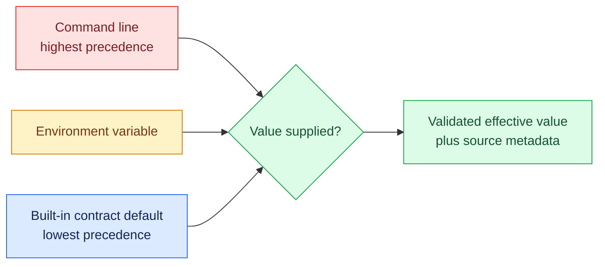

<!--
Copyright (c) KMG. All Rights Reserved.

Licensed under the Apache License, Version 2.0 (the "License");
you may not use this file except in compliance with the License.
You may obtain a copy of the License at

    http://www.apache.org/licenses/LICENSE-2.0
-->

# Implementation internals

This document explains how the Python control plane implements the architecture. It is intended for maintainers,
reviewers, and software agents. Normative invariants remain in [`../AGENTS.md`](../AGENTS.md), architectural
decisions in [`ARCHITECTURE.md`](ARCHITECTURE.md), and operator procedures in [`USAGE.md`](USAGE.md).

## Component ownership

| Module | Primary object or function | Owned resources/state |
|---|---|---|
| `main.py` | `main()`, `run()` | Composition, signal handlers, periodic status, top-level shutdown |
| `config.py` | `parse_configuration()` | Immutable dashboard, monitoring, platform, and download configuration |
| `bootstrap.py` | `NativeToolBootstrap` | Verified download, partial file, safe extraction, atomic tool installation |
| `registry.py` | `TargetRegistry` | Validated endpoint snapshot and `targets.json` |
| `provisioning.py` | discovery/provisioner classes | Prometheus file discovery, dashboard clones, mappings |
| `grafana_plugin.py` | `install_comparison_plugin()` | Atomic packaged Grafana app installation |
| `monitoring.py` | `ManagedMonitoringStack` | Generated native configuration, two services, supervisor, target status |
| `processes.py` | lifecycle/process classes | Port ownership, guardians, process trees, PID records, bounded logs |
| `guardian.py` | `guard()` | One owned native child and hard-parent-death cleanup |
| `windows_job.py` | `WindowsKillOnCloseJob` | Suspended assignment to a kernel kill-on-close Job Object |
| `web.py` | `DashboardHttpServer` | HTTP listener/thread, bounded worker pool, API transaction serialization |
| `files.py` | `atomic_write()` | Temporary file, file `fsync`, replace, POSIX directory `fsync` |
| `models.py` | immutable dataclasses | Endpoint identity, persisted schema, API status values |
| `network.py` | `normalize_host()` | Shared conservative IP/DNS normalization |

Constructors prepare Python objects only. Native processes, listener threads, and supervisor threads are acquired by
explicit `start()` methods and released by idempotent `close()` or `stop()` methods.

Container packaging does not introduce another composition root. Production Compose pulls the completed runtime
image; the development override builds that image locally. Both invoke the same `sbk-dashboard` entry point, and the
Python `run()` composition below remains the sole owner of Prometheus and Grafana in either delivery mode.

The optional source-archive launchers are outside the package composition root. A dependency-free dispatcher first
reuses an active venv/Conda environment; with only Python 3.10+ available, it creates a versioned, platform-specific,
source-fingerprinted private venv below `SBK_DASHBOARD_HOME`. An exclusive bounded lock protects a sibling staging
directory and atomic promotion, two recent fingerprints are retained, and pip downloads are shared through
`<home>/cache/pip`. It installs pip when necessary and prepares the local project before any launcher ownership
state or native process can be acquired. Without supported Python, OS-native shell/PowerShell code downloads the
exact-version portable archive and adjacent checksum, enforces bounded transfer and safe entries, and promotes a
verified staging tree under `<home>/distributions/<version>/<platform>`. A valid cached tree bypasses the network.
Both paths hand the launcher an environment kind, location, and fresh/reused/repaired state; the launcher combines
that with OS and interpreter details before acquiring instance state or native processes.
The repository URL and bootstrap transfer/lock bounds are shared through `scripts/portable-bootstrap.properties`
so the dependency-free Unix and Windows implementations consume one policy contract.
Foreground mode then calls
`main.main()` in the console-attached helper process. The PyInstaller entry routes lifecycle verbs through the same
launcher and uses internal executable modes for its dashboard child and watcher. On Windows, an identity-specific stop-request file is watched
by one bounded thread and converted into `SIGINT` in that same process, while console interrupts are handled
directly. Abrupt foreground death remains covered by the native-process guardians. Background mode first starts an empty supervisor, records its
PID and creation time, and authorizes acquisition with a bounded marker handshake. Only then may the supervisor
start `python -m sbk_dashboard` and its parent-death watcher. A reverse marker is emitted only after both processes
exist and the application has survived the immediate-exit window; the initiating command reports success only after
that confirmation. The shared stop path tolerates process exit between identity validation and signaling, waits or
force-cleans the captured tree, and removes only the matching ownership record. Ownership records and background
logs are keyed by management port (with legacy filenames retained for port 9721). Informational start requests do
not acquire state. A stop request without a port enumerates all ownership records; `-port`/`--port` limits cleanup to
one record. For a non-default management port, configuration derives an isolated default data directory. After
native tools are resolved and immediately before stack startup, built-in Prometheus/Grafana ports are retained when
available or replaced by bounded deterministic fallbacks. CLI/environment port values are never changed. The
effective configuration records and prints automatic selections, and a default Grafana public URL follows an
automatically selected Grafana port. `-continue true` bypasses fallback selection so compatible services can be
health-checked and attached on the requested ports.

Launcher start reservation uses exclusive state-file creation before any background supervisor is spawned. A
same-port concurrent start therefore observes the live starting process rather than acquiring a second dashboard.
Stop-all treats each port record independently: an unreadable record is reported and skipped without preventing
cleanup of valid instances. Windows stop fallback matches the exact `python -m sbk_dashboard` child rather than its
launcher watcher, and a closed background output pipe exits the log loop immediately.

## Composition and startup

`main.main()` performs the outer error mapping: argument parsing and configuration `ValueError`s exit with status 2,
caught startup/operational `OSError`s with status 1, and an interactive interrupt returns normally. It first
configures basic logging and prints runtime identity, then parses configuration and applies the selected log level.

`NativeToolBootstrap.resolve()` checks configured paths and `PATH` before downloading. A missing tool is downloaded
to `<data>/downloads/<archive>.part`, bounded by `download.max.bytes`, flushed, checksum-verified, and promoted. Safe
TAR/ZIP validation rejects traversal, links, devices, FIFOs, and platform drive escapes before extraction. The
extracted distribution is promoted from a temporary install directory only after its expected executable exists.

`run()` then composes:

1. `TargetRegistry`, which creates or validates `targets.json`;
2. `ManagedMonitoringStack`, which owns native configuration and service lifecycles; and
3. `DashboardHttpServer`, created only after monitoring startup succeeds.

Monitoring startup creates directory structure and configuration, reconciles persisted targets, runs `promtool`
when available, applies the selected port policy, starts Prometheus then Grafana, publishes initial target status,
and starts one supervisor. The management server begins admission only after both native readiness probes succeed.

## Configuration pipeline

Configuration selection is centralized in `config.py`:



Every selected public/operational value records its source for startup logging. Service classes receive frozen
dataclasses and do not independently consult environment variables. `contracts.py`, `endpoint_policy.py`,
`platforms.py`, and `layout.py` own shared defaults, validation policy, platform normalization, and paths.
External monitoring properties overlay the packaged `native-artifacts.json` manifest, with platform-qualified keys
preferred over legacy generic keys.

`RuntimePlatform` normalizes Linux, macOS, and Windows plus x86-64 and ARM64. Archive URLs must be absolute HTTPS,
checksums exactly 64 hexadecimal characters, and archive/executable paths safe relative paths.

## Endpoint identity and persistence

`BenchmarkTarget` is immutable. Its ID is the first 16 hexadecimal characters of SHA-256 over normalized
lowercase `host:port`. The persisted document is intentionally small:

```json
{
  "id": "f9720cad2e38eec6",
  "name": "Local SBK",
  "host": "127.0.0.1",
  "port": 9718,
  "metricsPath": "/metrics",
  "kind": "SBK",
  "createdAt": "2026-08-04T00:00:00Z"
}
```

Loading revalidates host, port, name, kind, path, and the ID-to-host/port relationship before any value can enter a
Prometheus label or generated filename. `TargetRegistry` uses copy-on-write dictionaries: it persists the proposed
snapshot first and publishes it in memory only after the atomic write succeeds.

`atomic_write()` writes a sibling temporary file, flushes and `fsync`s it, calls `os.replace`, and on POSIX `fsync`s
the parent directory. Exceptions remove the temporary file without exposing partial JSON.

## Registration and deletion transaction

The HTTP layer has one `_mutation_lock`, so create/delete and their monitoring reconciliation cannot interleave.
Registration proceeds as follows:

1. bound request parsing and validation;
2. return the existing immutable target with HTTP 200 when all normalized registration fields exactly match;
3. otherwise, atomic registry persistence for a new endpoint identity;
4. deterministic reconciliation of discovery, dashboards, mappings, and status;
5. API rendering with a request-specific dashboard hostname; and
6. HTTP 201 for the new target.

An exact repeat does not persist or reconcile and therefore cannot generate another dashboard. Different name,
metrics path, or kind values for an existing `host:port` are rejected instead of mutating it. If reconciliation
fails, the new registration is removed, the prior snapshot is reconciled best-effort, and the request
fails. Deletion saves the immutable target, removes it, reconciles, and restores it on failure. This is a
compensating transaction across several atomically replaced files; there is no database transaction coordinator.

## Prometheus discovery

`PrometheusTargetDiscovery` writes one file-discovery group per endpoint:

```json
{
  "targets": ["127.0.0.1:9718"],
  "labels": {
    "sbk_endpoint_id": "f9720cad2e38eec6",
    "sbk_dashboard_name": "SBK Dashboard",
    "sbk_kind": "SBK",
    "sbk_metrics_path": "/metrics"
  }
}
```

Generated `prometheus.yml` refreshes file discovery every two seconds. Relabeling copies `sbk_metrics_path` into
`__metrics_path__` and drops the temporary label; `sbk_endpoint_id` remains attached to every scraped series.
Prometheus receives the configured scrape/evaluation interval and
`--storage.tsdb.retention.time=<days>d` on its command line.

The Python process never stores samples. Prometheus owns scrape scheduling, WAL/TSDB recovery, query execution, and
retention cleanup.

## Dashboard provisioning

`GrafanaDashboardProvisioner` loads the packaged canonical JSON once. For each target it deep-copies that object,
sets `uid=sbk-<endpoint-id>`, assigns an endpoint title/tags, and recursively visits the copy. Every string `expr`
containing an `SBK_*` selector receives `sbk_endpoint_id="<endpoint-id>"`, preserving existing selector labels.

The generated dashboard is atomically written to `monitoring/grafana/dashboards/sbk-<endpoint-id>.json`. Reconcile
removes only files matching the managed `sbk-*.json` namespace that are absent from the expected endpoint set.
Grafana's file provider polls this directory and its provisioned Prometheus datasource uses the fixed UID expected by
the canonical dashboard.

`POST /api/comparison-dashboard` validates 2–8 unique registered IDs, sorts the set, and derives a stable
`sbk-comparison-<16-hex>` UID from its SHA-256 digest. The provisioner atomically writes or refreshes that
selection's canonical-dashboard descriptor and returns both a request-host-aware Grafana app URL and a classic
provisioned-dashboard fallback URL. Repeating the same set in any order reuses the UID and file. The descriptor adds
a multi-select variable and immutable target metadata/policy. All canonical `SBK_*` selectors use its regex matcher;
legends retain the readable name, kind, and immutable endpoint ID.

`grafana_plugin.py` atomically copies the packaged production app into the managed Grafana plugin directory.
`monitoring.py` permits only that unsigned plugin ID and provisions the app before Grafana starts. The app validates
the descriptor, groups identical target time selections, converts the canonical visual panels to Grafana Scenes,
and scopes each scene's queries to its group. Global and relative scenes refresh; fixed historical scenes do not.
Time state is URL-only and never enters `targets.json` or dashboard mappings. Four groups and a 31-day absolute span
bound each view. The classic URL retains one Grafana-wide time range for compatibility.

The source plugin descriptor uses the application version, while webpack derives the packaged plugin version as
`<application-version>-build.<sha256-prefix>` from the frontend source tree, package metadata/lock, and build
configuration. Grafana keys the loaded browser module by this version. The deterministic suffix therefore changes
when the committed module changes, preventing a same-release source update from serving an older cached comparison
implementation; identical inputs still reproduce identical metadata and bundles.

Grafana discovers descriptor files asynchronously on its bounded provider polling interval. Each descriptor carries
an explicit schema version. The comparison app treats HTTP 404 and an older or incomplete schema as transient
provisioning states, retries twelve times at 500 ms intervals, and cancels the pending timer when the view closes.
Other backend errors fail immediately with their HTTP status. If the bounded retries expire, the view offers a
manual retry instead of retaining an unrecoverable blank state. Reconciliation upgrades a cached descriptor from an
older schema when all of its endpoint IDs remain registered.

Comparison files are a 128-entry modification-time cache guarded by the provisioner's existing lock. The current
selection is never evicted during its write. Reconciliation bounded-reads managed comparison metadata, retains
entries whose endpoints remain registered, and removes malformed entries or entries containing a deleted endpoint.
Comparison definitions and time selections do not alter endpoint registration or mapping persistence.

Dashboard mappings persist deterministic default URLs. API responses do not blindly return that stored hostname:
when `grafana-url` is still the default, the validated direct request `Host` supplies only the browser hostname while
the configured Grafana scheme, port, and base path remain authoritative.

## Target status publication

The supervisor queries Prometheus `/api/v1/targets?state=active` only when Prometheus is healthy. The timeout and
response size are bounded. Before the request, it captures `_target_generation`; after the slow network operation,
it reacquires `_data_lock` and discards the response if reconciliation advanced that generation.

For a current response, the stack builds a complete replacement status dictionary. A registered endpoint omitted
by Prometheus becomes `down`; it does not remain `pending` indefinitely. Readers receive already-published snapshots
without network waits. Repeated identical refresh failures produce one warning until the error changes or recovers.

## HTTP concurrency and browser activity

`BoundedThreadPoolHttpServer` is an Active Object/Bulkhead:

- one `serve_forever` thread accepts connections;
- a fixed `ThreadPoolExecutor` runs eight workers by default;
- a bounded semaphore covers active plus queued work;
- admission beyond that bound receives HTTP 503 immediately; and
- each accepted socket receives a configurable timeout.

JSON bodies are limited to 64 KiB, including explicit rejection of negative `Content-Length`. Assets use a
SHA-256-derived query fingerprint over the final substituted JavaScript and stylesheet response bytes plus
`no-cache` revalidation. Policy-constant substitutions therefore participate in cache identity. API responses use
`no-store`.

The shared `index.html` contains a default-target placeholder. `DashboardHttpServer` replaces it with the validated
`DashboardConfig.default_target_host` while serving the page. Configuration defaults it to `127.0.0.1`; the Docker
image selects `host.docker.internal` through `SBK_DASHBOARD_DEFAULT_TARGET_HOST` without maintaining a second UI.

Recent browser activity stores only validated opaque per-tab IDs in two capacity-limited ordered maps. Landing
heartbeats expire after two minutes and dashboard-open events after five. This telemetry neither proxies nor changes
Grafana/Prometheus traffic and cannot observe direct native-server clients.

## Native ownership and supervision

`PortProcessManager` inspects both configured ports before stopping either existing service. It accepts only verified
Prometheus/Grafana executable names or a persisted PID record whose PID, creation time, executable, and port still
match. Availability probes account for IPv4/IPv6, wildcard listeners, DNS bind names, POSIX `TIME_WAIT`, and
restricted Windows socket inspection.

Each owned `ManagedNativeService` launches a guardian in a new POSIX session or Windows process group. The guardian
starts the real native command and atomically returns its PID. The control plane records native identity, waits for
HTTP readiness, and continuously drains guardian/native combined output through a bounded rotating log pump.
On Windows, the guardian first creates a kill-on-close Job Object, starts the native command suspended, assigns it
to the job, and resumes its primary thread only after successful assignment. This removes the launch-to-assignment
orphan window and gives inherited native descendants kernel-enforced lifetime containment.

The single monitoring supervisor:

- health-checks attached services without restarting them;
- restarts an exited owned service immediately;
- restarts a running owned service after three failed health checks; and
- applies exponential launch backoff from one second through 60 seconds.

If the control process disappears, the guardian detects PID/creation-time mismatch four times per second and
terminates the native descendant tree. If a guardian disappears unexpectedly, the control plane's native PID check
still detects and cleans the remaining tree during restart/shutdown.
On Windows, guardian termination additionally closes the only Job Object handle, so the kernel terminates any
surviving job member without waiting for polling or a later supervisor pass.

`main.select_native_ports()` classifies port sources before native-tool bootstrap. Built-in defaults use
`PortProcessManager.find_available()` and may receive a bounded fallback; CLI/environment ports use
`require_available()` and fail with listener identity without stopping it. `ManagedMonitoringStack._start()` passes
per-service replacement policy into the final two-port inspection, preserving the same rule if a listener appears
between selection and acquisition. Continue mode retains the requested ports for compatible attachment.

## Threads and processes

Default topology after startup with owned native services:

| Resource | Count | Purpose | Shutdown owner |
|---|---:|---|---|
| Main Python thread | 1 | Signals, periodic status, composition | `run()` |
| HTTP accept thread | 1 | Socket admission | `DashboardHttpServer` |
| HTTP workers | 8 | Bounded request handling | `BoundedThreadPoolHttpServer` |
| Native supervisor | 1 | Service health/restart and target refresh | `ManagedMonitoringStack` |
| Log-pump threads | 2 | Drain and rotate child output | Each `ManagedNativeService` |
| Guardian processes | 2 | Parent-death cleanup | Each guardian/native pair |
| Prometheus process | 1 | Scrape, TSDB, PromQL | Monitoring stack/guardian |
| Grafana process | 1 | Datasource queries and rendering | Monitoring stack/guardian |

The HTTP queue, worker count, endpoint/status collections, response sizes, request sizes, recent-client maps, log
generations, retries, and restart backoff all have explicit bounds.

## Shutdown and failure boundaries

Normal shutdown order is management admission, HTTP workers, supervisor, Grafana, Prometheus, log pumps, and signal
handler restoration. Native termination is graceful first and forceful after bounded waits. Descendants are
re-enumerated before the forced Windows phase.

| Failure | Result |
|---|---|
| Remote endpoint unavailable | Endpoint becomes down; server and stored history remain available |
| Target refresh unavailable/oversized | Previous status snapshot remains; warning is deduplicated |
| Registration reconciliation fails | Registry mutation is rolled back; request fails |
| Prometheus cannot start | Application startup fails because no metrics engine exists |
| Grafana cannot start | Partial Prometheus startup is cleaned before application failure |
| Owned native process exits | Supervisor restarts it with bounded policy |
| Attached native process fails | Marked unhealthy but never restarted or killed |
| Control process receives SIGINT/SIGTERM | Ordered shutdown executes |
| Control process is force-killed | Guardians terminate owned native trees |
| Native log storage temporarily fails | Pipe continues draining; writes retry with bounded backoff |

## Safe extension points

- Add CLI/environment settings only through `config.py` and immutable config objects.
- Add a native platform only through `RuntimePlatform` plus `native-artifacts.json` and extraction tests.
- Change endpoint fields through model, registry, API, discovery, mappings, compatibility, and rollback together.
- Change dashboard transformations only on deep copies and preserve full `SBK_*` selector scoping.
- Add HTTP routes through the bounded server; never create a second unbounded listener/executor.
- Change process behavior through `NativeServiceSpec`, health strategy, lifecycle states, and ownership tests.

The detailed change recipes and completion checklist are in [`AGENT_GUIDE.md`](AGENT_GUIDE.md).
