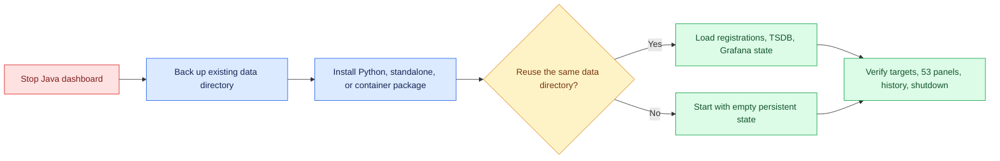

<!--
Copyright (c) KMG. All Rights Reserved.

Licensed under the Apache License, Version 2.0 (the "License");
you may not use this file except in compliance with the License.
You may obtain a copy of the License at

    http://www.apache.org/licenses/LICENSE-2.0
-->

# Migration from the Java implementation

## Single-dashboard multi-range comparison

The comparison API now accepts one registered endpoint as well as the existing 2–8 endpoint sets. Selecting one
endpoint opens two time lanes for the same canonical dashboard and permits adding up to eight lanes. Lane count and
range selections are URL-only browser state. No registration, discovery, persistence, or native-process format
changes are required. Existing multi-target comparison IDs, URLs, and behavior remain compatible.

Comparison descriptor schema 2 also gives every cached descriptor a UID-derived unique Grafana title. On the first
restart, reconciliation rewrites older schema-1 files automatically. This prevents Grafana from disabling its file
provider when several different comparison files previously shared the `SBK/SBM Live Comparison` title.

The comparison app now waits through a bounded 37.5-second exponential readiness window for Grafana's asynchronous
file provider. Existing IDs, bookmarks, classic fallback dashboards, and stored comparison files remain compatible.
Repeated selection of an unchanged comparison no longer rewrites its descriptor.

Dedicated endpoint links now pass through a read-only readiness gateway before entering Grafana. Grafana reports
native health before its asynchronous file provider necessarily imports a newly written dashboard, which previously
made a new link randomly show `Dashboard not found` for the first polling interval. The gateway performs bounded
loopback UID probes across browser refreshes and redirects only after Grafana returns HTTP 200. Existing endpoint
IDs, direct `dashboardUrl` values, bookmarks, persisted files, and Grafana URLs remain unchanged. API clients can use
the new `dashboardOpenUrl` field or the `ready` field from `GET /api/targets/<id>/dashboard`.



The Python rewrite preserves the external contract:

- the command name remains `sbk-dashboard`;
- all command-line options and environment-variable precedence remain available;
- default ports and seven-day retention remain unchanged;
- existing `targets.json` field names and endpoint IDs remain readable;
- the monitoring directory, Prometheus TSDB, Grafana data, generated dashboards, and mappings remain in place;
- the exact canonical Grafana dashboard remains packaged.

The comparison feature adds an optional `kind` field with values `SBK` or `SBM`. Existing registrations lacking the
field continue to load as `SBK`, so no registry migration is required. Reconciliation generates
comparison dashboards and attaches `sbk_dashboard_name` and `sbk_kind` to newly scraped samples for readable legends.
Samples retained from before this feature keep their original label set and remain queryable; a Grafana range that
crosses the upgrade can show an older endpoint-ID-only series beside its newly named series. Endpoint IDs, dedicated
dashboard UIDs, and stored historical samples remain unchanged. Comparison selections are carried in Grafana URLs
and create no new user-managed registry.

Comparison dashboards now use an order-independent `sbk-comparison-<16-hex>` UID derived from the selected endpoint
set instead of the former global `sbk-comparison` UID. Selecting the same set again reuses its ID and URL. The old
generated shared file is removed by reconciliation; bookmarks using that old UID must be recreated through the
landing page or comparison API. The new generated-file cache is bounded to 128 entries and does not change endpoint
IDs, samples, or registration persistence.

The comparison URL now opens the bundled `kmg-sbkcomparison-app`. Existing deterministic comparison descriptors and
UIDs remain valid, and the API also returns `classicDashboardUrl` for the earlier single-range provisioned view.
Every target initially follows one global live range; per-target relative-live or fixed historical selections are
URL state and require no data migration. The app is installed automatically into the managed Grafana data directory
on startup in direct, portable, wheel, and container deployments. Fixed ranges are capped at 31 days and each view
at four distinct time groups.

Build and runtime requirements changed from JDK 25 plus Gradle to Python 3.10+ plus `pip` or Conda. Remove Java launch
scripts from service definitions and point them at the environment's generated `sbk-dashboard` command.

Source-checkout launchers can now fall back to the exact-version standalone release when Python 3.10+ is absent.
The first fallback stores the verified runtime below `SBK_DASHBOARD_HOME/distributions`; later starts reuse it
without Python or network access. Existing venv, Conda, private source runtimes, application data, registrations,
native tools, and launcher ownership records remain compatible and retain precedence. No data migration is needed.
The launcher now reports OS/Python/environment details and whether it created, reused, or repaired the selected
runtime. This is informational output only and adds no persisted-data migration.

Example systemd command after installing into `/opt/sbk-dashboard-venv`:

```ini
ExecStart=/opt/sbk-dashboard-venv/bin/sbk-dashboard -data /var/lib/sbk-dashboard
```

Stop the Java version before starting the Python version. The default `-continue false` behavior can replace old
Prometheus and Grafana processes safely, but an orderly migration avoids an unnecessary forced service transition.

`SBK_JAVA_HOME` and `JAVA_HOME` no longer affect the dashboard. No data migration is required when the same
`SBK_DASHBOARD_DATA_DIR` is selected.

## Network and logging changes in the production-hardening release

Prometheus now binds to `127.0.0.1` by default instead of every interface. This is compatible with the managed
Grafana datasource and health checks. Deployments that intentionally query Prometheus remotely must explicitly set
`-prometheus-bind` or `SBK_DASHBOARD_PROMETHEUS_BIND` and provide their own network controls.

Management and Grafana continue to bind publicly by default. They can now be restricted independently with `-bind`
and `-grafana-bind`. Listener addresses do not change generated public URLs; continue using `-grafana-url` for proxy,
TLS, or external DNS routing.

Control-plane messages now use timestamped standard Python logging on stderr. Service definitions that previously
redirected stdout should capture stderr as well, or rely on the host service manager's combined journal. Native
Prometheus and Grafana console logs remain in bounded rotating files under the monitoring data directory.

Grafana's default startup deadline is now 120 seconds; Prometheus remains 45 seconds. Persistent JSON remains
backward compatible and needs no data migration.

The Python server emits one concise INFO-level runtime status every 60 seconds by default. Use
`-status-seconds <1-86400>` or `SBK_DASHBOARD_STATUS_SECONDS` to change the interval. This is operational output only;
it adds no persisted field and requires no data migration.

Owned Prometheus and Grafana processes now run beneath lightweight lifecycle guardians. This adds no service option
or persisted-data migration. Service managers may retain their existing stop timeout and process-group policy; normal
shutdown remains graceful, while hard termination of only the main PID now triggers guardian cleanup. Attached
`-continue true` services remain externally owned and are never guarded or terminated by sbk-dashboard.

Windows-owned native services now additionally use a kill-on-close Job Object. Each native process starts suspended,
is assigned to the job, and resumes only after assignment succeeds, so Prometheus, Grafana, and their descendants
cannot escape during startup or survive closure of the guardian's job handle. This changes no command-line option,
service definition, or persisted data. POSIX deployments retain their dedicated session/process-group cleanup, and
containers retain the same application cleanup inside Docker's final PID-namespace/cgroup termination boundary.

The landing page now displays total, up, and down endpoint counters derived from the existing target inventory API.
This is a browser-only presentation change with no new endpoint, option, or persisted-data migration.

Registered endpoints missing from a successful Prometheus target response now transition from initial `pending` to
`down`. Earlier versions left this case pending indefinitely, causing the landing-page Down counter to omit stale
session endpoints. This status correction requires no configuration or data migration.

Landing-page JavaScript and CSS URLs now include a content fingerprint of the final substituted response bytes, and
all assets require browser revalidation. Source edits and server-owned UI policy changes both invalidate the cache
key. Operators do not need to ask users to clear their browser cache after upgrading; the next page load fetches a
compatible control script and stylesheet automatically.

The bundled Grafana comparison plugin now receives a deterministic build suffix in its packaged version. This
invalidates Grafana's browser module cache when comparison sources change without requiring an application-version
bump. Restart sbk-dashboard after updating the checkout so the managed plugin is atomically replaced; newly opened
comparison pages then load the matching descriptor and canonical row layout automatically. Tabs already open before
the restart must be reloaded because their JavaScript process is already running.

Periodic status now reports bounded recent browser activity: `clients_recent`, `landing_clients_2m`, and
`grafana_opens_5m`. This adds only an in-memory control-plane heartbeat endpoint and opaque per-tab browser IDs; it
does not change persisted data, command options, native Prometheus/Grafana configuration, or direct-server routing.
Direct Grafana bookmarks and Prometheus API users remain outside these counts.

Interactive local startup now makes one best-effort request to open the management landing page in a new browser tab.
SSH, CI, non-interactive Windows service, and headless Unix sessions are detected and skipped automatically. Browser
startup failure is non-fatal and adds no command-line option or persisted state.

Endpoint registry loading now revalidates normalized host names, metrics paths, field bounds, and the stable
host-and-port-derived endpoint ID before generating discovery or dashboard files. Registries produced by supported
sbk-dashboard releases remain compatible. Manually modified entries with inconsistent IDs or invalid fields must be
corrected before startup. Native archive downloads are now capped by the `download.max.bytes` monitoring property;
the packaged default is 2 GiB.

## Optional container deployment

Container deployments created after the container-hardening update bind published ports to `127.0.0.1` by default.
Set `SBK_DASHBOARD_PUBLISH_HOST=0.0.0.0` only when retaining deliberate network-wide access behind an appropriate
firewall or authenticated proxy. Compose also runs with a read-only root filesystem; all persistent writes remain
under the existing `/var/lib/sbk-dashboard` volume, so no data migration is required. Native binaries under `/opt`
are now immutable root-owned image content.

The base `compose.yaml` now applies a 512 PID limit and Docker `json-file` rotation of 10 MiB with three files.
Override these with `SBK_DASHBOARD_PIDS_LIMIT`, `SBK_DASHBOARD_LOG_MAX_SIZE`, and
`SBK_DASHBOARD_LOG_MAX_FILES`. The optional `compose.resources.yaml` overlay supplies default 4 GiB memory and 2
CPU limits; it is not automatically applied, allowing existing deployments to select capacity appropriate to their
target cardinality.
Release images are vulnerability-gated, carry SBOM/provenance attestations, and are signed by the GitHub release
workflow. Existing version tags remain usable; production operators can adopt immutable digest references without
changing stored registrations or monitoring data.

The verified native defaults advance to Prometheus 3.13.2 and Grafana 13.1.3 across supported operating systems and
architectures. Existing downloaded versions remain in their versioned tool cache but are no longer selected by the
packaged defaults. Persistent Prometheus TSDB, Grafana database, registrations, and dashboard identities remain in
the data root and require no format migration.

Release 1.26.8.1 added an optional Linux AMD64/ARM64 container without changing endpoint IDs, persisted JSON,
dashboard UIDs, retention, or the native child-process design. To move an existing direct installation, stop it
cleanly and copy its data root into a Docker volume or a UID/GID 10001-writable bind mount at
`/var/lib/sbk-dashboard`. Publish host ports 9721 and 3000; do not publish internal Prometheus port 9090.

The production `compose.yaml` now consumes the pinned Docker Hub release image and has no source-build section. Run
`docker compose pull` followed by `docker compose up --detach`; this creates and retains the named data volume while
avoiding Prometheus/Grafana archive downloads during startup. Source developers must add `compose.dev.yaml`
explicitly. Recreating or upgrading the container against the same volume preserves registrations, generated
dashboards, Grafana state, and Prometheus history. `docker compose down` preserves the volume;
`docker compose down --volumes` permanently removes it and must not be used during a normal upgrade.

Inside a container, `127.0.0.1` identifies the container itself. The image now defaults the endpoint form to
`host.docker.internal` (the supplied Compose file adds the host-gateway mapping), while native/Conda execution keeps
the `127.0.0.1` default. Existing registrations and endpoint identities are unchanged. Use a routable DNS/IP address
for a remote endpoint. See `docs/DOCKER.md` for the complete procedure.

The production container base is now pinned to Python 3.12.13 on Debian Trixie by immutable multi-architecture
digest, and container CI is pinned to Ubuntu 24.04. This changes only the packaged Linux userspace and build runner;
application behavior, persisted data, endpoint identity, and native deployment support are unchanged. Compose now
enables IPv6 on its bridge so literal IPv6 targets can be scraped when the Docker host has working IPv6 routing.

Release 1.26.8.2 switched the published-image workflow to Docker Hub, added source-archive foreground/background
launchers for Linux, macOS, and Windows, and changed only the container endpoint-form default to
`host.docker.internal`. Direct Python/Conda target defaults and persisted registrations remain unchanged.

The multi-instance launcher extension keeps the historical default-port data root and launcher filenames. An
instance using a non-default management port now defaults to `~/.sbk-dashboard/instances/<port>`. If the built-in
Prometheus 9090 or Grafana 3000 port is occupied, and that native port was not supplied by CLI or environment,
startup chooses and reports a bounded fallback port instead of replacing the listener. Existing deployments that
explicitly configure native ports or data directories retain their exact values.

Operator-supplied Prometheus and Grafana ports are now strictly non-replaceable. If a CLI/environment port is busy,
startup reports its listener where identifiable and exits instead of stopping an existing native service. Omit the
native-port option to use the built-in default with automatic fallback, or use `-continue true` to attach to already
running compatible services. This behavior changes no persisted data.

Exact repeated endpoint registration is now idempotent. Submitting the same normalized host, port, metrics path,
display name, and SBK/SBM kind returns the existing endpoint and dashboard rather than a duplicate-registration
error. The initial API request returns HTTP 201 and repeats return HTTP 200. Existing endpoint IDs and persisted
registrations are unchanged; conflicting metadata for an existing `host:port` is still rejected.

Portable startup replaces the checkout-local `.venv` fallback. Source scripts require only Python 3.10+ with venv,
reuse an active venv/Conda environment when present, and otherwise create an immutable runtime below
`~/.sbk-dashboard/app/<version>/<platform>/<source-fingerprint>`. Shared package downloads, native archives/tools,
launcher state, logs, and default data live beneath the same home; `SBK_DASHBOARD_HOME` relocates it.
`SBK_DASHBOARD_DATA_DIR` and `SBK_DASHBOARD_LAUNCHER_DIR` remain authoritative, and existing data needs no migration.
GitHub releases also provide frozen Linux AMD64, macOS Apple-silicon, and Windows AMD64 executables without a Python
prerequisite.

The configuration-policy consolidation after 1.26.8.2 does not change defaults, CLI flags, environment variables,
endpoint IDs, or stored formats. Built-in native artifact metadata moved from packaged properties into
`native-artifacts.json`, which is also consumed by Docker builds. Existing external
`monitoring-download.properties` overrides remain supported. Release maintainers should update `version.py` and run
`python scripts/sync_release_metadata.py --write`; CI rejects stale current-release references.
