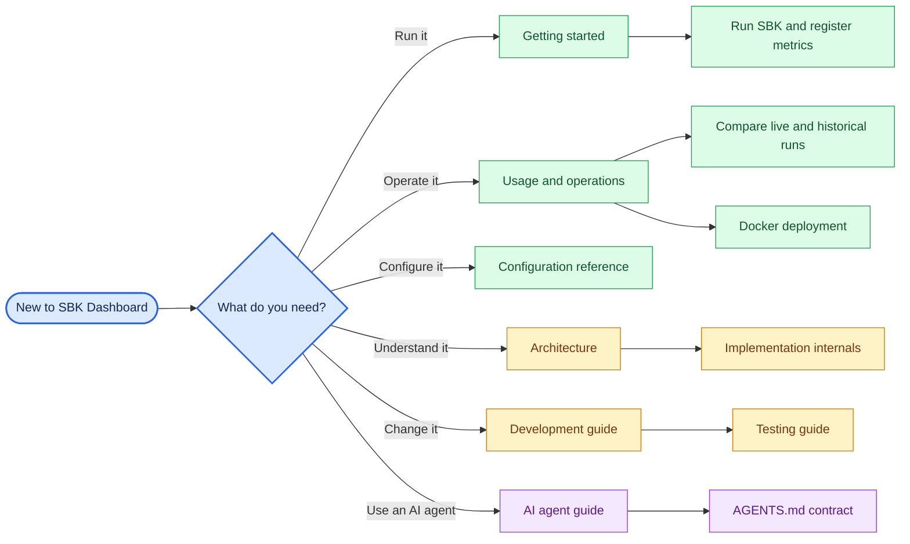

<!--
Copyright (c) KMG. All Rights Reserved.

Licensed under the Apache License, Version 2.0 (the "License");
you may not use this file except in compliance with the License.
You may obtain a copy of the License at

    http://www.apache.org/licenses/LICENSE-2.0
-->

# Documentation center

This page is the entry point for SBK Dashboard documentation. Start with the path that matches your role; each
specialist guide links back here so a new engineer can always recover the larger context.

## First-day path

1. Follow [Getting started](GETTING_STARTED.md) to launch the application and register a live endpoint.
2. Read [Configuration reference](CONFIGURATION.md) before changing ports, bind addresses, retention, or process
   ownership behavior.
3. Read [Architecture](ARCHITECTURE.md) to understand the one-control-plane/two-native-child design.
4. Follow [Development](DEVELOPMENT.md) to create an environment and run the validation suite.
5. Use [Implementation internals](INTERNALS.md) when changing a specific module or lifecycle.

## Documentation by audience

| Audience | Begin here | Continue with |
|---|---|---|
| First-time user | [Getting started](GETTING_STARTED.md) | [SBK integration](SBK.md), [Usage](USAGE.md) |
| Host operator | [Usage](USAGE.md) | [Configuration](CONFIGURATION.md), [Portable runtime](PORTABLE.md) |
| Container operator | [Docker deployment](DOCKER.md) | [Configuration](CONFIGURATION.md), [Docker publishing](DOCKER_HUB.md) |
| Software engineer | [Development](DEVELOPMENT.md) | [Architecture](ARCHITECTURE.md), [Internals](INTERNALS.md), [Testing](TESTING.md) |
| Release engineer | [Testing](TESTING.md) | [Docker publishing](DOCKER_HUB.md), [Migration](MIGRATION.md) |
| AI coding agent | [AI agent guide](AI_AGENTS.md) | [`AGENTS.md`](../AGENTS.md), [Agent guide](AGENT_GUIDE.md) |

## Guide catalog

| Guide | Question it answers |
|---|---|
| [Getting started](GETTING_STARTED.md) | How do I get from a clone to a working dashboard? |
| [Usage and operations](USAGE.md) | How do I start, stop, back up, upgrade, and troubleshoot it? |
| [Configuration reference](CONFIGURATION.md) | What does every CLI option and environment variable do? |
| [SBK integration](SBK.md) | How does `PrometheusLogger` connect a benchmark to the dashboard? |
| [Comparison](COMPARISON.md) | How do multiple targets use shared or independent live and historical ranges? |
| [Portable installation](PORTABLE.md) | How does first-run bootstrap work without Python, and what is cached? |
| [Docker deployment](DOCKER.md) | How do I securely run the supported container package? |
| [Architecture](ARCHITECTURE.md) | Why is the system designed this way, and what invariants must remain? |
| [Implementation internals](INTERNALS.md) | Which module owns each call path, lock, process, and persistent file? |
| [Development](DEVELOPMENT.md) | How do I set up, navigate, change, and validate the repository? |
| [Testing](TESTING.md) | Which automated and live checks prove a change? |
| [Migration](MIGRATION.md) | What compatibility and upgrade behavior must operators know? |
| [Docker Hub publishing](DOCKER_HUB.md) | How are multi-architecture images built, verified, signed, and published? |
| [AI agent guide](AI_AGENTS.md) | How should Codex, Devin, Cursor, Windsurf, and other agents work here? |

## Source-of-truth rule

Documentation explains behavior; implementation contracts remain executable:

- version: `src/sbk_dashboard/version.py`;
- CLI parsing and precedence: `src/sbk_dashboard/config.py`;
- defaults and numeric bounds: `src/sbk_dashboard/contracts.py`;
- endpoint identity: `src/sbk_dashboard/endpoint_policy.py`;
- public API: `src/sbk_dashboard/web.py`;
- native artifacts: `src/sbk_dashboard/resources/native-artifacts.json`;
- agent rules: [`AGENTS.md`](../AGENTS.md).

When a document and source disagree, treat that as a defect: update the implementation or documentation together
and add a contract test that prevents the same drift.
