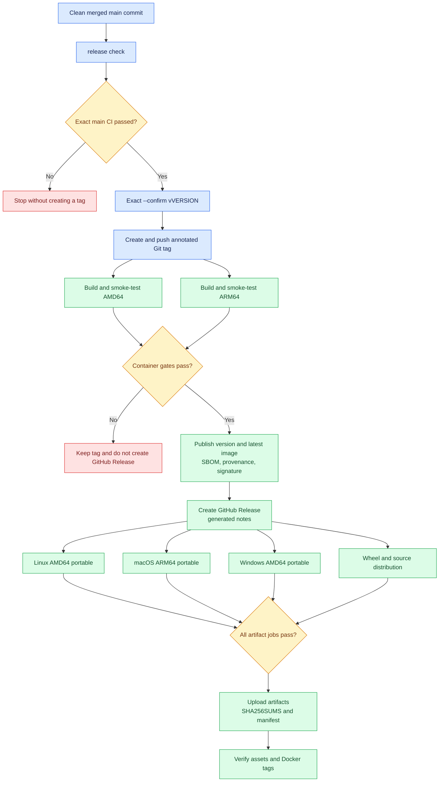

<!--
Copyright (c) KMG. All Rights Reserved.

Licensed under the Apache License, Version 2.0 (the "License");
you may not use this file except in compliance with the License.
You may obtain a copy of the License at

    http://www.apache.org/licenses/LICENSE-2.0
-->

# Publish a complete release

Use the dedicated source-checkout release command to publish one version consistently from Linux, macOS, or Windows.
The runtime `sbk-dashboard`, `sbk-dashboard.ps1`, and `sbk-dashboard.cmd` launchers are not involved and retain only
their portable application behavior. The release command creates no local platform substitutes: GitHub-hosted Linux,
Apple-silicon macOS, Windows, and
native ARM64 runners build and validate their own artifacts. Docker publishing remains in the existing gated
container workflow.

The safe default is `check`. Publication requires the separate `publish` action plus an exact `--confirm v<version>`
value. Unit and pull-request tests use only mocks, manifest fixtures, workflow builds, and offline checks; they do
not create a Git tag, GitHub Release, release asset, or Docker image.

## Delivery flow



## What one release contains

For version `<version>`, the command verifies these explicit GitHub Release assets:

| Artifact | Purpose |
|---|---|
| `sbk_dashboard-<version>-py3-none-any.whl` | Python wheel for venv or Conda installation |
| `sbk_dashboard-<version>.tar.gz` | Python source distribution |
| `sbk-dashboard-<version>-linux-amd64.tar.gz` and `.sha256` | Python-free Linux x86-64 application |
| `sbk-dashboard-<version>-macos-arm64.tar.gz` and `.sha256` | Python-free Apple-silicon application |
| `sbk-dashboard-<version>-windows-amd64.zip` and `.sha256` | Python-free Windows x86-64 application |
| `SHA256SUMS` | Direct SHA-256 entries for all eight build artifacts, including archives, Python packages, and per-archive checksum files |
| `release-manifest.json` | Version, tag, commit, sizes, and SHA-256 values |

GitHub also supplies its standard source-code ZIP and TAR archives. The release body is generated from commits and
merged pull requests since the preceding release. Docker Hub receives `kmgowda/sbk-dashboard:<version>` and
`kmgowda/sbk-dashboard:latest`, pointing to the same signed multi-architecture digest.

## Prerequisites

Run from a source checkout after the version change has been reviewed and merged:

- Python 3.10 or newer and Git are available. No project runtime installation is needed by the release command.
- The checked-out branch is `main`, its working tree is clean, and `HEAD` exactly matches `origin/main`.
- `src/sbk_dashboard/version.py` and every synchronized release reference contain the intended version.
- The exact `main` commit has a successful `ci.yml` push run.
- Git can push to `origin` using the normal credential manager, SSH agent, or other secure Git configuration.
- `GITHUB_TOKEN` belongs to GitHub user `kmgowda` and is authorized to read Actions and create releases in
  `kmgowda/sbk-dashboard`. The command rejects another authenticated login or repository owner.
- Repository Actions secrets `DOCKERHUB_USERNAME` and `DOCKERHUB_TOKEN` are configured as described in
  [`DOCKER_HUB.md`](DOCKER_HUB.md).

Do not put GitHub or Docker tokens in command arguments, tracked files, shell history, or committed environment
files. The release command reads only `GITHUB_TOKEN` from its environment; Docker credentials remain
inside GitHub Actions.

## Prepare the version

Change the source of truth, synchronize release references, validate, commit, open a PR, and merge it before
publishing:

```bash
python scripts/sync_release_metadata.py --write
python scripts/sync_release_metadata.py
```

The first command assumes `src/sbk_dashboard/version.py` already contains the new version. Follow
[`TESTING.md`](TESTING.md) for the complete pre-merge validation. After merge:

```bash
git checkout main
git pull --ff-only origin main
git status --short --branch
```

## Check without publishing

Linux or macOS:

```bash
./release-sbk-dashboard.sh check
```

Windows PowerShell or Command Prompt:

```powershell
.\Release-SbkDashboard.ps1 check
.\release-sbk-dashboard.cmd check
```

The command prints the checked-out branch, required release branch, repository, commit, version, planned tag, Docker
tags, GitHub Release URL, and every required asset. It fails if metadata is stale, the tree is dirty, `HEAD` differs
from remote `main`, or the version tag/release
already exists, or the exact commit has not passed the main CI workflow. It never writes a tag or calls a mutating
GitHub API.

For local development of the command itself, the offline option uses the fetched `origin/main` reference instead of
network APIs. A clean feature branch can validate local metadata and command wiring without releasing anything:

```bash
./release-sbk-dashboard.sh check --allow-branch --offline
```

Offline validation cannot prove current CI, GitHub tag/release, or Docker registry state. `publish` deliberately has
no branch or offline override and still requires the checked-out commit to equal remote `main`.

## Publish

Export the GitHub token without placing it on the command line, then repeat the exact tag printed by `check`:

```bash
export GITHUB_TOKEN='<token-from-secure-credential-store>'
./release-sbk-dashboard.sh publish --confirm v1.26.8.4
```

```powershell
$env:GITHUB_TOKEN = '<token-from-secure-credential-store>'
.\Release-SbkDashboard.ps1 publish --confirm v1.26.8.4
```

Publication is intentionally bounded but may run for up to two hours while native container and portable jobs
complete. The command prints links for each workflow. It returns success only after:

1. the exact `main` commit passed cross-platform CI;
2. the annotated tag was pushed;
3. AMD64 and ARM64 images passed their native smoke gates;
4. the version and `latest` multi-architecture image was published, attested, and signed;
5. the generated-notes GitHub Release was published;
6. every portable and Python artifact was attached; and
7. the release assets and Docker Hub tag digests were verified.

## Recover a partial release

The command never moves an existing tag and never overwrites a release asset.

- If CI fails, no tag exists. Fix the failure through a normal PR and release the resulting commit/version.
- If container validation fails, the immutable tag exists but no GitHub Release is created. Inspect and rerun the
  failed `container.yml` jobs. After they pass for the same commit, use `publish --confirm v<version> --resume`.
- If portable packaging fails, the tag, image, and GitHub Release exist. Rerun the failed `portable.yml` jobs, then
  use `--resume` to verify the complete asset set.
- If a tag points to another commit, stop. Use a new version; do not delete or move a published release tag.

The `--resume` option accepts existing state only when the local tag, remote tag, release, and checked-out commit are
consistent. The final workflow compares the size and GitHub SHA-256 digest of every existing asset, keeps identical
assets, and uploads only missing assets. If GitHub still reports an asset as open or has not populated its digest,
the workflow waits for a bounded five-minute metadata-propagation window instead of treating that asset as missing
or overwriting it. A completed conflicting asset still fails the job. It does not bypass failed workflows or
missing assets.

## Implementation boundaries

[`scripts/release.py`](../scripts/release.py) is an OS-neutral, standard-library orchestrator. POSIX and PowerShell
dispatchers only select Python and pass arguments unchanged. [`release_contract.py`](../scripts/release_contract.py)
owns asset names and bounds; [`build_release_manifest.py`](../scripts/build_release_manifest.py) validates the exact
workflow outputs; [`select_release_assets.py`](../scripts/select_release_assets.py) makes partial-upload retries
idempotent without weakening immutability. GitHub requests pin API version `2022-11-28`; Docker Hub uses its own JSON
media type and bounded exponential/rate-limit backoff. GitHub Actions owns native builds, secrets, attestations, and
publication. Rate-limit handling accepts either relative delays or numeric Unix timestamps, clamps every sleep to
the remaining release timeout, and queries Docker Hub through its current namespace/repository tag API.

This separation is preferable to local multi-platform release builds: a macOS laptop cannot natively validate
Windows and Linux ARM64, local credentials should not include every registry/signing capability, and duplicating
workflow policy in three operating-system scripts would drift.
