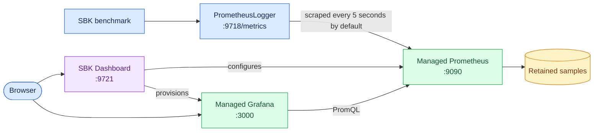

<!--
Copyright (c) KMG. All Rights Reserved.

Licensed under the Apache License, Version 2.0 (the "License");
you may not use this file except in compliance with the License.
You may obtain a copy of the License at

    http://www.apache.org/licenses/LICENSE-2.0
-->

# Use SBK with PrometheusLogger

This guide connects an SBK benchmark to SBK Dashboard. SBK's `PrometheusLogger` publishes the current benchmark
measurements as Prometheus metrics; SBK Dashboard runs the Prometheus server that scrapes and retains those metrics
and the Grafana server that displays them. `PrometheusLogger` does not start SBK Dashboard, Prometheus, or Grafana.

For dashboard installation, upgrades, backups, and service operation, see [`USAGE.md`](USAGE.md). For SBK workload
and driver options, use the documentation and `-help` output from the SBK version being run.

## How the pieces connect



The exporter belongs to the SBK process and normally exists only while that benchmark is running. The dashboard
target therefore becomes `down` after SBK exits. This is expected: Prometheus keeps the samples it already scraped
until the configured retention period expires, and the completed run remains visible by selecting its time range
in Grafana.

Default ports are:

| Service | Default endpoint |
|---|---|
| Direct SBK `PrometheusLogger` | `9718/metrics` |
| SBM or SBK-GEM aggregate exporter | `9719/metrics` |
| SBK Dashboard management UI/API | `9721` |
| Dashboard-managed Prometheus | `9090`, loopback-only by default |
| Dashboard-managed Grafana | `3000` |

## Direct SBK quick start

### 1. Build or install SBK

SBK requires the JDK version documented by its current release. From an SBK source checkout, verify Java and build
the runnable distribution:

```bash
java -version
./gradlew installDist
./build/install/sbk/bin/sbk -help
```

If using a released SBK distribution, substitute its `bin/sbk` path in the examples below. On Windows, use the
corresponding `sbk.bat` launcher and a Windows file path.

### 2. Start SBK Dashboard

Start one dashboard deployment on the monitoring host. For example, use Docker Compose:

```bash
docker compose pull
docker compose up --detach
```

Or run a directly installed Python package:

```bash
sbk-dashboard
```

Wait for the management page at <http://localhost:9721/>. Starting the dashboard first lets Prometheus scrape the
benchmark from its first reporting windows.

### 3. Run SBK with PrometheusLogger

The output logger must be selected explicitly:

```bash
./build/install/sbk/bin/sbk \
  -class file \
  -file /tmp/sbk-dashboard-example.dat \
  -writers 1 \
  -size 4096 \
  -seconds 120 \
  -records 1000 \
  -out PrometheusLogger
```

This filesystem workload is only an example. `PrometheusLogger` can be used with the other SBK storage drivers and
their workload options. Ask the selected driver and logger for the authoritative merged option set:

```bash
./build/install/sbk/bin/sbk -class file -out PrometheusLogger -help
```

With no `-context` option, direct SBK exports at `http://<sbk-host>:9718/metrics`. While SBK is running, verify it
locally on the SBK host:

```bash
curl -fsS http://127.0.0.1:9718/metrics | head
```

SBK prints usable exporter URLs when the logger starts. Use a printed non-loopback address when the dashboard runs
on another machine.

### 4. Register the exporter

Open the management page and add these values:

| Field | Direct native dashboard | Dashboard in supplied Compose stack |
|---|---|---|
| Display name | Any meaningful run/source name | Any meaningful run/source name |
| Benchmark type | `SBK` | `SBK` |
| Host or IP | `127.0.0.1` when SBK is on the same host | `host.docker.internal` when SBK is on the Docker host |
| Port | `9718` | `9718` |
| Metrics path | `/metrics` | `/metrics` |

For SBK on a different machine, use a DNS name or IP address reachable from the dashboard's Prometheus process.
Do not use `127.0.0.1` for a remote exporter. In a container, `127.0.0.1` identifies the dashboard container, not
the Docker host; the supplied Compose configuration provides the `host.docker.internal` host-gateway mapping.

The same registration can be created through the API:

```bash
curl --fail-with-body \
  -H 'Content-Type: application/json' \
  --data '{"name":"SBK file write","kind":"SBK","host":"127.0.0.1","port":9718,"metricsPath":"/metrics"}' \
  http://127.0.0.1:9721/api/targets
```

Register while SBK is running if an immediate `up` result is required. It is also safe to register first: the
endpoint will be `down` until the exporter becomes reachable and will recover automatically after a successful
scrape.

### 5. Open and interpret the dashboard

After the target changes from `pending` to `up`, select **Open dashboard**. Each registered `host:port` receives a
stable, isolated dashboard. Choose a Grafana time range that includes the benchmark run.

Target states have these meanings:

- `pending`: registration completed and the next successful Prometheus target refresh has not yet published state;
- `up`: Prometheus successfully scraped the exporter;
- `down`: the exporter stopped, is unreachable, or returned a scrape error; and
- `unknown`: defensive fallback for unrecognized status data.

The dashboard is based on SBK's `SBK_*` series. SBK identifies direct measurements with `component="sbk"` and
includes storage class and read/write action labels. Prometheus adds `sbk_endpoint_id`, which keeps dashboards for
different registered endpoints isolated.

To compare concurrent results, register every exporter with the correct `SBK` or `SBM` type, select 2–8 endpoint
checkboxes, and choose **Compare selected**. The selector displays name, type, and exporter address; chart legends
show the registered dashboard name and type plus the immutable endpoint ID. Comparison uses wall-clock time and does
not shift sequential historical runs to a common elapsed-time origin.

## Change the exporter port or path

Use SBK's `-context PORT/PATH` option when port 9718 is occupied or a different path is required:

```bash
./build/install/sbk/bin/sbk \
  -class file \
  -file /tmp/sbk-dashboard-example.dat \
  -readers 1 \
  -size 4096 \
  -seconds 120 \
  -out PrometheusLogger \
  -context 19718/sbk-metrics
```

Register port `19718` and metrics path `/sbk-metrics`. The leading slash belongs in the dashboard form/API even
though SBK's `-context` syntax is `PORT/PATH`. `-context no` disables Prometheus export and therefore cannot feed
SBK Dashboard.

Only one process can listen on a given address and port. Give simultaneous SBK processes distinct `-context` ports
and register each port separately. Endpoint identity is based on normalized `host:port`, so:

- the same host on two ports produces two isolated dashboards;
- changing only the display name or metrics path does not create a new endpoint; and
- sequential runs on the same registered `host:port` reuse its dashboard and history.

## Distributed SBK, SBM, and SBK-GEM

In a distributed run, SBK clients normally send measurements with `GrpcLogger` to SBM, and SBM publishes the
aggregate Prometheus endpoint. SBK-GEM uses the same SBM-backed aggregation model. Register the coordinator rather
than each gRPC client:

| Run type | Logger that owns the scrape endpoint | Register in SBK Dashboard |
|---|---|---|
| Direct SBK | `PrometheusLogger` | `<sbk-host>:9718/metrics` |
| Standalone SBM aggregation | `SbmPrometheusLogger` | `<sbm-host>:9719/metrics` |
| SBK-GEM aggregation | `GemPrometheusLogger` | `<coordinator-host>:9719/metrics` |

For example, start SBM's aggregate logger, then point SBK clients at its gRPC service using the exact options for
the installed SBK release:

```bash
./sbm/build/install/sbm/bin/sbm \
  -out SbmPrometheusLogger -class file -action r

./build/install/sbk/bin/sbk \
  -class file -file /tmp/sbk-dashboard-example.dat \
  -readers 1 -size 4096 -seconds 120 \
  -out GrpcLogger -sbm <sbm-host> -sbmport 9717
```

Then register `<sbm-host>` with type `SBM` on port `9719` with path `/metrics`. The aggregate series use
`component="sbm"`, including
SBK-GEM runs, because SBM owns the aggregation and metrics endpoint. Consult the matching SBK release documentation
for coordinator, node, and YML-launcher setup; those workload orchestration options are outside this dashboard.

## Verify collection

Check the dashboard control plane and target inventory:

```bash
curl -fsS http://127.0.0.1:9721/api/health
curl -fsS http://127.0.0.1:9721/api/targets
```

For a native dashboard installation, its managed Prometheus is loopback-accessible by default:

```bash
curl -fsS 'http://127.0.0.1:9090/api/v1/targets?state=active'
curl -fsSG --data-urlencode 'query=up{job="sbk-dashboard"}' \
  http://127.0.0.1:9090/api/v1/query
```

Prometheus port 9090 is intentionally not published by the supplied Compose deployment. Use the management target
inventory and Grafana there, or perform container diagnostics as described in [`DOCKER.md`](DOCKER.md).

## Networking and security

The endpoint host must be reachable from Prometheus, not merely from the browser. Test the metrics URL from the
dashboard host, or from the dashboard container's network namespace when diagnosing Compose. Allow the exporter
port through host firewalls only for the monitoring host or trusted benchmark network.

SBK's exporter has no authentication or TLS. SBK Dashboard also ships with authentication disabled, and its default
management and Grafana listeners are public IPv4 listeners. Do not expose exporter port 9718/9719, management port
9721, Grafana port 3000, or SBM gRPC port 9717 directly to an untrusted network. Use firewall restrictions and, for
user-facing services, an authenticated TLS reverse proxy.

## Troubleshooting

| Symptom | What to check |
|---|---|
| SBK rejects or cannot start `PrometheusLogger` | Confirm `-out PrometheusLogger`, inspect logger-specific `-help`, check whether the port is occupied, or choose another `-context` port |
| Local `curl` to the exporter fails | Keep the benchmark running, use the URL printed by SBK, and verify the configured port/path |
| Target stays `pending` | Wait for a target refresh and confirm registration reconciliation completed |
| Target is `down` | Curl the exact exporter URL from Prometheus's host/network namespace; check DNS, routing, firewall, port, and path |
| Compose cannot scrape host SBK | Register `host.docker.internal`, retain the supplied host-gateway mapping, and allow the exporter port through the host firewall |
| Dashboard has no data | Confirm target `up`, select a time range covering the run, and verify that the endpoint exposes `SBK_*` metrics |
| Target goes down when the run ends | Expected: the SBK-owned exporter stopped; historical samples remain until retention expires |
| Two simultaneous runs conflict | Assign different `-context` ports and register both `host:port` pairs |
| Grafana link has the wrong hostname | Open the management UI through the desired hostname or configure an explicit `-grafana-url` |
