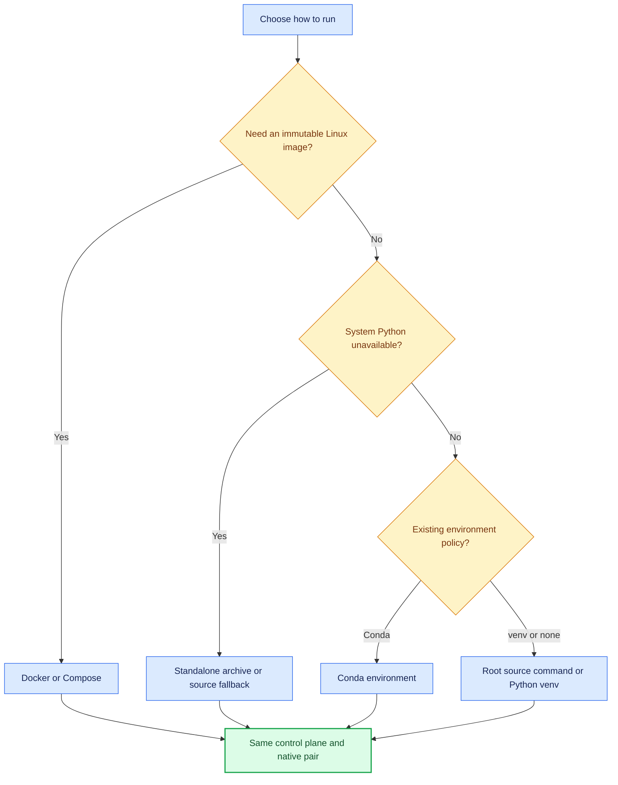

<!--
Copyright (c) KMG. All Rights Reserved.

Licensed under the Apache License, Version 2.0 (the "License");
you may not use this file except in compliance with the License.
You may obtain a copy of the License at

    http://www.apache.org/licenses/LICENSE-2.0
-->

# Usage and operations

This guide covers normal installation, shell-environment handling, endpoint registration, shutdown, persistence,
upgrades, and common operational checks. See [`ARCHITECTURE.md`](ARCHITECTURE.md) for design decisions and
[`INTERNALS.md`](INTERNALS.md) for implementation details.

## Choose a deployment

| Deployment | Best fit | Prometheus and Grafana |
|---|---|---|
| Standalone archive | Download, extract, and run without system Python | Native child processes on that host |
| Source bootstrap | Clone/extract; Python is optional with a matching standalone release | Native child processes on that host |
| Python venv | Direct host installation with isolated Python packages | Native child processes on that host |
| Conda | Existing Conda-based operations or development workflow | Native child processes on that host |
| Docker/Compose | Reproducible Linux image and named-volume persistence | Native child processes in the same container |

All modes run the same control plane and one Prometheus/Grafana pair. Docker is packaging, not a distributed
service topology.



Production Compose pulls the prebuilt pinned image, so starting the service does not compile Python or separately
download Prometheus/Grafana. `compose.dev.yaml` is used only when deliberately building the same image from source.

## Portable first start

The root `sbk-dashboard` (Linux/macOS), `sbk-dashboard.ps1` (PowerShell), and `sbk-dashboard.cmd` (Command Prompt)
are the recommended source-checkout entry points. They prefer an active venv/Conda environment, then Python 3.10+
with `venv`. If supported Python is unavailable, they download and install the exact-version standalone runtime.
Later starts reuse the validated private venv or frozen runtime and their caches:

```bash
./sbk-dashboard --help
./sbk-dashboard background -port 19721
./sbk-dashboard stop -port 19721
./sbk-dashboard repair
```

```powershell
.\sbk-dashboard.ps1 --help
.\sbk-dashboard.ps1 background -port 19721
.\sbk-dashboard.ps1 stop -port 19721
.\sbk-dashboard.ps1 repair
```

Standalone release archives contain a frozen `sbk-dashboard` executable and need no system Python. They support
foreground/background startup and selective/all-instance stop. See [`PORTABLE.md`](PORTABLE.md) for verification, platform
coverage, private-home layout, offline behavior, and recovery.

The bootstrap does not install Conda or replace the host Python. It prepares an already active venv/Conda
environment, creates an isolated private venv when supported Python exists, or selects the standalone bundle with
its own Python. Startup identifies the OS/release/architecture, Python implementation/version/executable,
environment kind and location, portable home, and `fresh environment created`/`saved environment reused` state.

## Python venv lifecycle

Create, activate, install, and run on Linux or macOS:

```bash
python3 -m venv .venv
. .venv/bin/activate
python -m pip install --upgrade pip
python -m pip install .
sbk-dashboard
```

PowerShell uses a platform-specific activation script:

```powershell
py -3 -m venv .venv
.\.venv\Scripts\Activate.ps1
python -m pip install --upgrade pip
python -m pip install .
sbk-dashboard
```

Command Prompt uses:

```batch
py -3 -m venv .venv
.venv\Scripts\activate.bat
python -m pip install --upgrade pip
python -m pip install .
sbk-dashboard
```

For interactive use, leave the server in the foreground. Stop it cleanly with `Ctrl+C`, wait for Grafana and
Prometheus shutdown messages, and then leave the environment:

```text
deactivate
```

The same `deactivate` command works in bash, zsh, Command Prompt, and PowerShell after their activation scripts have
been run. It restores the shell's previous Python/PATH selection. It does not:

- stop a dashboard running in another terminal, service, or container;
- delete `.venv`;
- uninstall downloaded Prometheus/Grafana tools; or
- delete endpoint registrations, Grafana state, or Prometheus history.

Reactivate later with the matching activation command. To rebuild a disposable venv, first stop the application and
deactivate it, then remove only that known `.venv` directory and create it again. Persistent data normally remains
under `~/.sbk-dashboard`, outside the venv.

## Conda lifecycle

Create from the repository definition:

```bash
conda env create -f environment.yml
conda activate sbk-dashboard
sbk-dashboard
```

`environment.yml` installs the project in editable development mode with its development tools.

For a smaller runtime-only environment:

```bash
conda create --name sbk-dashboard python=3.12 pip
conda activate sbk-dashboard
python -m pip install .
sbk-dashboard
```

Stop the foreground server with `Ctrl+C`, then leave the environment:

```bash
conda deactivate
```

Conda environments can be nested. Repeat `conda deactivate` if the prompt still shows an environment you intend to
leave. Inspect available environments with `conda env list`, and return with `conda activate sbk-dashboard`.

Environment removal is separate from deactivation:

```bash
conda deactivate
conda env remove --name sbk-dashboard
```

Do not remove the environment while `sbk-dashboard`, its guardians, Prometheus, or Grafana are still using its
Python executable. Removing the Conda environment does not remove an external `-data` directory.

## First start

Run:

```bash
sbk-dashboard
```

On first start the control plane:

1. prints its version, OS details, Python executable/environment, fresh/reused bootstrap state, supplied arguments,
   and effective configuration sources;
2. resolves installed Prometheus and Grafana or downloads the platform-specific pinned archives;
3. verifies SHA-256, safely extracts, and atomically installs missing tools;
4. loads endpoint registrations and regenerates monitoring configuration;
5. starts Prometheus, then Grafana, then the management server; and
6. opens the landing page only when a local graphical desktop is detected.

SSH, service, CI, and headless sessions intentionally skip browser launch. Open the printed URL manually, normally
`http://localhost:9721/`.

## Start and stop scripts

The repository and source archive include a root dispatcher plus foreground, background, and stop scripts.
They are not installed by the wheel; a wheel installation always provides the `sbk-dashboard` console command.
The helper scripts select Python in this order: an active virtual environment, an active Conda environment, then
Python on `PATH`. An active environment is reused and prepared once per checkout fingerprint. Without an active
environment, supported Python creates a private runtime under `SBK_DASHBOARD_HOME`; no repository `.venv` is
created. Missing pip, `sbk-dashboard`, and `psutil` are installed before launcher acquisition. Dependency
installation may require access to the configured Python package index. The stop command prepares the same runtime
when necessary, allowing a fresh command set to locate launcher ownership consistently.

Before starting, the scripts print the selected Python executable and environment, require Python 3.10 or newer,
prepare missing dependencies, import `sbk-dashboard`, and print its detected version. A missing or outdated Python,
broken active environment, unavailable venv/pip support, or failed package installation produces a concrete error
and exits without acquiring any launcher or native-process resources.

On Linux or macOS:

```bash
# Foreground: logs remain on this console; Ctrl+C stops the application.
./scripts/start-sbk-dashboard.sh

# Background: logs are written to the launcher log file.
./scripts/start-sbk-dashboard-background.sh

# Stops all instances started by either command above.
./scripts/stop-sbk-dashboard.sh

# Stops only the launcher-managed instance on management port 19721.
./scripts/stop-sbk-dashboard.sh -port 19721
```

On Windows PowerShell:

```powershell
# Foreground: logs remain on this console; Ctrl+C stops the application.
.\scripts\Start-SbkDashboard.ps1

# Background: logs are written to the launcher log file.
.\scripts\Start-SbkDashboardBackground.ps1

# Stops all instances started by either command above.
.\scripts\Stop-SbkDashboard.ps1

# Stops only the launcher-managed instance on management port 19721.
.\scripts\Stop-SbkDashboard.ps1 -port 19721
```

Every argument after the start-script name is passed unchanged and in the same order to the `sbk-dashboard`
application. Quote values containing spaces according to the current shell. For example:

```bash
./scripts/start-sbk-dashboard.sh -data /srv/sbk-dashboard -retention 14
```

```powershell
.\scripts\Start-SbkDashboard.ps1 -data C:\sbk-dashboard-data -retention 14
```

`--help`, `-h`, `--version`, and `-v` bypass running-instance checks, so help and version output remain available
while a dashboard is running. Launcher identity is the management port. Starting on a different management port is
allowed, while a second start on the same port reports the already-running instance. Each application instance owns
its own Prometheus and Grafana children. When their built-in ports are occupied and neither a CLI option nor an
environment variable supplied a port, startup selects the next suitable ports automatically. A non-default
management port also receives the isolated default data directory `~/.sbk-dashboard/instances/<port>`. Therefore,
starting another instance can be as simple as:

```bash
./scripts/start-sbk-dashboard-background.sh -port 19721
```

The management port is reserved before Prometheus or Grafana starts. If another process already owns the selected
management port, startup identifies the listener PID/executable when the operating system permits, leaves it
running, and exits with a command-line remedy instead of exposing a raw platform socket error such as macOS
`Errno 48`. Stop the existing launcher-managed instance or select a different management port:

```bash
./sbk-dashboard stop -port 9721
./sbk-dashboard -port 19721
```

`-continue true` is the exception: it retains the configured/default native ports so the existing health-checked
services can be attached rather than selecting replacements.

Supply all ports and the data directory when stable operator-selected values are required:

```bash
./scripts/start-sbk-dashboard-background.sh -port 19721 -prometheus-port 19091 \
  -grafana-port 13001 -data /srv/sbk-dashboard/19721
./scripts/start-sbk-dashboard-background.sh -port 19722 -prometheus-port 19092 \
  -grafana-port 13002 -data /srv/sbk-dashboard/19722
```

With no options, the stop script stops all launcher-managed foreground and background instances. Pass
`-port <port>` or `--port <port>` to stop only the instance listening on that management port. Launcher state
records the port, mode, PID, and process creation time, so a reused PID cannot identify an unrelated process. The
stop helper does not search by process name or terminate an unrelated manually started dashboard.

Launcher state defaults to `<SBK_DASHBOARD_HOME>/launcher` on every platform, where the home defaults to
`~/.sbk-dashboard`. A pre-existing legacy Windows `%LOCALAPPDATA%\SBK Dashboard\launcher` is still recognized when
the portable home is not selected explicitly. Set `SBK_DASHBOARD_LAUNCHER_DIR` to override only state/log location.
Foreground logs are printed directly on the current console. The background launcher drains output continuously to
`sbk-dashboard.log` for the default port and `sbk-dashboard-<port>.log` for other ports in that directory, rotating
each log at 10 MiB with three backups. Default-port state remains `sbk-dashboard.json`; other instances use
`sbk-dashboard-<port>.json`.
The stop scripts request normal control-plane shutdown and wait up to 45 seconds; set
`SBK_DASHBOARD_STOP_TIMEOUT` to a value from 1 through 300 seconds when a different bound is required. If graceful
shutdown exceeds that bound, the launcher forcefully cleans up only its recorded process tree. An independent
parent-death watcher provides the same bounded cleanup if the background supervisor is killed, including forced
termination. In foreground mode the application's native-process guardians handle abrupt parent death. Interrupting
background startup before authorization acquires no dashboard process; interruption after authorization tears down
the supervisor and everything it acquired. The start command reports success only after the dashboard survives its
immediate startup window and its parent-death watcher is running.

## Add an endpoint

For the complete benchmark-side workflow—including selecting SBK's `PrometheusLogger`, changing `-context`, Docker
host addressing, distributed SBM/SBK-GEM exporters, and scrape verification—see
[`SBK.md`](SBK.md).

The landing-page form accepts:

| Field | Meaning |
|---|---|
| Display name | Operator label; initially `SBK Dashboard`, while a deliberately blank value falls back to `host:port` |
| Benchmark type | `SBK` or `SBM`; older registrations without this field continue to load as `SBK` |
| Host or IP | DNS name, IPv4 literal, or IPv6 literal as reachable from Prometheus |
| Port | SBK/SBM PrometheusLogger HTTP port, from 1 through 65535 |
| Metrics path | Absolute HTTP path, normally `/metrics` |

Identity is based only on normalized `host:port`. Repeating the same normalized host, port, display name, metrics
path, and benchmark type is idempotent: the existing endpoint and dashboard ID are returned and no duplicate
dashboard is generated. If the same `host:port` is submitted with a different name, metrics path, or benchmark type,
the request is rejected rather than silently changing the existing registration. The same host on a second port
produces an independent dashboard.

Endpoint states mean:

- `pending`: registration was reconciled and awaits a successful Prometheus target refresh;
- `up`: Prometheus reports a successful scrape;
- `down`: Prometheus reports failure or no longer reports that registered target; and
- `unknown`: a defensive state for unrecognized status data.

A down endpoint is non-fatal. Existing Prometheus history remains queryable until retention removes it.

## Compare live SBK and SBM results

Select one endpoint to compare the same dashboard across 2–8 time lanes, or select 2–4 endpoint checkboxes by
default to compare different dashboards, then choose the comparison action. Start with
`-max-comparison-targets <2..32>` to change the multi-target limit for that application instance. The opened
Grafana comparison app applies the selected stable endpoint IDs to every `SBK_*` query and identifies each series by its
friendly dashboard name, benchmark type, and stable endpoint ID. For example: `Primary NVMe [SBK · f9720cad…] —
Average Latency`. Every target initially follows the global live range. After inspecting the shared view, set an
individual target to an independent relative-live window or a fixed historical interval; choose **Follow global** to
resynchronize it. Equal ranges share one query group. The generated URL contains endpoint and time state and can be
bookmarked or shared. The normalized endpoint set deterministically produces one
`sbk-comparison-<16-hex>` ID: repeating the same selection in any order reuses the same dashboard ID and URL.
Generated comparison files are a bounded cache of 128 entries rather than a separate user-managed registry.
In single-target mode, **Add time range** and **Remove last range** change only bounded URL state; they do not create
registrations or dashboard descriptors. Existing multi-target URLs and behavior are unchanged.

The view permits at most four distinct time groups and 31 days per fixed range. It compares wall-clock ranges and
does not align separate historical runs by elapsed benchmark time. Removing an endpoint removes it from future selections, while already
scraped samples remain subject to normal Prometheus retention and removes cached comparisons containing that
endpoint during reconciliation. See [Compare SBK and SBM results](COMPARISON.md) for a complete walkthrough.

## Use public and remote addresses

Opening the landing page through `http://server.example:9721/` causes default generated dashboard links to use
`http://server.example:3000/`. Public IPv4, DNS, loopback, and bracketed IPv6 follow the same rule. Use an explicit
`-grafana-url` when a reverse proxy, TLS terminator, base path, or different published port makes request-host
derivation insufficient.

The endpoint address is resolved from the Prometheus process's network namespace:

- a direct host installation defaults the form to `127.0.0.1` for SBK on the same host;
- the supplied container defaults the form to `host.docker.internal` for an exporter on the Docker host; and
- a remote exporter uses its routable DNS, IPv4, or IPv6 address.

`SBK_DASHBOARD_DEFAULT_TARGET_HOST` can override the form default for a custom deployment. It changes only the
initial form value; every submitted endpoint is still validated and persisted normally.

Authentication is not implemented. Restrict management port 9721 and Grafana port 3000 to trusted networks or put
them behind an authenticated reverse proxy.

## Stop, restart, and deactivate

For a foreground native installation, press `Ctrl+C`. A normal shutdown:

1. stops accepting management requests;
2. stops and joins HTTP workers;
3. signals the monitoring supervisor;
4. stops owned Grafana and then owned Prometheus; and
5. closes log pumps and removes owned-process records.

Wait for completion before running `deactivate` or `conda deactivate`. A later `sbk-dashboard` invocation reloads
registrations, mappings, Grafana state, and Prometheus TSDB from the same data directory.

For a dashboard launched by the supplied detached scripts, use the matching stop script documented above. The stop
script only addresses a process whose PID and creation time match its launcher state.

For Docker:

```bash
docker compose stop
docker compose start
docker compose down
```

Normal `docker compose down` keeps the named volume. Do not add `--volumes` unless permanent deletion of all
container-managed history and registrations is intended.

## Existing native services

Startup identifies each native port as the built-in default, a command-line/environment value, or a bounded
automatic fallback selected because the default was occupied. If `-prometheus-port`, `-grafana-port`,
`SBK_DASHBOARD_PROMETHEUS_PORT`, or `SBK_DASHBOARD_GRAFANA_PORT` supplies a port that is already in use, startup
reports the bind address and listener PID/executable when available, stops no process, and exits. Prometheus and
Grafana must also use distinct ports.

The default `-continue false` mode rechecks both ports immediately before starting either service, so a listener
that appears after initial selection cannot cause an operator-supplied port to be replaced. It also refuses to stop
unrelated or unidentified processes.

`-continue true` attaches only when the configured Prometheus and Grafana health endpoints are already compatible:

```bash
sbk-dashboard -continue true
```

Attached services are observed but are not restarted or stopped by sbk-dashboard. Their configuration must already
use this data directory's discovery and provisioning files.

## Data, backup, and retention

The default data directory is `~/.sbk-dashboard` when the management port is 9721. A non-default management port
uses `~/.sbk-dashboard/instances/<port>` so concurrent instances never share Prometheus TSDB, Grafana state, or
process ownership. An explicit `-data` or `SBK_DASHBOARD_DATA_DIR` remains authoritative. Set `-data` for a service
installation:

```bash
sbk-dashboard -data /var/lib/sbk-dashboard -retention 14
```

Stop the service before taking a filesystem-level copy of the complete data directory. This produces a consistent
snapshot across `targets.json`, mappings, Grafana SQLite state, and Prometheus TSDB. Restoring only selected PID or
generated configuration files is unsafe; restore the complete stopped snapshot or let generated files be rebuilt
from registrations.

Prometheus applies `-retention` as time-based TSDB retention and removes expired blocks in the background. Removing
an endpoint deletes its generated dashboard/discovery entry but does not synchronously rewrite historical TSDB
blocks.

## Upgrade and uninstall

For a source/venv installation, stop the server, activate the environment, install the new package, run
`sbk-dashboard -v`, and restart with the same data directory. For Conda, activate the existing environment before
upgrading with pip. See [`MIGRATION.md`](MIGRATION.md) before a version change.

`python -m pip uninstall sbk-dashboard` removes the Python package from the active environment. It intentionally
does not delete the data directory or downloaded native tools. Back up and remove persistent data only as a separate
operator decision.

## Operational checks

```bash
curl -fsS http://127.0.0.1:9721/api/health
curl -fsS http://127.0.0.1:9721/api/targets
```

The periodic status log reports control-plane/native health, endpoint counts, and bounded recent landing-page
activity. It does not count direct Grafana bookmarks or direct Prometheus API traffic.

For diagnosis:

- inspect startup's effective configuration and source annotations;
- inspect bounded logs under `<data>/monitoring/logs/`;
- query Prometheus target state through the management endpoint inventory;
- verify the exporter from the Prometheus host/network namespace; and
- use [`TESTING.md`](TESTING.md) for a complete native-stack or real-SBK validation.
